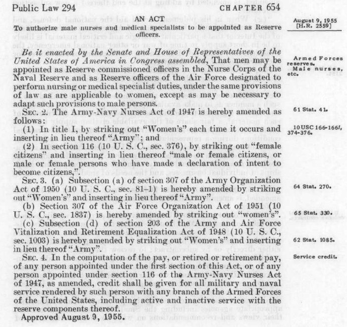

Men nursed in American military hospitals long before they were allowed to be military nurses. The law that made the Army's nurse corps permanent, the Army Reorganization Act of 2 February 1901, created a "Nurse Corps (female)", and the Navy's corps of 1908 was women only too. When the Army's 1918 reorganization renamed it the **[United States Army Nurse Corps](kloom:e/united-states-army-nurse-corps)**, it kept appointments to women. Male contract nurses had served, and died, in Cuba in 1898. In April 1918 a memorandum reported seven male nurses at Base Hospital No. 25 in France with "the same training" and "the same State Diplomas" as the women, "yet they are classed as orderlies and paid about one half the salary of a female nurse." A colonel of the Medical Corps answered that the men were ineligible: under the law, "the Nurse Corps is for women only."

## Twenty years of asking

In 1940 the **[American Nurses Association](kloom:e/american-nurses-association)** formed a section for men nurses, and through 1939 and 1940 men's nursing organizations across the country wrote to Congress, the Surgeon General and the President. One man wrote to Roosevelt that men nurses had the same training as women, belonged to the same associations and were licensed in every state, "yet, in spite of equal training, we are not accepted for peace time or war service." The Assistant Surgeon General replied that there was no possibility of commissioned rank for male nurses, and that a technical sergeant held "a position in the Army that has dignity and importance." Through the Second World War, as the frame before this one tells, the Army was so short of nurses that the President asked Congress to draft them, while trained men nurses served only as enlisted men, outside the nurse corps.

In March 1949 the Surgeons General of the three services agreed that male nurses could be used, but no law let them be commissioned. **[Frances Payne Bolton](kloom:e/frances-p-bolton)**, the Ohio congresswoman whose act had created the Cadet Nurse Corps, introduced a bill to commission men in August 1949, and again in January 1951, and the arguments ran for six years: where men would live, whether married men could serve, whether they would take orders from women, and what soldiers would make of them. Her bill passed as Public Law 294, signed by **[Dwight D. Eisenhower](kloom:e/dwight-d-eisenhower)** on 9 August 1955.

## What the law changed

The act is short, and it works by striking words out. Its first section lets men be appointed reserve officers in the Navy's Nurse Corps and the Air Force "under the same provisions of law as are applicable to women". The rest edits other laws, among them:

| The law amended                       | Struck out        | Put in its place                         |
| ------------------------------------- | ----------------- | ---------------------------------------- |
| Army-Navy Nurses Act of 1947, title I | "Women's"         | "Army"                                   |
| The same act, section 116             | "female citizens" | "male or female citizens", or declarants |
| Army Organization Act of 1950, s. 307 | "Women's"         | "Army"                                   |
| Air Force Organization Act of 1951    | "women's"         | nothing                                  |

Title I of the 1947 act had created the Women's Medical Specialist Corps, of dietitians and therapists, so in the same stroke it became the Army Medical Specialist Corps. The commissions were in the reserve only: a man could serve, but not make a regular career.

On 6 October 1955 **Edward L. T. Lyon**, a nurse anesthetist from Kings Park, New York, was commissioned a second lieutenant in the Army Nurse Corps Reserve, and went on active duty four days later: the first man commissioned in the corps, fifty-four years after it was founded. In December 1956 the first three male nurses reported to Fort Campbell, Kentucky, for airborne training, and in 1958 two of the twenty-one Army nurses sent to Lebanon were men. In November 1964 seven men from the Pennsylvania Hospital School of Nursing for Men in Philadelphia, students in the Army's program, were commissioned together.

## The Navy, and the regular corps

The 1955 act opened the **[United States Navy Nurse Corps](kloom:e/united-states-navy-nurse-corps)** reserve to men, but the Navy took none for a decade. In November 1964 the Secretary of the Navy, Paul Nitze, changed the corps' rules to admit them, and in 1965 the first men were commissioned in the Naval Reserve. Wikipedia names the first as Ensign George M. Silver, in 1965; an article from a Marine Corps air station puts him in 1966.

The war in **[Vietnam](kloom:e/vietnam-war)** finished what Bolton began. In April 1966 the Defense Department issued Special Call 38, a draft of 900 male nurses, 700 for the Army and 200 for the Navy: twenty-one years after the nurse draft of 1945 died in the Senate. It brought the Army Nurse Corps 27 warrant officers and 124 commissioned officers. On 30 September 1966 Public Law 89-609, after bills Bolton had introduced in 1961, 1963 and 1965, let men hold regular commissions. The Navy's first man entered its regular Nurse Corps in 1968, and by Susan Godson's count, which the Naval History and Heritage Command repeats, 379 men served in the corps from 1965 to 1971. By February 1970 the Army had about 1,000 male nurses, among them John D. Ford, the first anesthesia student commissioned under its program for registered nurses still in school.

The Army Medical Department's history office, in an article from its nurse corps newsletter, puts men at more than 35 per cent of the Army Nurse Corps. We found no newer official count. The trail began, in the frame on the first training schools, with a profession built for women; it ends with the law that let men into it on the same terms.
