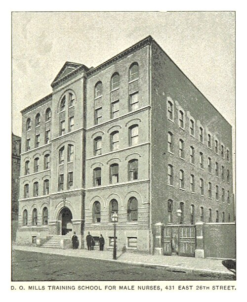

On 17 December 1888 a training school for male nurses took its first pupils at **[Bellevue Hospital](kloom:e/bellevue-hospital)** in New York. Its managers' report of 1892 says it was founded for two reasons: "to give to Bellevue Hospital a corps of educated male nurses," and "to furnish a new calling and profession to young men." The money came from the banker **[Darius Ogden Mills](kloom:e/darius-ogden-mills)**, and it was known as the Mills Training School for Male Nurses. Bellevue's school for women, opened in 1873, had remade the nursing of its wards, but the hospital still employed untrained men in its men's wards, and its physicians wanted them trained "according to the same methods as the women."

## The course

The school was run by women. It began under the superintendent of the women's school and her head nurses, and from June 1889 under its own superintendent, Mrs. A. S. Willard. Its regulations of 1892 set out the terms:

| Term          | The Mills School, 1892                                                                                 |
| ------------- | ------------------------------------------------------------------------------------------------------ |
| Age           | 21 to 35                                                                                               |
| Entrance test | Reading aloud, penmanship, simple arithmetic and English dictation, "to take notes of lectures"        |
| Probation     | One month, with board and lodging and no pay                                                           |
| Course        | Two years in the wards of Bellevue; in the second, "any duty" the superintendent assigns               |
| Allowance     | $12 a month the first year, $15 the second, "not intended as wages"                                    |
| Hours         | Day nurses on duty 8 a.m. to 8 p.m., with an afternoon off a week, half of Sunday and two weeks a year |
| Finish        | An examination of "general fitness for the work of nursing in private", then a diploma                 |

The lectures, forty-two of them, ran from the care of patients and the hygiene of the sick-room through the pulse, the temperature and respiration, to catheters, the genito-urinary system and the examination of urine, enemata, hypodermics, cupping and leeching, bandages, splints, hemorrhage, poisons and asphyxia. By our reading of the list, not one was on childbirth or the diseases of women and children, which the women's schools taught. The men were trained for men's wards. The school took charge of five medical wards in 1888, and by 1892 of eight medical, ten surgical and the prison ward: the plate draws them a square to a ward, beside a pupil's twelve-hour day and his two years.

The physician **[Abraham Jacobi](kloom:e/abraham-jacobi)**, chairman of the managers, told the graduates of 1892 why the men were needed: "No woman, at least none who possess sufficiently high intellectual and moral culture to be safely trusted with the sacred office of caring for the sick, can or will undertake to render all the service required by sick men." Modesty, his and the patients', was the argument. By 1892 the school had 698 applications, had accepted 166 men on probation, and had 56 pupils on its roll; it graduated 18 in 1891 and 17 in 1892. By our arithmetic, fewer than one applicant in four was taken on trial. Most of the first graduates, the report's list shows, went into private nursing in New York. Trae Stewart's history of men's nursing for the _American Journal of Nursing_'s blog, in 2026, counts 438 graduates by 1911. The school ran, with interruptions, until Bellevue's schools closed in 1969.

## An older line, and a narrower door

Men had nursed long before. The [Hospitallers](kloom:e/knights-hospitaller) of Jerusalem were a brotherhood of men under vows who served the sick, and orders of men kept the work up: the **[Alexians](kloom:e/alexians)**, a lay congregation begun among the men who nursed and buried plague victims in the Low Countries in the fourteenth century, and the **[Brothers Hospitallers of Saint John of God](kloom:e/brothers-hospitallers-of-saint-john-of-god)**, founded in Spain in 1572. The Alexians built a hospital in Chicago in 1866. When they completed a new one there in 1898, its cornerstone of 1896 named a house for a school of nurses, and their jubilee book of 1916 describes a training school "for such young men as are preparing for their vocation in the service of the sick." Other schools for men opened, at St. Vincent's Hospital in New York (1888), at asylums, and at the Pennsylvania Hospital (1914).

But most schools took women only, and so did the nation's largest employer of nurses in war. The Army's Nurse Corps was created in 1901 as the "Nurse Corps (female)", and the act of 1918 that renamed it restricted appointments to women. Men were not commissioned in it until 1955, as the frame on men commissioned as nurses tells. The census shows the result:

| Year | Men, % of employed RNs | Source                                     |
| ---- | ---------------------- | ------------------------------------------ |
| 1970 | 2.7                    | Census Bureau                              |
| 1980 | 4.1                    | Census Bureau                              |
| 1990 | 5.7                    | Census Bureau                              |
| 2000 | 7.6                    | Census Bureau                              |
| 2006 | 8.9                    | Census Bureau, American Community Survey   |
| 2011 | 9.6                    | Census Bureau, American Community Survey   |
| 2025 | 12.7                   | Bureau of Labor Statistics, annual average |

As of 2025, the latest annual figures, the Bureau of Labor Statistics counted 3,528,000 employed registered nurses, 87.3 percent of them women; its survey differs from the census, so the last step is not exactly comparable. Wikipedia's article on **[men in nursing](kloom:e/men-in-nursing)** gives fewer than 1 percent in 1930. The assumption has outlived the rule: in 2016 Tolga Bolukbasi and his colleagues found that the [word2vec](kloom:e/word2vec) vectors, trained on Google News, answered "a father is to a doctor as a mother is to _x_" with _nurse_, and noted that the phrase "male nurse" was several times more frequent in the news than "female nurse": the man was the one who had to be named.

The next frame returns to the women the schools kept out, and the association Black nurses built when they were shut out of their own.
