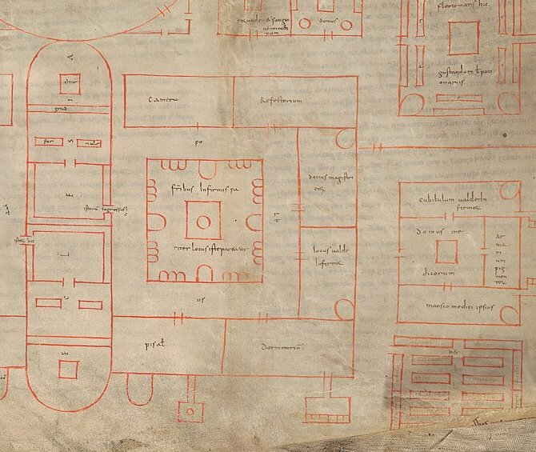

Some time around 530, at **[Monte Cassino](kloom:e/monte-cassino)**, a hilltop between Rome and Naples, **[Benedict of Nursia](kloom:e/benedict-of-nursia)** wrote a short rule for the monks who lived with him. Two and a half centuries later **[Charlemagne](kloom:e/charlemagne)** had the **[Rule of Saint Benedict](kloom:e/rule-of-saint-benedict)** copied and sent out as the standard for monks throughout western Europe, and its thirty-sixth chapter, "On the Sick Brethren", is the founding text of the Western infirmary. It begins:

> Before all things and above all things, care must be taken of the sick, so that they will be served as if they were Christ in person.

The chapter is short, and every sentence in it is an instruction. The sick are to be given a room of their own, and "an attendant who is God-fearing, diligent and solicitous". They may have baths as often as is good for them, where the healthy have them rarely. The very weak may eat meat, which the rest of the community does not, until they are on the mend. The sick, for their part, are not to wear out their brothers with "unnecessary demands", and are to be borne with patiently when they do. The abbot answers for any neglect, by the cellarer or by the attendant. Leonard Doyle's 1948 translation, quoted here, sets the whole Rule out to be read through three times a year, and chapter 36 falls on 15 March, 15 July and 14 November.

## The plan that built the chapter

Three centuries later a monk drew what the chapter asks for. The **[Plan of Saint Gall](kloom:e/plan-of-saint-gall)** is a drawing of a whole Benedictine monastery on five sewn pieces of parchment, about 112 by 78 centimeters, made at **[Reichenau](kloom:e/reichenau-island)** around 820–830 and dedicated to Gozbert, abbot of **Saint Gall** in what is now Switzerland. Its buildings are drawn in red ink, and about 333 brown inscriptions say what each is for. Nobody ever built it. Scholars disagree about what it was: Walter Horn and Ernest Born argued that it copies an ideal plan sent out after the reforming synods at Aachen in 816–817, a model of how a monastery under the Rule should look, while Werner Jacobsen and others, from the compass marks and corrections in the parchment, argue that it is an original drawn for Gozbert's own rebuilding.

Either way, the infirmary is the Rule made into rooms. We read its inscriptions from the manuscript, in our translation:

| The Rule asks for             | The plan provides                                                                                                                            |
| ----------------------------- | -------------------------------------------------------------------------------------------------------------------------------------------- |
| A room set apart for the sick | Their own cloister, "let this place be made ready for the sick brothers together", with a dormitory, a refectory, a warming room and a store |
| An attendant                  | "The house of their master", the infirmarian, beside "the place of the very sick"                                                            |
| Baths                         | A bathhouse next to the infirmary                                                                                                            |
| Meat for the very weak        | A kitchen "of the same, and of those being bled"                                                                                             |

The infirmary shares a church with the house of the novices, back to back across one wall: the sick, the old and the young, whom chapters 36 and 37 of the Rule treat more gently than the rest, kept apart from the main community.

## The physician's house

Beyond the infirmary the plan goes further than the Rule. Benedict asks for an attendant and says nothing of physicians; the plan gives them a house of their own, labeled "the house of the physicians", with "a little room for the very sick", "a cupboard of drugs", and "the lodging of the physician himself". Next to it is the _herbularius_, a physic garden of sixteen beds, each named: lilies and roses, pennyroyal, cumin and lovage among them. A separate house is labeled "here the bled, or those taking potions, are to eat". The plan expects **[bloodletting](kloom:e/bloodletting)** to be common enough to give the monks who had just been bled, like those dosed with potions, a dining room of their own while they recovered, and the infirmary's kitchen cooks for them too.

The plan shows two kinds of care side by side. The infirmarian and his attendants were monks, nursing their brothers as the Rule told them to, as part of the religious life. The physician brought learning from outside it. The same division, a vocation to care and a profession to cure, runs through every frame that follows.

A monastery's infirmary was for its own monks. In the plan, pilgrims and the poor have a hospice of their own, beneath the main cloister. When the sick who needed care were pilgrims arriving by the thousand, the work outgrew any monastery's infirmary, and in Jerusalem a brotherhood was formed to do nothing else: the Hospitallers.
