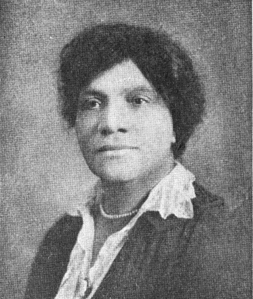

In the autumn of 1906 a private-duty nurse in New Haven, Connecticut, set out to learn how Black nurses were faring. **[Martha Minerva Franklin](kloom:e/martha-minerva-franklin)** had trained at the Women's Hospital in Philadelphia, the only Black graduate of her class of 1897, and she wrote more than five hundred letters to Black nurses, to the superintendents of training schools and to nursing organizations. What she found, as her biographers summarize it, was that the national association of nurses was open to Black nurses in principle, but many of the state associations through which nurses joined it would not admit them. She wrote some fifteen hundred more letters calling a meeting. In August 1908, at the Lincoln Hospital and Home in New York, a hospital whose nursing school trained Black women, fifty-two nurses founded the **[National Association of Colored Graduate Nurses](kloom:e/national-association-of-colored-graduate-nurses)**, and elected Franklin its president.

## Why it was needed

Most Black women who became nurses were trained in a separate system of schools: at Spelman Seminary in Atlanta from 1886, Provident Hospital in Chicago from 1891, Freedmen's Hospital in Washington, Lincoln in New York and others, because the white schools would not take them. Mary Mahoney's school was an exception. The national body, the Nurses' Associated Alumnae, had been built from the alumnae associations of schools, and took those of Black schools too. But in 1916, as the **[American Nurses Association](kloom:e/american-nurses-association)**, it changed its rules so that a nurse joined through her state and district associations. The plate draws the result as a mechanism: one path to the ANA, through a gate that many states kept shut. The ANA said so itself in 2022: "from 1916 until 1964, ANA purposefully, systemically and systematically excluded Black nurses."

The association's own terms were set out in its report to the _Journal of the National Medical Association_, the Black physicians' journal, after its convention in Boston of August 1909:

| What the NACGN reported in 1909 | In its words                                                                                                                            |
| ------------------------------- | --------------------------------------------------------------------------------------------------------------------------------------- |
| Its object                      | "To advance the standard and best interest of trained nurses and to place the profession on the highest plane attainable"               |
| Who could join                  | "All nurses graduating from recognized hospitals giving a course of not less than two years' actual training after August, 1908"        |
| How it would grow               | Chairmen appointed for districts "to organize local branches"                                                                           |
| What it would build             | "A much needed Registry for colored nurses", to supply the public "with nurses capable of rendering any professional service indicated" |

It set its standard high on purpose: it hoped to "cause our young women to enter only those hospitals offering the best training." The report calls the Boston meeting the association's second annual convention; the photograph of its members there, in the New York Public Library, is captioned as its first.

## Thoms and the war

The treasurer in 1909 was a nurse at the Lincoln Hospital, listed as Adah B. Samuels. As **[Adah Belle Thoms](kloom:e/adah-belle-thoms)** she had trained in New York, the only Black woman in a class of thirty, and then at Lincoln, where she was acting director of the school from 1906 to 1923, never given the full title. She became the association's president in 1916. When the United States entered the First World War, the way into the **[United States Army Nurse Corps](kloom:e/united-states-army-nurse-corps)** ran through enrollment in the **[American Red Cross](kloom:e/american-red-cross)** nursing service, and Thoms campaigned for Black nurses to be enrolled and called. The Army Medical Department's historians write that more than eighteen hundred Black nurses were certified by the Red Cross, "yet only a handful were allowed to actually serve." It was the influenza epidemic and the shortage of nurses that changed the War Department's mind: eighteen Black nurses were authorized, and assigned in December 1918 to Camp Sherman, Ohio, and Camp Grant, Illinois.

They lived in separate quarters. Accounts differ on whom they nursed: one of them, **[Aileen Cole Stewart](kloom:e/aileen-cole-stewart)**, wrote in 1963 that "there apparently was no bias or discrimination in our nursing assignments," and that they nursed German prisoners "just as we did our American boys"; a centennial account says they were allowed to nurse only Black soldiers and prisoners. All agree on the timing. "We arrived after the Armistice was signed," Stewart said, "which alone was anticlimactic."

## A headquarters, and an end

The association grew, by Wikipedia's figures, from 125 members in 1912 to 500 in 1920. In 1934, with a grant from the Rosenwald Fund and office space lent by the National Health Circle for Colored People, it opened a national headquarters in New York and hired **[Mabel K. Staupers](kloom:e/mabel-k-staupers)** as its executive secretary. By 1944, the _Journal_ reported, the headquarters served nearly 11,000 graduate nurses and students, with about 220 affiliated organizations. Its fight to take Black nurses into the armed forces in the Second World War is the frame on ending the Army's quota.

In 1946 the ANA's delegates urged the removal of the barriers to "nurses belonging to minority racial groups," and in 1948 they created an individual membership for any nurse her state or district would not accept: the dashed path over the gate. The association voted in 1949 to dissolve, and in 1951 it did, and the ANA took over its Mary Mahoney Award. The last district association, in Louisiana, dropped its racial rule only in 1964. The next frame, the Cadet Nurse Corps, follows the federal money of the Second World War into the schools.
