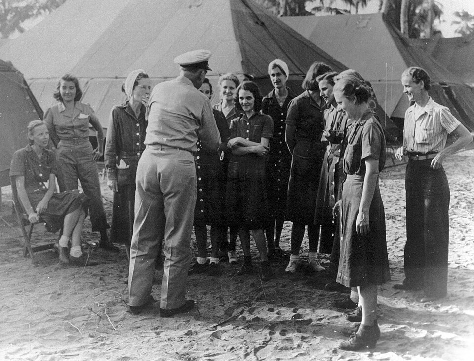

Sixteen Navy nurses became prisoners of the Japanese in the first weeks of the Pacific war, in two groups, and all sixteen came home. When they were taken they had no military rank. Before the war Navy nurses were addressed as "Miss", and the Japanese, who had no experience of women in uniform, classed them as civilians. Both groups went on nursing in captivity, and both left accounts, which are their tellings.

## Five on Guam

The naval hospital on **[Guam](kloom:e/guam)** had a chief nurse, Marion Olds, and four staff nurses: **[Leona Jackson](kloom:e/wilma-leona-jackson)**, Lorraine Christiansen, Virginia Fogerty and Doris Yetter, with about thirty nurses from Guam itself, trained in the Navy's school there. Japanese aircraft bombed the island from 8 December 1941, and on the morning of 10 December its governor surrendered. (The Wikipedia account of the battle counts four nurses in the garrison; Jackson's own account names the chief and four more.) Jackson wrote for the _American Journal of Nursing_ in November 1942: "This was the time for which we had trained all these years". The nurses kept the hospital running under occupation until 10 January 1942, when they were shipped to Japan with the island's other prisoners. In the camp, an old Army barracks, cold and long unused, straw mats over a little padding were their patients' beds. In March the five were moved to Kobe, to what Jackson called a fourth-rate hotel with sprung beds and better food, and on 17 June they boarded the _Asama Maru_ at Yokohama in an exchange of nationals carried out in Portuguese East Africa, now Mozambique. They reached New York on 25 August 1942. Jackson went back to Guam in 1944, and directed the Corps from 1954 to 1958.

## Eleven at Los Baños

In Manila the chief nurse of the 150-bed Cañacao Naval Hospital, beside the Cavite Navy Yard, was **[Laura M. Cobb](kloom:e/laura-m-cobb)**, then nearly fifty, who had first joined the Navy in 1918. When Cavite was bombed on 10 December 1941 she sent nurses with the wounded across the bay by drawing lots with applicator sticks; Ann Bernatitus drew the short one, and went on to Bataan. Her eleven, Cobb and ten others, were working in a makeshift hospital in a Manila school when the Japanese entered the city on 2 January 1942. Told to inventory the drugs, Cobb had the [quinine](kloom:e/quinine) labeled soda bicarbonate, and kept it.

On 8 March they were taken to **[Santo Tomas Internment Camp](kloom:e/santo-tomas-internment-camp)**, a university campus where more than 3,500 civilians were held. Cobb ran the nurses at the camp hospital in the machine shop, in four-hour day shifts and twelve-hour nights, and the nurses taught hand washing against the dysentery. In July the Army nurses captured on Corregidor arrived; the frame on Bataan tells theirs. On 14 May 1943 the Navy nurses went by boxcar with about 800 men to a new camp at Los Baños, south of Manila, to open its hospital. They built it from nothing:

| What they needed | What they used                                                                          |
| ---------------- | --------------------------------------------------------------------------------------- |
| Beds             | Cots and tables made by other internees; 25 beds by Dorothy Still's count, 21 by Cobb's |
| Cups and dishes  | Broken corrugated roofing                                                               |
| Medicines        | Infusions of leaves; later, Red Cross supplies that reached the camp in 1944            |
| Adhesive         | The sap of a rubber tree                                                                |
| Sutures          | Traded for nursing the Japanese guards                                                  |

By 1944 the camp held more than 3,000 people. The nurses worked twelve-hour shifts and saw up to 200 patients a day, for dysentery, tuberculosis and above all [beriberi](kloom:e/thiamine-deficiency), which swelled their own legs; some fainted at work. In the last three months, by a later estimate, the internees ate fewer than 900 calories a day. Cobb lost 35 pounds.

## The raid

On the morning of 23 February 1945 Dorothy Still, on night duty, was feeding a newborn with the last of the powdered milk when paratroopers of the US 11th Airborne Division dropped beside the camp and Filipino guerrillas rose on the guards. Amphibious tractors crashed through the gate. In the **[raid on Los Baños](kloom:e/raid-on-los-banos)** 2,147 internees were carried or walked out; Cobb saw her patients loaded onto the tractors. In retaliation the Japanese killed about 1,500 Filipino civilians in the town and its neighbors. The plate draws the raid's four parts as a schematic. Flown to Leyte, the nurses dined with Vice Admiral Thomas Kinkaid, as the photograph shows, and landed at San Francisco on 10 March.

## Afterwards

Each nurse gained seven or eight pounds in her first ten days. All were awarded the Bronze Star and a Gold Star in place of a second, and Cobb an Army Distinguished Unit Citation; a recommendation that Cobb receive the Legion of Merit came to nothing. In Still's telling, decades later, Los Baños had been "country club living" until the Japanese Army took over the camps late in 1943 and the rations failed. At Guam, on the way home, Cobb told reporters she wanted to go back to the Philippines: "I've been on the receiving end too long." Her health failed instead, and she retired in 1947. Captured without rank, these nurses came home to a Corps that had won it while they were away, which is where the next frame begins.
