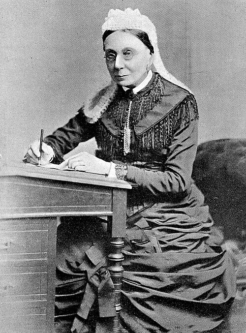

After the Crimean War the British public gave **[Florence Nightingale](kloom:e/florence-nightingale)** a fund in her honor, about £44,000, to found "an institution for the training, sustenance, and protection of nurses and hospital attendants". By 1859 she was an invalid, working from her rooms, and she saw that she could not run a school herself. She chose to work through an existing hospital and the people already in it. **[St Thomas' Hospital](kloom:e/st-thomas-hospital)**, by London Bridge, was large, rich and well managed, its resident medical officer, R. G. Whitfield, was sympathetic, and its matron was **[Sarah Wardroper](kloom:e/sarah-elizabeth-wardroper)**, a widow who had run its nursing since 1854. Under the agreement, the hospital gave the training and the Nightingale Fund paid for it, the probationers' keep and wages included. In May 1860 advertisements invited candidates, and fifteen probationers were admitted for a year. The sources do not agree on the day. Nutting and Dock's _History of Nursing_ (1907) gives 15 June 1860; Nightingale's biographer Sir Edward Cook, writing from the Fund's own reports, gives 24 June; King's College London, which absorbed the school in 1996 as its nursing faculty, dates its founding to 9 July. The **[Nightingale Training School](kloom:e/florence-nightingale-faculty-of-nursing-midwifery-and-palliative-care)** is often called the first secular school of nursing.

## The year

Nightingale wrote the plan and never taught in it. Confined to her room, Cook says, she was unable to visit the hospital; the matron and the medical officer ran the school, and reported to her in detail. The probationers worked as assistant nurses in the wards, were taught there by the ward sisters and the resident medical officer, and heard lectures from members of the medical staff. What they were to learn was printed in the Fund committee's first report as the "Duties of Probationers":

| Required to be          | Expected to become skillful in                                                                                                             |
| ----------------------- | ------------------------------------------------------------------------------------------------------------------------------------------ |
| Sober, honest, truthful | Dressing blisters, burns, sores and wounds; fomentations, poultices, minor dressings                                                       |
| Punctual                | Applying leeches, externally and internally; giving enemas                                                                                 |
| Quiet and orderly       | Trusses and appliances; friction of the body and limbs                                                                                     |
| Cleanly and neat        | Moving, feeding and cleaning helpless patients; preventing and dressing bedsores                                                           |
|                         | Bandaging; lining splints; making a bed with the patient in it                                                                             |
|                         | Attending at operations                                                                                                                    |
|                         | Cooking gruel, arrowroot, egg flip, puddings and drinks for the sick                                                                       |
|                         | Ventilation, "keeping the ward fresh by night as well as by day"; clean utensils                                                           |
|                         | Observing secretions, pulse, skin, appetite, delirium or stupor, breathing, sleep, wounds, and the effect of diet, stimulants and medicine |
|                         | Managing convalescents                                                                                                                     |

Each month the matron filled in a "Monthly Sheet of Personal Character and Acquirements" for every probationer, which Nightingale had drawn up. Its moral record had five heads, punctuality, quietness, trustworthiness, personal neatness and cleanliness, and ward management; its technical record, by Cook's count, fourteen main heads, some with ten or twelve sub-heads, observation of the sick the most detailed. Against every item the matron wrote one of five grades: Excellent, Good, Moderate, Imperfect, or 0. Those who passed at the end of the year went on the hospital's register as certificated nurses.

## The home

The second principle, as Nightingale put it, was that nurses should "live in a home fit to form their moral life and discipline". The upper floor of a new wing held a bedroom for each probationer, a sitting room and rooms for the sister in charge. The Fund paid board, lodging, washing and a uniform, a brown dress with a white cap and apron, and £10 for the year. The chaplain spoke to them twice a week. They went out only in pairs ("Of course we part as soon as we get to the corner," one said later), and one who was found walking out with a medical student was dismissed. Of the first fifteen, Cook says thirteen finished; another account says four were dismissed and replaced. Six took posts at St Thomas' and two in workhouse infirmaries.

Wardroper was the school's head until 1887. Nightingale's sketch of her, written at her death, says she had no hospital training ("there was none to be had"), that "her word was law", and that she wrote her character reports on probationers "again and again in order to be perfectly just".

## Sent out

The school was meant to make heads of nursing, not private nurses. In 1865 **[Agnes Jones](kloom:e/agnes-jones-nurse)**, trained there in 1862, took twelve Nightingale nurses and seven probationers to the Liverpool Workhouse Infirmary, where 1,200 sick paupers had been nursed by other paupers; she died of typhus there in 1868. In March 1868 **[Lucy Osburn](kloom:e/lucy-osburn)** and five other St Thomas' nurses arrived in Sydney to reform its infirmary, at the request of the colonial politician Henry Parkes. Osburn had missed four months of her own year, and the school, by the account Wikipedia draws from her biographer Judith Godden, was badly run at the time, its surgical teaching poor. A probationer of 1867, Rebecca Strong, remembered "kindness, watchfulness, cleanliness", a few stray lectures "and a dummy on which to practise bandaging". In 1873 the surgeon John Croft wrote the school a syllabus of lectures on surgical nursing, and teaching by the medical staff became part of every year. That same year three American schools opened on the Nightingale plan, which the frame on the first American training schools tells.
