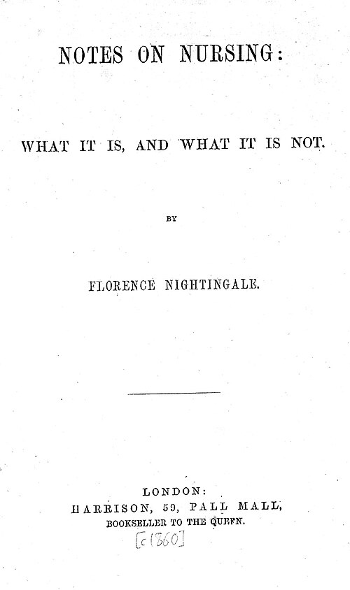

In December 1859 the London bookseller Harrison, of Pall Mall, published a small book of under eighty pages at five shillings: **[_Notes on Nursing: What It Is, and What It Is Not_](kloom:e/notes-on-nursing)**, by **[Florence Nightingale](kloom:e/florence-nightingale)**. It was not a textbook for hospital nurses, and its preface says so. The notes were "meant simply to give hints for thought to women who have personal charge of the health of others", and almost every woman, she wrote, had that charge at some time, of a child or an invalid: "in other words, every woman is a nurse." What she offered was sanitary knowledge, "distinct from medical knowledge, which only a profession can have".

## The first canon

_Notes on Nursing_ opens with a claim: that sufferings thought to come with a disease are "very often not symptoms of the disease at all", but of "the want of fresh air, or of light, or of warmth, or of quiet, or of cleanliness". Its thirteen chapters then take those wants one at a time: ventilation and warming, the health of houses, "petty management" (how the work goes on when the nurse is out of the room), noise, variety, food, bed and bedding, light, cleanliness of rooms and of the person, the "chattering hopes and advices" of visitors, and the observation of the sick. The first chapter is the one she put first in importance too:

> The very first canon of nursing, the first and the last thing upon which a nurse's attention must be fixed, the first essential to a patient, without which all the rest you can do for him is as nothing, ... is this: TO KEEP THE AIR HE BREATHES AS PURE AS THE EXTERNAL AIR, WITHOUT CHILLING HIM.

Every rule in the chapter follows from that sentence, and each is something a woman at home could do that evening:

| The rule                                    | In her words                                                                                                                |
| ------------------------------------------- | --------------------------------------------------------------------------------------------------------------------------- |
| Air the room from outside, not a hall       | "Windows are made to open; doors are made to shut"                                                                          |
| Fresh is not cold                           | "To have the air within as pure as the air without, it is not necessary ... to make it as cold"                             |
| Keep the fire and the window together       | "The safest atmosphere of all for a patient is a good fire and an open window"                                              |
| Night air is no danger                      | "What air can we breathe at night but night air?"                                                                           |
| Watch the weak at dawn                      | Feel the feet and legs by hand; hot bottles and a warm drink; "this fatal chill is most apt to occur towards early morning" |
| Nothing damp dried in the sick room         | Damp towels and bedclothes "dry and air themselves into the patient's air"                                                  |
| A lid on every chamber pot, emptied at once | No slop-pail ever brought into the room                                                                                     |
| No trust in fumigation                      | "The offensive thing, not its smell, must be removed"                                                                       |
| The test                                    | The nurse should "feel the air gently moving over her face, when still"                                                     |

The book is as concrete everywhere. Bedding that is never aired, she wrote, makes patients feverish: "in nine cases out of ten it is a symptom of bedding."

## The wrong model

The theory under the chapter was **[miasma](kloom:e/miasma-theory)**: the old belief that disease rises from foul air, decay and smells. Nightingale held it plainly. In a footnote she asks whether it is not "living in a continual mistake to look upon diseases ... as separate entities, which must exist, like cats and dogs", and says that she had "seen with my eyes and smelt with my nose small-pox growing up in first specimens", in close rooms and crowded wards where it could not have been caught: "Now, dogs do not pass into cats." With a little overcrowding, she had seen continued fever grow up, with a little more typhoid, and with more again typhus, all in one ward. Her model predicted that fevers arise of themselves wherever air goes foul, and that a sick room kept as fresh as the street would breed none.

That was wrong. Diseases are caused by particular organisms, and they do not turn into one another; within two years **[Louis Pasteur](kloom:e/louis-pasteur)**'s experiments with broths sealed from the air had begun to show that microbes do not arise of themselves. Yet the practice held up, because it acted on the real causes as well as the imagined one. Air changed through an open window dilutes what the sick breathe out, and a 2022 review of airborne infection notes that the old belief "captured some grains of truth", since airborne diseases spread far more readily indoors in poorly ventilated rooms. Excreta carried away at once and pots rinsed and lidded break the path by which typhoid and cholera pass, which the **[germ theory of disease](kloom:e/germ-theory-of-disease)** would later trace. The sanitary reformers who shared her belief, **[Edwin Chadwick](kloom:e/edwin-chadwick)** among them ("all smell is disease"), fared less evenly: their separate drains kept sewer air out of houses and cut cholera, by one account, while by another the sewers they built emptied into the Thames, from which much of London drank.

How long she held out is disputed. A study of nurses' training at **[St Thomas' Hospital](kloom:e/st-thomas-hospital)** finds her objecting in 1878 to a physician's lecture to probationers on germ theory, "O if they would leave the germs alone & see to the air!", and accepting germs only towards the end of her life. The airborne-infection review argues she accepted them "before many physicians did", and quotes her advice of 1882 to keep chlorinated soda for nurses to wash their hands after a dressing: "It may destroy germs at the expense of the cuticle." Her habits of cleanliness never changed; her explanation slowly did.

## Its readers

The book sold at once. Her biographer Sir Edward Cook, writing from her papers, gives 15,000 copies in a month, followed quickly by an edition at two shillings. In 1861 came _Notes on Nursing for the Labouring Classes_ at sevenpence, with a new chapter, "Minding Baby", for the girls who looked after younger children. She told a friend that a Peckham schoolmaster made his girls mind the book by telling them it was "for baby's sake", and that several had opened their parents' windows at night. It was reprinted in America and translated into German, French and other languages; in the 1870s a surgeon teaching the probationers at St Thomas' told them to read it at least four times. Those probationers belonged to her next venture, the Nightingale school.
