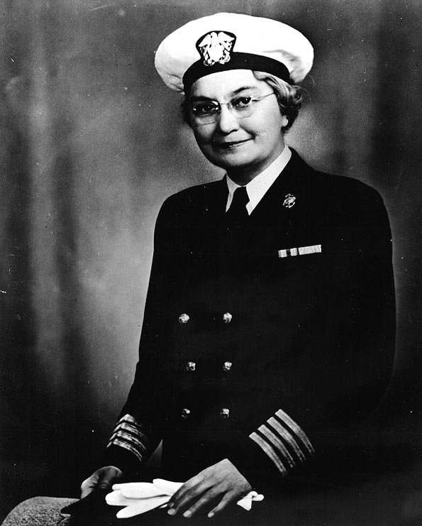

For its first thirty-four years the **[Navy Nurse Corps](kloom:e/united-states-navy-nurse-corps)** had no rank at all. A nurse was addressed as "Miss", paid less than an officer and more than a sailor. "We were neither fish nor fowl," **[Ann Bernatitus](kloom:e/ann-a-bernatitus)**, who joined in 1936, said in her telling. "We were not officers and we were not enlisted." Yet the work was an officer's. On her first ward at Chelsea she taught and supervised the **[hospital corpsmen](kloom:e/hospital-corpsman)**, counted the blankets and thermometers every morning, and took the critically ill patients herself. The Navy's male staff officers had been given full rank in 1899; the **[Army Nurse Corps](kloom:e/united-states-army-nurse-corps)** won "relative rank" in 1920, the right to wear an officer's insignia and use an officer's authority without an officer's commission or base pay. Navy nurses waited for a war.

## Three laws in two years

The **[Second World War](kloom:e/world-war-ii)** brought them three. The texts are short, and each did one thing.

| Date             | Law                           | What it gave Navy nurses                                                                                                                                                     |
| ---------------- | ----------------------------- | ---------------------------------------------------------------------------------------------------------------------------------------------------------------------------- |
| 3 July 1942      | Public Law 654, 77th Congress | Relative rank: the superintendent a lieutenant commander, assistant superintendents (one to 300 nurses) lieutenants, chief nurses lieutenants (junior grade), nurses ensigns |
| 22 December 1942 | Public Law 828, section 7     | For the war and six months after, the pay and allowances of Army nurses of the same relative rank                                                                            |
| 26 February 1944 | Public Law 238, 78th Congress | For the war and six months after, the rank itself: nurses "shall have and shall be designated by the rank which corresponds to the relative rank"                            |

The first gave a nurse's authority in writing, "next after the commissioned officers of the Medical Corps and Dental Corps" in medical matters "in and about naval hospitals". The second lifted an ensign's pay from $90 a month to $150, and made the superintendent, **[Sue S. Dauser](kloom:e/sue-s-dauser)**, a relative captain; on 22 December 1942 she became the first woman in the Navy to wear a captain's four gold stripes. The third made the rank real, but only for the duration, and its second section warned that nothing in it enlarged the nurses' authority or changed how they were appointed. Army nurses received temporary commissions by an act of June 1944. A temporary rank would lapse six months after the war unless Congress acted.

The rank showed on the uniform. The Bureau of Medicine and Surgery's instructions of August 1943 dressed a chief nurse, a relative lieutenant (junior grade), in shoulder marks with a stripe and a half and no corps device, a silver bar on her right collar tip and the Nurse Corps insignia on her left; the superintendent wore a captain's silver eagle.

## The act of 16 April 1947

Congress acted with the Army–Navy Nurses Act, signed on 16 April 1947. Its title II, for the Navy, reads:

| Section | What it says                                                                                                                                                                     |
| ------- | -------------------------------------------------------------------------------------------------------------------------------------------------------------------------------- |
| 201     | A Nurse Corps is "created and established as a Staff Corps of the United States Navy", its officers commissioned by the President with the Senate's consent, ensign to commander |
| 201     | Commanders may be no more than 0.7 percent, and lieutenant commanders 1.6 percent, of the permanent corps; its size is six nurses to every 1,000 in the Navy and Marine Corps    |
| 202     | A Director, chosen from lieutenant commanders or above for four years at most, holds the rank of captain while she serves                                                        |
| 204     | New nurses are appointed ensigns: women citizens 21 to 28 years old                                                                                                              |
| 205     | Authority in medical and sanitary matters next after the Medical and Dental Corps, but "they shall not be eligible for the exercise of command"                                  |
| 207     | Retirement at 55 for commanders and lieutenant commanders, at 50 for lieutenants and below                                                                                       |

Title I did the same for the Army: an Army Nurse Corps of second lieutenants to lieutenant colonels, at least 2,558 strong, its chief a temporary colonel. By our arithmetic, a corps of, say, 2,000 nurses could hold 14 commanders and 32 lieutenant commanders, and at least 97.7 percent of any corps would be lieutenants or below. Laura Cobb, back from Los Baños as a lieutenant commander, retired that year. The plate draws the ladder: each rank's sleeve stripes, the highest rank the law allowed a Navy nurse year by year (dashed while it was only relative), and the 1947 pyramid cut to its two ceilings.

## What the stripes did

On a ward or in an operating room the change was less in the work than in its standing. A nurse had always run the corpsmen; now the law said she was their officer, and a corpsman she corrected was answering an ensign, not a "Miss". Nursing questions came to her before anyone below the doctors. She could not command a ship or a station, and the narrow top of the pyramid meant few would rise above lieutenant. The law also said "female", and men were not admitted to the Corps until 1965, a story told in the frame on men commissioned as nurses.

The pyramid stood for twenty years. Public Law 90-130, signed on 8 November 1967 "to remove restrictions on the careers of female officers", struck out the ceilings on women's promotion that had kept them below flag rank, gave the Navy's Director the rank of captain "unless otherwise entitled to a higher rank", and counted a nurse's service before April 1947 as commissioned service toward retirement. Five years later the Director of the Navy Nurse Corps became the Navy's first woman admiral, in the frame on Alene Duerk.
