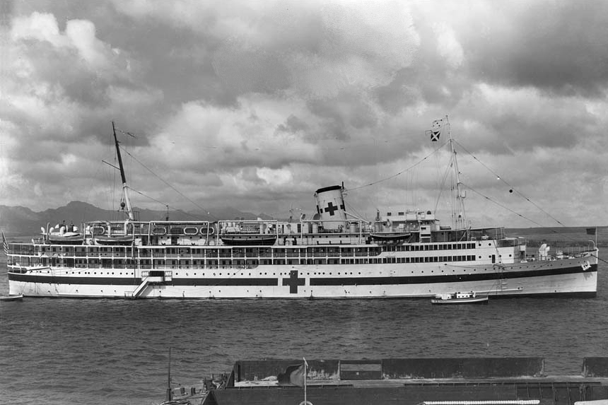

On the morning of Sunday, 7 December 1941, the **[attack on Pearl Harbor](kloom:e/attack-on-pearl-harbor)** killed 2,403 Americans, servicemen and civilians, and brought the United States into **[World War II](kloom:e/world-war-ii)**. The fleet's hospital stood on Hospital Point, across the main channel from Ford Island and the battleships. Its nurses, women of the **[Navy Nurse Corps](kloom:e/united-states-navy-nurse-corps)**, had lately grown to about thirty, under Chief Nurse Gertrude Arnest. North of Ford Island, less than half a mile from the _Arizona_, lay the Navy's newest hospital ship, **[USS _Solace_ (AH-5)](kloom:e/uss-solace-ah-5)**, commissioned that August, with Grace Lally as her chief nurse. The ship was not hit. At the hospital a crashing Japanese plane tore off a corner of the laboratory.

## A nurse's day

**Ruth Erickson**, a Navy nurse at the hospital, told her day to the Bureau of Medicine and Surgery's historian Jan Herman in 1994, fifty-two years later; what follows is her telling. She was off duty, at a late breakfast, when the planes came over low enough to see a pilot's goggles. The chief nurse telephoned: "Girls, get into your uniforms at once, This is the real thing!" Erickson ran across the street "through a shrapnel shower" to the orthopedic dressing room, found it locked, waited for a corpsman to fetch the keys, and helped draw water into every container they could find and set up the instrument boiler. The first patient came in at 8:25 with a large wound of the abdomen, bleeding profusely. A doctor started an intravenous line and a transfusion, and the man died within the hour.

Then the burned came. The _Nevada_ had run aground on Hospital Point, and her men swam through oil to reach it. The dress of the day was T-shirts and shorts, and in her words "the burns began where the pants ended." Someone brought Flit guns, insecticide sprayers, from stores; the nurses filled them with **[tannic acid](kloom:e/tannic-acid)**, sprayed the burns, and gave sedatives for the pain. The stream of burned men lasted until mid-afternoon. Erickson was relieved at four, went back on duty at eight on a surgical ward lit by flashlights behind blackout paper, and spent the next week on a ward of burns. She later became the tenth Director of the Navy Nurse Corps. Rosella Nesgis, another of the hospital's nurses, interviewed in 2002, remembered night duty on the burn ward. The worst burned died at night, most of them, she said, at about half past four or five in the morning, and she sat by them, held their hands, and talked to them about their families.

## The day in numbers

The Navy's medical history, published in 1953, counts the day this way:

|                               | Naval Hospital                  | _Solace_ |
| ----------------------------- | ------------------------------- | -------- |
| Ready for casualties          | 08:15                           | 08:25    |
| Admitted on 7 December        | 546, and 313 dead brought in    | 132      |
| Treated and sent back to duty | more than 200                   | about 80 |
| With significant burns        | about 60 per cent of admissions |          |
| Patients at midnight          | 960                             |          |

The sources differ at the edges. _Solace_'s own doctors, writing in 1942, counted about 141 received aboard, over 70 per cent of them burned, and lost 26 in the first day, ten in the second and one in the third. The Navy's magazine in 1991 put the share of burns at the hospital at 47 per cent. Plasma was what ran short. The hospital had only 40 units of dried plasma, and the rest came wet, from Honolulu's civilian plasma bank. Ten days after the attack the surgeon Isidor Ravdin gave the new concentrated **[albumin](kloom:e/human-serum-albumin)**, rushed to Hawaii, to seven badly burned men, swollen and still losing plasma, some of them given too much salt solution; all seven improved.

The Army's 82 nurses in Hawaii took casualties at Tripler, Schofield Barracks and Hickam Field. At Tripler surgeons operated without gloves and nurses wore cleaning rags as masks. At Hickam the chief nurse, **[Annie Fox](kloom:e/annie-fox-nurse)**, became the first Army nurse to receive the Purple Heart, for her calm and leadership, before the rules changed and a Bronze Star replaced it.

## Tanning a burn

Aboard _Solace_ the routine was written down. Two of her medical officers, George Eckert and James Mader, published it in 1942:

| Step | What was done                                                                                                        |
| ---- | -------------------------------------------------------------------------------------------------------------------- |
| 1    | Morphine to every severe case at the quarterdeck; plasma, 750 to 1,000 cc or more, if he needed it                   |
| 2    | One pound of tannic acid crystals to a clean stainless-steel bucket of drinking water, made fresh every 24 hours     |
| 3    | Burned clothing cut away, fuel oil washed off with green soap and water, no debridement                              |
| 4    | Every burned surface sprayed, the eyes covered, the man laid under a tent warmed if need be by one electric bulb     |
| 5    | Spraying repeated every hour until a firm crust formed, about 24 hours; then nothing until it lifted, in 3 or 4 days |
| 6    | Water or fruit juice offered every hour for 72 hours, a corpsman going bed to bed through the night                  |

The crust was the point. It stopped the burn weeping plasma, and it needed little nursing, which mattered with hundreds of patients at once. Ravdin and his colleague Perrin Long, who studied the casualties, also saw what it cost: infection under the tan, tanned fingers that died, and stiff hands. They saw too that even a thin undershirt had saved the skin beneath it, and the Navy drew the lesson: long sleeves and trousers, or antiflash clothing, when an attack was coming. Eckert defended tannic acid on the face and hands, where others already objected to the scars it left, and reports that it damaged the liver followed. By the war's end the Navy had, in its own words, virtually abandoned tannic acid and the dyes, for vaseline and the pressure dressing.

Less than nine hours after the attack the war reached the Philippines, where Army and Navy nurses would nurse through a siege and then a prison camp: the Angels of Bataan.
