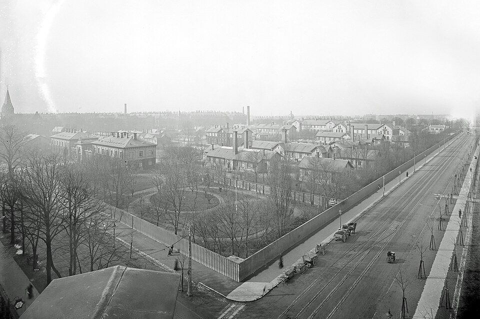

In the summer of 1952 **[polio](kloom:e/polio)** came to **[Copenhagen](kloom:e/copenhagen)** on a scale no one there had seen. The city of about 1.2 million had one hospital for communicable diseases, the Blegdam Hospital, with some 500 beds, and in the last five months of the year it took in about 3,000 patients with poliomyelitis, by the count of its chief physician, **H. C. A. Lassen**. (A paper by two of its anesthetists gave 3,722 for the patients who passed through it, of 5,722 notified in Denmark that year.) About a third were paralyzed, and many had the bulbar form, which paralyzes the muscles of breathing and swallowing. To keep them alive the hospital had one tank respirator, an Emerson, and six cuirass respirators that fitted round the chest.

## What the iron lung could not do

The tank was the **[iron lung](kloom:e/iron-lung)** that Philip Drinker and Louis Shaw had described in 1929: a sheet-iron cylinder that closed round the patient's body, with the head outside through a rubber collar. Pumps lowered the pressure in the tank, the chest rose and air ran into the lungs; raised it, and the air was pushed out. Their machine gave any pressure up to about 60 cm of water, at 10 to 40 breaths a minute, and had portholes to watch the patient through and small taps to pass in a thermometer or a blood-pressure cuff. It moved the chest, but it could not clear the throat. A patient who could not swallow drowned in his own secretions, or slowly filled with carbon dioxide. From 1934 to 1944 the hospital had used respirators on 76 patients, and 80 per cent died. In the first three weeks of 1952, 31 bulbar patients were treated in the tank and the cuirasses, and 27 died, 19 within three days of admission.

## Ventilation by hand

On 25 August Lassen called in **[Bjørn Ibsen](kloom:e/bjorn-aage-ibsen)**, an anesthetist who had spent a year at **[Massachusetts General Hospital](kloom:e/massachusetts-general-hospital)** in Boston. That day a 12-year-old boy had died in a respirator with a serum bicarbonate far above normal, which the physicians had read as an unexplained alkalosis. Ibsen read it as carbon dioxide that the boy could not breathe out. Two days later he tried his answer on a 12-year-old girl, Vivi Ebert, paralyzed in all four limbs, cyanotic and gasping. A **[tracheotomy](kloom:e/tracheotomy)** was made under local anesthesia, a cuffed rubber tube went into her windpipe, and when she fought it Ibsen gave her 100 mg of Pentothal; her breathing stopped, and he could fill her lungs with a bag. She lived. The method that followed, from the three men's papers of 1954:

| Step        | What was done                                                                                                                    |
| ----------- | -------------------------------------------------------------------------------------------------------------------------------- |
| Airway      | A tube through the mouth first, under general anesthesia (usually cyclopropane); a stomach tube passed and the stomach emptied   |
| Tracheotomy | High, just below the larynx; a cuffed rubber tube sealed the trachea from the throat                                             |
| Circuit     | A rubber bag, a canister of soda lime to take up carbon dioxide, and a cylinder of half oxygen and half nitrogen at 5 to 6 L/min |
| Rate        | 16 to 25 squeezes a minute for an adult, 20 to 30 for a child; inflation in about one second, and the pressure let fall to zero  |
| Suction     | A catheter down the tube; never more than 15 seconds at a time in a patient who could not breathe                                |
| Standby     | A spare set on every floor, in case a patient's own failed                                                                       |

The nitrogen was there because patients given pure oxygen had complained of a burning behind the breastbone; the half-filled bag and the canister made the system forgiving for hands that had had only a short training.

## Who kept watch

The hands were students'. On one day, with 75 patients under hand ventilation, the anesthetists Erik Andersen and Ibsen counted 250 medical students squeezing bags, 260 nurses brought in from outside "to sit at the bedside and attend to the patients' requirements", and 27 hospital workers changing cylinders, of which 250 were emptied in the 24 hours. Lassen counted about 600 trained nurses on the polio service, and about 1,000 students over the epidemic; John West gives a roster of 200, and cites a report of 1,500 students and 165,000 hours. Patients likely to fail were moved to observation wards for what the anesthetists called "minute-to-minute observation", with blood pressure, pulse and breathing recorded, and by their estimate about 100,000 blood pressures were taken in five months. Vivi Ebert's record for her first night, as Louise Reisner-Sénélar transcribed it, notes her pulse and pressure again and again until morning, often a quarter of an hour apart. None of these accounts, all written by physicians, names a nurse.

| Admitted         | Patients | Died     |
| ---------------- | -------- | -------- |
| 24 July – 25 Aug | 31       | 27 (87%) |
| 26 Aug – 8 Sept  | 50       | 26 (52%) |
| 8 – 23 Sept      | 50       | 24 (48%) |
| 23 Sept – 5 Oct  | 50       | 19 (38%) |
| 6 – 21 Oct       | 50       | 13 (26%) |
| 21 Oct – 6 Nov   | 50       | 18 (36%) |

## The numbers, and the unit that followed

Lassen's table, counted to 1 April 1953, is the hospital's own. Of 321 patients treated after 27 August, 265 had a tracheotomy and 232 were ventilated by bag; mortality fell from over 80 per cent to just under 40, and in a last group of 50 to 22 per cent. Later accounts give 90 falling to 25 per cent, which is not Lassen's count. Vivi Ebert was ventilated by hand until January 1953, left the hospital in 1959 in a wheelchair, and died at 31.

By December 1953 Ibsen had a ten-bed recovery room at the Kommunehospital, in what had been a classroom for student nurses. In his own telling, he wrote a patient's readings on its blackboard with a forecast for the next day, and the sickest patients came to be kept there rather than sent back to the wards. Berthelsen and Cronqvist call it the first **[intensive care unit](kloom:e/intensive-care-unit)**. The next frame leaves the ward for the clinic, where nurses began to diagnose.
