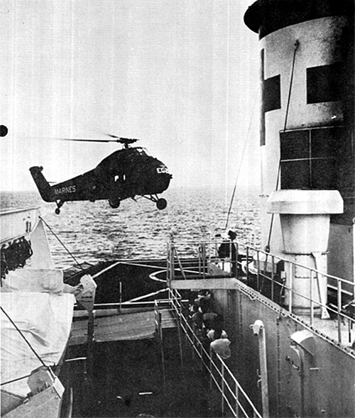

When the United States sent combat troops to Vietnam in 1965, the Navy had no **[hospital ship](kloom:e/hospital-ship)** in commission. The narrow country, with a long coast and its fighting never far from the sea, suited one, and so the Navy took **[USS _Repose_](kloom:e/uss-repose-ah-16)** (AH-16) out of the reserve fleet at Suisun Bay, where she had lain since the Korean War. She was recommissioned at Hunters Point, San Francisco, on 16 October 1965, with a medical staff of 54 officers, 29 nurses and 543 enlisted by Herman's count (the nurses' own history says fourteen sailed with her and all 29 were aboard by late March 1966), and on 16 February 1966 she began taking patients off Chu Lai. For the next four years she worked the coast of I Corps, the northernmost region of South Vietnam, from Chu Lai north through **[Da Nang](kloom:e/da-nang)** to Dong Ha and Quang Tri, and she earned the nickname "Angel of the Orient".

## A hospital on eight decks

_Repose_ was one of six ships of the Haven class, built on 520-foot cargo hulls in the Second World War. Jan Herman's history of Navy medicine in Vietnam lays out how she was arranged. She had eight decks, three of them below the waterline. Her engines were all aft, so the whole forward part of the ship could be one hospital, with wide corridors running through it. The plate draws her in profile, a schematic rather than a survey, with the path a casualty took:

| Step | Where                         | What happened                                                                                                     |
| ---- | ----------------------------- | ----------------------------------------------------------------------------------------------------------------- |
| 1    | The helicopter deck, aft      | A helicopter set the wounded down; Herman says a man could be on the operating table within half an hour          |
| 2    | The ramp                      | Stretcher bearers carried them down a sloping ramp, widened in the 1965 refit                                     |
| 3    | Triage                        | Next to the deck, equipped for rapid evaluation and resuscitation                                                 |
| 4    | The surgical suite, amidships | Where the ship rolled least: two major operating rooms, a fracture room, anesthesia and surgical supply           |
| 5    | Intensive care and the wards  | On the three decks above the waterline, in two-tier bunks; three tiers for patients who could care for themselves |
| 6    | Onward                        | Back to their units, or carried to the Naval Hospital at Yokosuka in Japan                                        |

The ship had a portable heart-lung machine and a frozen blood bank, in the belief of her oral surgeon the first ever put aboard a ship: red cells kept frozen, then thawed and washed for transfusion, part of the Navy's trial of frozen blood in Vietnam that _In the Blood_ follows at Da Nang. In his time aboard, he said, they gave 3,067 pints of blood. Her capacity is given as 721 beds by the Navy's ship history and 750 by Herman, who adds that the staff found 560 patients could be managed comfortably. Under the Geneva Conventions she carried no guns, sailed lit at night and wore a white hull with three red crosses along it and four on her funnel.

## On the wards

The nurses' own words survive in the memories the Navy Nurse Corps collected after the war, and in Herman's oral histories; they are their tellings. Lieutenant Mary Lee Sulkowski remembered what the ship meant to a man carried in from the field: white linen, "nurses in white starched uniforms, air conditioning, ice cream". Barbara Coffin Rodgers, who served in the ship's eighteen-bed intensive care unit from September 1967 to September 1968, remembered the **[Tet Offensive](kloom:e/tet-offensive)** of February 1968, when "the decks were lined with stretchers headed for the operating room", and an August when "we lost one a day". In heavy fighting, helicopters landed as many as 200 patients in a day. The operating room supervisor in 1968 was **[Frances Shea](kloom:e/frances-shea-buckley)**, later Director of the Navy Nurse Corps, who wrote of how the nurse became "the shoulder to cry on" for patients, corpsmen and doctors, and kept her own troubles to herself.

By the time _Repose_ left Vietnam on 14 March 1970, her people had treated more than 9,000 battle casualties and admitted about 24,000 patients. Bill Terry, the oral surgeon, counted fewer than one death in a hundred among the patients who reached the ship alive.

## Sanctuary

Her sister **[USS _Sanctuary_](kloom:e/uss-sanctuary)** (AH-17) joined her in April 1967, also with 29 nurses. On her first afternoon off Da Nang she took ten Marines burned when their amphibious tank hit a mine; by the end of April she had admitted 717 patients (319 combat casualties, 72 other injuries and 326 sick) and lost two. In her first year she admitted 5,354 and treated 9,187 more as outpatients, and helicopters landed on her deck more than 2,500 times. The Sanctuary nurse Miki Iwata recalled wounds that "had to be packed, cleaned, and dressed", and how many hands one patient needed. _Sanctuary_ left Da Nang for the last time on 23 April 1971.

She had one more first. In August 1972 the Chief of Naval Operations, **[Elmo Zumwalt](kloom:e/elmo-zumwalt)**, ordered women assigned to her ship's company as a pilot for women at sea, and when she was recommissioned on 18 November 1972 she carried two women officers and 60 enlisted women in jobs other than medical ones: the Navy's first ship with a ship's company of men and women. The nurses had been at sea since 1920. The trail ends in the same year, with the first woman the Navy made an admiral.
