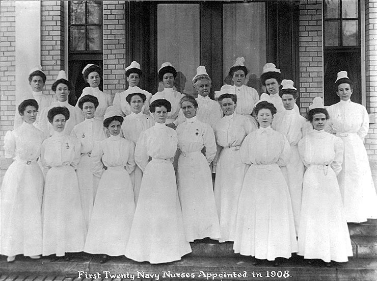

For a century the Navy nursed its sick with men: surgeons, and enlisted sailors rated nurses from 1861 and baymen from 1876, then hospital apprentices. Women came aboard only in emergencies. In the Civil War the Navy's first hospital ship, the **[_Red Rover_](kloom:e/uss-red-rover)**, sailed on the Mississippi on 29 December 1862 with four nuns of the **[Sisters of the Holy Cross](kloom:e/sisters-of-the-holy-cross)**, and with Black women, entered in the deck log as "contraband of war", who did nursing duty; one of them, Ann Stokes, served from January 1863 to October 1864 and later drew a Navy pension. In the war with Spain in 1898 the Navy took volunteer nurses into its hospitals ashore, chosen through the Daughters of the American Revolution and paid $30 a month from private funds, not by Congress. The Army made its women nurses a permanent corps in 1901. The Navy followed seven years later.

## The act

The **[United States Navy Nurse Corps](kloom:e/united-states-navy-nurse-corps)** was made by a few sentences in the naval appropriation act that [Theodore Roosevelt](kloom:e/theodore-roosevelt) signed on 13 May 1908, between the money for the Bureau of Medicine and Surgery and a line on the pay of the Hospital Corps. Read off the statute, its terms are these:

| The act says                                                                                                                        | What it meant                                  |
| ----------------------------------------------------------------------------------------------------------------------------------- | ---------------------------------------------- |
| "The nurse corps (female) of the United States Navy is hereby established"                                                          | women only, until men were admitted in 1965    |
| One superintendent, appointed by the Secretary of the Navy, and "as many chief nurses, nurses, and reserve nurses as may be needed" | no fixed size                                  |
| Every nurse a graduate of a hospital training school with a course "not less than two years"                                        | trained nurses only                            |
| An examination "as to their professional, moral, mental, and physical fitness"                                                      | held in Washington, at the nurse's own expense |
| Duty at naval hospitals and "on board of hospital and ambulance ships"                                                              | no nurse at sea until 1913                     |
| "The same pay, allowances, emoluments, and privileges" as the Army's nurse corps                                                    | $40 a month at home, $50 abroad                |

The act gave no rank. A Navy nurse was neither an officer nor an enlisted sailor, and her authority on a ward rested on custom. On paper she had the Army nurse's allowances, which included quarters and rations; in fact the quarters in Washington were still being drawn up that winter, and the Corps' histories say the first nurses rented a house and fed themselves.

## The twenty

**[Esther Voorhees Hasson](kloom:e/esther-hasson)**, born in Baltimore in 1867 and trained at the Connecticut Training School in New Haven, took the oath as the first superintendent on 18 August 1908. She had been an Army contract nurse on the hospital ship _Relief_ in 1898 and in the Philippines, and, the _American Journal of Nursing_ reported, had wanted to be an army nurse since reading Louisa May Alcott's _Hospital Sketches_ as a child. In November she listed the first fifteen appointed, with their schools: the Johns Hopkins Hospital, Bellevue, the Boston City Hospital, Lane Hospital in San Francisco. Several were veterans of 1898. The group photograph taken at the Naval Hospital in Washington, which the Naval History and Heritage Command dates to about October 1908, shows twenty with Hasson; since only fifteen had been named in print by November, it may be a little later. The Corps came to call them **the [Sacred Twenty](kloom:e/sacred-twenty)**. Among them were [Lenah Sutcliffe Higbee](kloom:e/lenah-higbee) and J. Beatrice Bowman, the next two superintendents.

Hasson set out the work in the _Journal_ in March 1909. Each nurse spent her first months at the Naval Medical School Hospital in Washington, on probation, learning the service's rules and the insignia of its ranks, before going out to the hospitals at Norfolk, Annapolis, Brooklyn and Mare Island. One of her "principal duties" was not to nurse the Navy herself but to teach the young hospital apprentices who would, because women were to serve on no ship but a hospital ship: "the bulk of the nursing of the Navy afloat will always fall" to them. She was to see that treatments, baths and medicines were given on time by the men, and to do the nursing herself whenever it was needed. Hasson asked for "dignity, self-control and courtesy", and warned that if the first nurses were "content with low standards either professionally, morally, or socially the status of the corps will be fixed for all time."

## The uniform and the pin

The first uniform, approved by the Surgeon General, was a white cotton drill shirtwaist and skirt, a cap of white lawn with a one-inch band of black velvet, and a red cross on the left sleeve. The Corps pin, about the size of a quarter, bore an anchor and a caduceus in blue enamel over the letters U.S.N., and a nurse could not wear it until her six months' probation were done. Nurses bought their own uniforms until 1923. From 1918 their collar device was the Medical Corps' gold oak leaf and silver acorn with the letters NNC; after 1947, when they became commissioned officers, it was the oak leaf alone. The plate draws the pin and the leaf on their construction lines.

## Who led the Corps, and how it grew

Hasson resigned in January 1911, when the Corps had about 85 nurses, and Higbee led it through the First World War, winning the Navy Cross; in 1945 the destroyer _Higbee_ became the first warship named for a woman. Navy nurses had no rank until [World War II](kloom:e/world-war-ii). The trail _Navy nurses_ follows the Corps from here, to sea, into captivity, to commissioned rank and, in 1972, to an admiral's flag.
