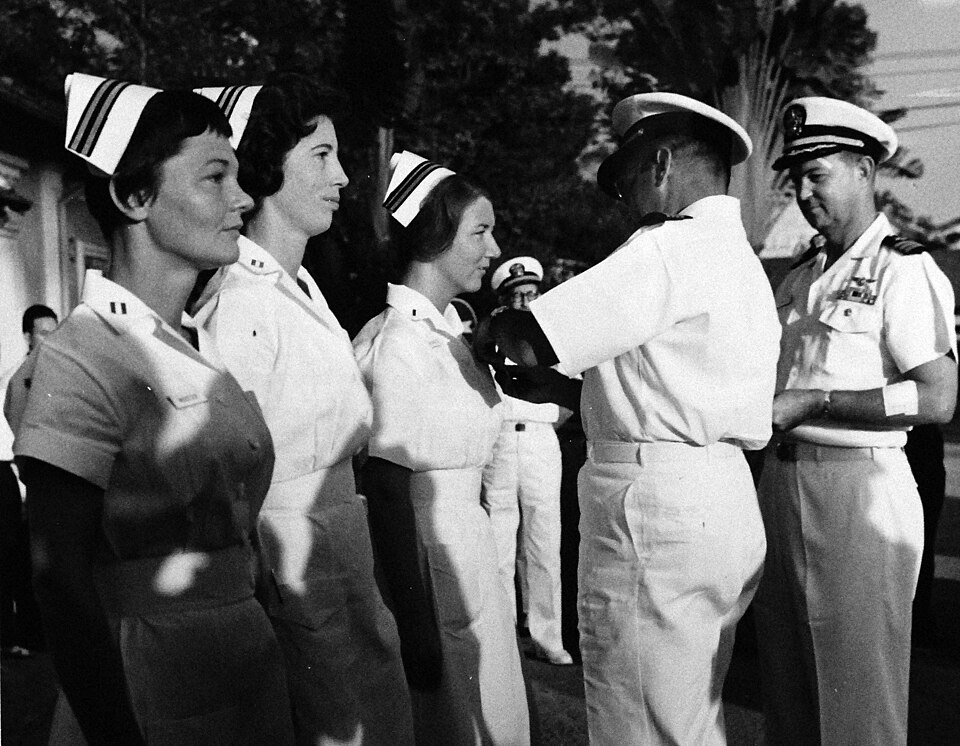

In February 1963 the first two Navy nurses reported to **[Saigon](kloom:e/ho-chi-minh-city)**, two years before American combat troops landed in South Vietnam. The Navy had taken over the medical care of the American advisers there from the embassy's dispensary, and its Headquarters Support Activity, set up in 1962, needed a hospital. The senior medical officer chose a run-down five-story building on Tran Hung Dao, downtown Saigon's busiest street, and by October 1963 it held 100 beds. Station Hospital Saigon was, from the day it opened, the only hospital of the US Navy anywhere that took American combat casualties straight from the field. It was a hospital of the **[United States Navy Nurse Corps](kloom:e/united-states-navy-nurse-corps)** as much as of its doctors: in three years 23 Navy nurses served there.

## The hospital

Jan Herman's history for the Naval History and Heritage Command describes the staff in its first years: a senior physician and nine medical officers (two general surgeons, an internist, a psychiatrist and four or five general practitioners), seven Navy nurses and eight Thai nurses, two Medical Service Corps officers, 76 hospital corpsmen and 40 Vietnamese clerks, drivers and janitors. An annex behind the main building, joined to it by stairways, served for isolation. A one-story stucco block in the courtyard held central supply, the emergency room and the operating room. A concrete wall topped with wire screens against thrown grenades surrounded the whole compound, and military police with shotguns patrolled it day and night. The plate draws it as a schematic, not a survey.

Helicopters landed the wounded on a soccer field five minutes away by ambulance; others came by aircraft into Tan Son Nhut airport. Much of the daily work was disease: everyone took chloroquine and primaquine against malaria, everyone was given immune globulin against infectious hepatitis, and amoebic dysentery, the commonest complaint, was treated with Diodoquin and oxytetracycline. The commanding officer, Captain Russell Fisichella, kept the hospital ready for a disaster by a rule of evacuation:

| Step | What was done                                                                                         |
| ---- | ----------------------------------------------------------------------------------------------------- |
| 1    | Patients able to travel went to the Army's 8th Field Hospital at Nha Trang, 200 miles north           |
| 2    | Two air evacuation flights a week took patients to the Air Force hospital at Clark in the Philippines |
| 3    | The aim: "no more than 50 percent occupancy in anticipation of possible mass casualties"              |

By our arithmetic, that held some fifty of the hundred beds empty on an ordinary day. On Christmas Eve 1964 they were needed.

## Christmas Eve

The nurses lived at the Brink Bachelor Officers' Quarters, a former hotel that housed American Army officers. A little before six in the evening of 24 December 1964, a car the Viet Cong had parked in its underground garage blew up, with about 200 pounds of explosive in its trunk. That was the **[1964 Brinks Hotel bombing](kloom:e/1964-brinks-hotel-bombing)**. Two Americans were killed, Lieutenant Colonel James Robert Hagen and David Agnew, a civilian of the Navy Department. The count of the wounded differs from source to source, from 53 to 98, Vietnamese staff among them.

Five Navy nurses lived there. Lieutenant Eileen Walsh was on duty at the hospital. Lieutenant **Ruth A. Mason** had gone down to see their maid through the security line with a Christmas present, and Lieutenant **Frances L. Crumpton**, who had been out shopping, was outside too. Lieutenant **Barbara J. Wooster**, the newest of them, was a few floors up. Lieutenant (junior grade) **Ann Darby Reynolds**, 25 and on call for the operating room, was watching from her French doors. In her telling, from her memoir and printed in _Vietnam_ magazine in 2021, the door blew in and covered her with glass, and her first thought was that there would be wounded and she must get to the hospital.

She did, in a jeep with the wounded in the back, and the others followed in other vehicles. The hospital worked as one room for emergency, triage, the operating room and recovery. Reynolds put a long green gown over her clothes and went to work, until a corpsman told her she was leaving a trail of blood. She had a deep cut below the knee. She was wearing sterile gloves and did not want to stop, so she had him wrap it in an elastic bandage and carried on. They worked until after two in the morning. Only then was her leg sutured, and on the next table lay the man from the room beside hers, found in the rubble around midnight. He died there. Crumpton's ears were injured, and she was flown to **[Clark Air Base](kloom:e/clark-air-base)** in the Philippines for surgery.

## The Purple Hearts

On 8 January 1965 Captain Archie Kuntze, commanding the Navy's support activity in Saigon, pinned the **[Purple Heart](kloom:e/purple-heart)**, the decoration for those wounded by the enemy, on Mason, Wooster and Reynolds; Crumpton received hers in the Philippines. Kuntze said the four would be recorded "as the first women members of the United States Armed Forces to receive the Purple Heart in Vietnam". Herman adds that they were the only Navy nurses awarded it in the whole **[Vietnam War](kloom:e/vietnam-war)**. Reynolds tells that Army patients from the Brink kept asking when the nurses would get theirs, and that until she raised it with their senior nurse, Commander Ann Richman, none of them had expected any.

The hospital went on as the war grew around it. By the time it was handed to the Army in 1966 (in March, by the Navy nurses' own history) it had admitted more than 6,000 patients and treated 130,000 outpatients. Reynolds retired from the Navy in 1988, a captain. The Navy's nurses went on to the war's larger hospitals ashore and afloat, and the next frame follows them aboard the hospital ship _Repose_.
