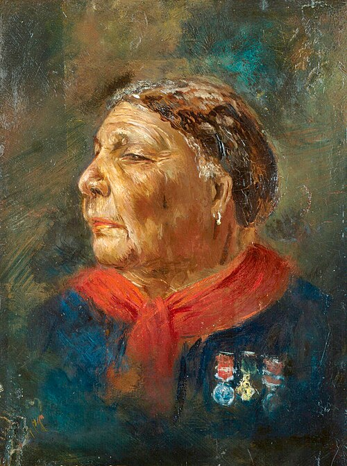

**[Mary Seacole](kloom:e/mary-seacole)** was born Mary Grant in Kingston, Jamaica, in 1805; she would not print the year herself, saying only that "the century and myself were both young together". Her father was a Scottish soldier. Her mother kept a boarding house for army and navy officers and was, in her daughter's words, "an admirable doctress", one of the Creole women who treated the sick with herbs and long experience. Seacole learned from her, nursed her own husband until his death, and by 1857, when she published _Wonderful Adventures of Mrs. Seacole in Many Lands_, had a practice of her own in Jamaica and Panama. That book is the main source for her life, and what follows is mostly her telling.

## The yellow doctress

In 1850 **[cholera](kloom:e/cholera)** reached Jamaica, and a doctor lodging in her house gave her "many hints as to its treatment". The next year she was at Cruces, on the **[Isthmus of Panama](kloom:e/isthmus-of-panama)**, where travelers bound for the California gold fields crossed by river and mule, when the disease came there too. The town's Spanish doctor lost his nerve, she says, and the people sent for "the yellow woman from Jamaica with the cholera medicine". She set out her treatment:

| For               | What she gave or did                                                                             |
| ----------------- | ------------------------------------------------------------------------------------------------ |
| The attack        | Mustard emetics; mustard plasters on the stomach, spine and neck; warm fomentations              |
| Medicine          | Calomel, a mercury salt, "at first in large then in gradually smaller doses"                     |
| One stubborn case | Ten grains of sugar of lead, a lead salt, in a pint of water, a tablespoonful every quarter hour |
| Thirst            | Water in which cinnamon had been boiled                                                          |
| Afterward         | Warmth about the heart, and strengthening medicines given cautiously, for fever followed         |

Opium she "rather dreaded", because it lulled the patient into "the sleep of death". She drew her own conclusion: "the course of treatment which saved one man, would, if persisted in, have very likely killed his brother." In 1853, back in Kingston, she was sent for by the medical authorities during an epidemic of **[yellow fever](kloom:e/yellow-fever)** and nursed at the army's Up-Park Camp, among soldiers of regiments she would meet again in the Crimea.

## Refused

In the autumn of 1854 she was in London, and when the news from the Crimea came she applied to go as a nurse. She tried the War Office, the Quartermaster-General's department and the Medical Department, then waited in the hall of Sidney Herbert's house to offer herself to his wife as a recruit for **[Florence Nightingale](kloom:e/florence-nightingale)**'s nurses, and was told the places were filled. One of Nightingale's companions saw her, and she "read in her face the fact, that had there been a vacancy, I should not have been chosen to fill it". She asked herself whether "American prejudices against colour had some root here". The Crimean Fund would not pay her passage either. So she went at her own cost, in partnership with a Caribbean acquaintance, Thomas Day, announcing on printed cards a "British Hotel" with "a mess table and comfortable quarters for sick and convalescent officers".

On the way, in early 1855, she spent a night at the Barrack Hospital at Scutari. In her telling Nightingale asked, "What do you want, Mrs. Seacole—anything that we can do for you?", and found her a bed in the washerwomen's quarters. Nightingale's own view came out fifteen years later, in a private letter to her brother-in-law, which said Seacole had kept "a bad house" in the Crimea, with "much drunkenness and improper conduct". Mark Bostridge found that Nightingale had also given money to a fund for Seacole after the war.

## Mother Seacole

At **[Balaclava](kloom:e/balaklava)**, where she landed, she spent her first weeks helping the doctors lift the sick and wounded from mules and ambulances onto the transports for Scutari, easing dressings and giving tea. By summer she and Day had built the British Hotel at Spring Hill near Kadikoi, about three and a half miles up the road to the army's camp: a store, a kitchen, huts and a stable yard, which Wikipedia's account puts at £800. Soldiers who would not go to hospital came to her for medicine, and she sold officers the food and comforts the commissariat lacked. On days of battle she went out with a bag of "lint, bandages, needles, thread, and medicines". **[William Howard Russell](kloom:e/william-howard-russell)** of The Times, who wrote her book's preface, called her in a dispatch of September 1855 "a warm and successful physician", and the soldiers called her "mother". Peace left the firm with stock it could not sell, and she was declared bankrupt in London in November 1856.

## A disputed place

Forgotten for most of a century after her death in 1881, she was found again from 1973, when the Jamaican Nurses Association rediscovered her grave in London; her book was reissued in 1984, and in 2004 she was voted the greatest Black Briton. On 30 June 2016 a statue of her by Martin Jennings was unveiled at St Thomas' Hospital, inscribed with Russell's words. The sociologist **[Lynn McDonald](kloom:e/lynn-mcdonald)**, of the Nightingale Society, argues that her cures have been "vastly exaggerated", that she was a businesswoman rather than a nurse, and that "her tea and lemonade did not save lives, pioneer nursing or advance health care". Her biographer Jane Robinson and Bostridge answer that her experience outstripped Nightingale's, in preparing medicines, diagnosis and minor surgery, and Jennings and others see race in the resistance to her statue. Both sides read the same book. She called herself "doctress, nurse, and 'mother'", and charged for what she sold. The next frame turns from the hotel back to the hospitals, and to the numbers Nightingale drew from them.
