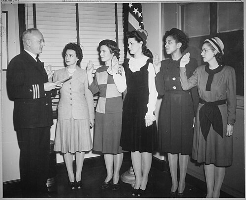

In October 1940 the War Department said it would take Black nurses into the **[United States Army Nurse Corps](kloom:e/united-states-army-nurse-corps)**, and **[Mabel Keaton Staupers](kloom:e/mabel-k-staupers)**, executive secretary of the [National Association of Colored Graduate Nurses](kloom:e/national-association-of-colored-graduate-nurses), was promised a quota: 56 nurses. The **[United States Navy Nurse Corps](kloom:e/united-states-navy-nurse-corps)** would take none. The number came out of segregation. The Medical Department's plan, approved that winter, put Black patients in "colored wards" with Black doctors and nurses: eight wards at each of the two posts with the most Black soldiers, Fort Bragg in North Carolina and Camp Livingston in Louisiana, staffed with 28 nurses at each hospital, as the Army's official historian of Black troops records. Two hospitals of 28 make 56, by our arithmetic, the quota exactly. Black nurses were to nurse Black soldiers and no one else, which the War Department called "segregation without discrimination". It was the same war in which the armed forces had the Red Cross keep Black donors' blood apart from white donors'. Staupers recalled telling the Surgeon General, James Magee, that Black nurses would fight "against any limitations on their service, whether a quota, segregation, or discrimination."

## The quota through the war

| Black nurses in the Army Nurse Corps | Number | Source                                |
| ------------------------------------ | ------ | ------------------------------------- |
| The first quota, 1940                | 56     | Hine, as JSTOR Daily reports her      |
| The ceiling, 1943                    | 160    | The Army's Center of Military History |
| Serving at the end of 1944           | 247    | Hine, as JSTOR Daily reports her      |
| Serving in September 1945            | 479    | The Army's Center of Military History |

In December 1941, with the Red Cross asking for 50,000 nurses, the _Pittsburgh Courier_ called the 56 "a drop in the bucket", and Staupers said it had not yet been filled. The ceiling was raised to 160 in 1943, and the women it let in were sent where Black troops were. Lieutenant **[Della Raney](kloom:e/della-h-raney)** became the corps' first Black chief nurse, at Tuskegee Air Field in Alabama, in 1942. In March 1943 Lieutenant Susan Freeman took the thirty nurses of the 25th Station Hospital to Liberia, the first Black nurse to command an Army nursing unit overseas; Lieutenant Agnes Glass was chief nurse of the 335th Station Hospital in Burma, which cared for the Black troops building the Ledo Road. Others went to the Southwest Pacific. And in June 1944 sixty-three nurses were sent to the 168th Station Hospital in England, and others to camps at home, to nurse German prisoners of war, an assignment Staupers protested in the Black press.

## The draft that broke it

In November 1944 Staupers met **[Eleanor Roosevelt](kloom:e/eleanor-roosevelt)** for half an hour at her New York apartment and told her all of it. Around the turn of the year James Magee's successor as Surgeon General, **[Norman T. Kirk](kloom:e/norman-t-kirk)**, told a recruiting meeting of 300 people in New York that a draft of nurses might be needed. Staupers stood up, in the historian Darlene Clark Hine's account, and asked why, if nurses were needed so desperately, the Army was not using Black ones. On 6 January President Roosevelt asked for the draft. In his radio address that night he said the Army and Navy needed 20,000 more nurses, and that Army hospitals at home had "one nurse to twenty-six beds, instead of one to fifteen beds, as there should be", which is about 58 percent of the nurses they needed, by our arithmetic. He asked Congress to amend the Selective Service Act "to provide for the induction of registered nurses into the armed forces".

Staupers asked everyone who would listen to wire the White House, and the NAACP, the American Civil Liberties Union, the YWCA and labor unions did. On 20 January Kirk announced that the Army would accept "every Negro nurse who puts in an application and meets the requirements", and within days the Navy's Rear Admiral W. J. C. Agnew said it would take Black nurses too. The Army's own brochure history dates the quota's end to 1944; Hine's account, which JSTOR Daily follows, dates it to Kirk's announcement. The House passed the nurse draft on 7 March. The Senate had not acted when Germany surrendered, and on 24 May the War Department told it the draft was no longer needed.

## The Navy's first

On 8 March 1945, in New York, a retired commander, Thomas A. Gaylord, swore in five new Navy nurses, and one of them, second from the right in the photograph, was **[Phyllis Mae Dailey](kloom:e/phyllis-mae-dailey)**, a graduate of the Lincoln School for Nurses. She was the first Black woman in the Navy Nurse Corps. Edith Mazie DeVoe, Helen Fredericka Turner and Eula Loucille Stimley followed her within two months: four, of more than 11,000 Navy nurses of the war. The Army ended it with 479 Black nurses in a corps of about 50,000.

The American Nurses Association opened its membership to Black nurses in 1948, and in 1949 Staupers, now president of the association that had made the fight, led it in voting to dissolve itself, its work done. In 1951 the NAACP gave her the Spingarn Medal for "spearheading the successful movement to integrate Negro nurses into American life as equals", and in 1961 she told the story herself in _No Time for Prejudice_. The next frame turns to the other half of the Army's rule: the corps was for women only.
