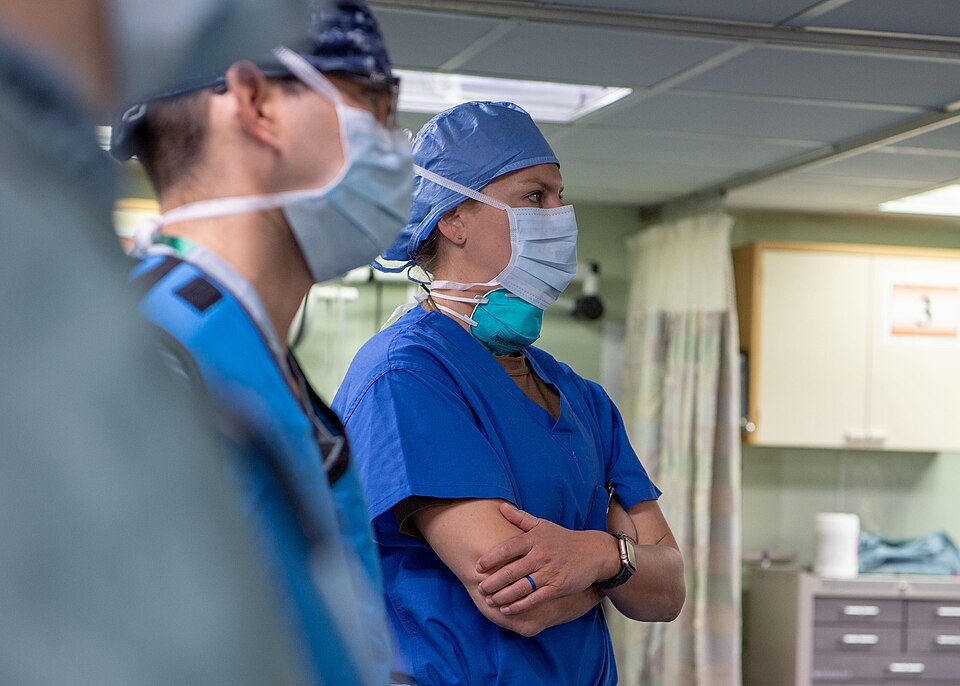

"Before we make the skin incision," the circulating nurse might announce, and then ask the room, "Does everyone agree that this is patient X, undergoing a right inguinal hernia repair?" The example is the **[World Health Organization](kloom:e/world-health-organization)**'s, from the manual for the **[WHO Surgical Safety Checklist](kloom:e/who-surgical-safety-checklist)**, a single page that the WHO's Safe Surgery Saves Lives program published in 2008 and revised in January 2009. The program was led by **[Atul Gawande](kloom:e/atul-gawande)**, a surgeon at Brigham and Women's Hospital in Boston. The page divides an operation into three pauses, and at each one somebody reads the questions aloud and somebody answers.

## Nineteen questions

The revised checklist asks nineteen things, in the order an operation meets them:

| Pause, and who must be present                                                    | What is confirmed aloud                                                                                                                                                                                                                                                                                                                                                                   |
| --------------------------------------------------------------------------------- | ----------------------------------------------------------------------------------------------------------------------------------------------------------------------------------------------------------------------------------------------------------------------------------------------------------------------------------------------------------------------------------------- |
| **Sign in**, before induction of anesthesia (nurse and anesthetist at least)      | The patient's identity, site, procedure and consent; the site marked; the anesthesia machine and medication check done; a pulse oximeter on and working; any known allergy; a difficult airway or risk of aspiration; a risk of losing more than 500 ml of blood (7 ml/kg in children), with two intravenous lines or central access and fluids planned                                   |
| **Time out**, before the skin incision (nurse, anesthetist and surgeon)           | Every member of the team introduced by name and role; the patient's name, the procedure and where the incision will be made; antibiotics given within the last 60 minutes; the surgeon's critical steps, length and expected blood loss; the anesthetist's concerns; the nurses' confirmation of sterility, with the indicator results, and of the equipment; essential imaging displayed |
| **Sign out**, before the patient leaves the room (nurse, anesthetist and surgeon) | The nurse confirms the name of the procedure, that the instrument, sponge and needle counts are complete, the specimen labels (read aloud, with the patient's name) and any equipment problems; then all three review the key concerns for the patient's recovery                                                                                                                         |

Each pause is meant to take no more than a minute. The time out rests on an American rule. In 2003 the **[Joint Commission](kloom:e/joint-commission)**, which accredits American hospitals, wrote a Universal Protocol for preventing wrong-site, wrong-procedure and wrong-person surgery, and from July 1, 2004 it was mandatory: the procedure verified before the patient reaches the room, the site marked, and a "time out" just before the incision in which the whole team confirms the patient, the site and the procedure. A rule did not end the error. In a survey of 1,050 hand surgeons, 21 percent said they had operated on the wrong site at least once, and in Pennsylvania, from 2004 to 2006, hospitals reported 427 wrong-site events, more than half of them caught as near misses; in 31 the time out had been done and had not stopped it.

## Who reads it

The manual asks for one person to run the checklist, the checklist coordinator, who "will often be a circulating nurse, but it can be any clinician". The coordinator "can and should prevent the team from progressing to the next phase of the operation until each step is satisfactorily addressed", and the manual admits that doing so "may alienate or irritate other team members". The manual leaves the choice to each hospital, but it names the circulating nurse first. The WHO's guidelines name "steep hierarchical structures in the operating room" among the causes of wrong-site surgery, where "persons who could prevent an error are reluctant to speak up". The introductions at the time out serve the same end: a team whose members know one another's names and roles is, the reasoning runs, one in which each is readier to raise a concern later. At the sign out it is the nurse who reports the count, and who reads each specimen's label aloud, since the WHO calls mislabeled specimens a frequent source of laboratory error.

The photograph shows one such briefing: Lieutenant Commander Amanda Kuczka, a perioperative nurse aboard the hospital ship _Mercy_, before an operation in April 2020.

## Eight hospitals, then Ontario

The checklist was tested in eight hospitals in eight cities, rich and poor: Toronto, New Delhi, Amman, Auckland, Manila, Ifakara in Tanzania, London and Seattle. Between October 2007 and September 2008 Alex Haynes, Gawande and their colleagues enrolled 3,733 patients before the checklist and 3,955 after it. In the _New England Journal of Medicine_ in January 2009 they reported that deaths fell from 1.5 to 0.8 percent and complications from 11.0 to 7.0 percent. All six safety steps they measured were done for 34.2 percent of patients before and 56.7 percent after; antibiotics on time rose from 56 to 83 percent. They wrote that the mechanism was "less clear", and that some of the gain might be the **[Hawthorne effect](kloom:e/hawthorne-effect)**, people doing better because they are watched.

| Study                                    | Patients before, after | Deaths before → after | Complications before → after |
| ---------------------------------------- | ---------------------- | --------------------- | ---------------------------- |
| 8H: eight hospitals (Haynes, 2009)       | 3,733, 3,955           | 1.5% → 0.8%           | 11.0% → 7.0%                 |
| ON: 101 Ontario hospitals (Urbach, 2014) | 109,341, 106,370       | 0.71% → 0.65%         | 3.86% → 3.82%                |

When a policy in Ontario encouraged every hospital to adopt a checklist, David Urbach and his colleagues compared three months before and after adoption at 101 hospitals. They found no significant change in deaths or complications. The two studies disagree. Later studies, as Wikipedia summarizes them, found that how a checklist arrives matters: one hospital where it "just appeared" in the operating rooms one day had trouble getting staff to use it, and others that succeeded credited a "local champion" who spent time and effort on it. The checklist itself says what it is not: "not intended to be comprehensive".

Its oldest question is the count, which the scrub and circulating nurses kept long before anyone printed it on a page. The trail began with the nurse whose hands the gloves were made for, in the frame on Caroline Hampton's gloves.
