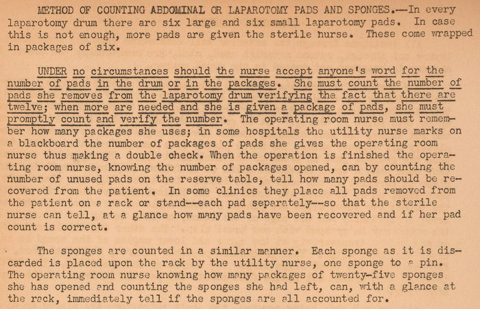
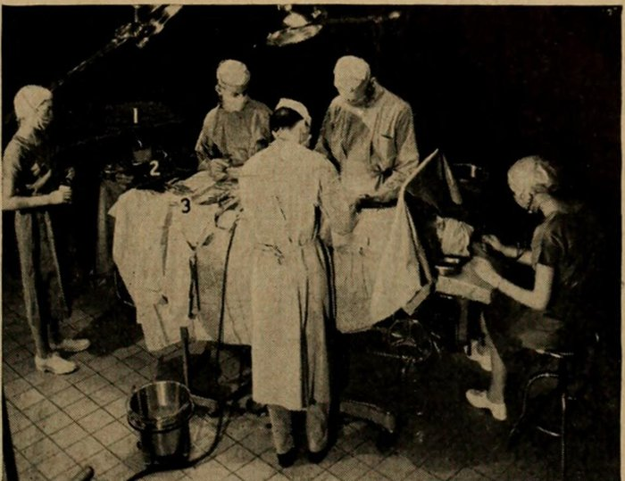

Every sponge that goes into a wound has to come out, and the only way to know is to count. A cotton sponge soaked in blood looks like the tissue around it, and one left behind becomes a **[gossypiboma](kloom:e/gossypiboma)**, from the Latin for cotton: a mass the body walls off, or an abscess, found weeks or years later. The count has long been the nurses' work, and the operating-room manuals of the 1940s and 1950s show how they kept it. In 1943 the Army's school for surgical technicians at **[Letterman General Hospital](kloom:e/letterman-army-hospital)** in San Francisco gave the rule in underlined type:

## A sponge to a pin

The Letterman method counted by subtraction. Every laparotomy drum held six large and six small pads, and every package of sponges twenty-five. The nurse counted each package herself as she opened it, and as each soiled sponge came off the field the utility nurse hung it on a rack, "one sponge to a pin". Packages opened, less sponges unused, had to equal the sponges on the rack. The United States Navy's _Handbook of the Hospital Corps_ of 1953, whose chapter on nursing was prepared by the **[Navy Nurse Corps](kloom:e/united-states-navy-nurse-corps)** under its director, Captain **[Winnie Gibson](kloom:e/winnie-gibson)**, an operating-room supervisor at Navy hospitals in the 1930s, with Lieutenant Elizabeth Feeney of the Corps on the editorial board, gave the same check to the circulating corpsman and the scrub corpsman together: before the peritoneum was closed, "the number of used sponges, the number the scrub corpsman still has must equal the total number of sponges placed in the operating room." If it did not, "the surgeon must be told and search instituted".

By 2009, when the World Health Organization's _Guidelines for Safe Surgery_ gathered the nursing associations' standards, among them those of the **[Association of periOperative Registered Nurses](kloom:e/association-of-perioperative-registered-nurses)**, the count had grown to sharps and instruments, and to four points in the operation:

| When                                            | What is counted                           |
| ----------------------------------------------- | ----------------------------------------- |
| Before the operation starts                     | Sponges, sharps, instruments, small items |
| Before a cavity within a cavity is closed       | Sponges and sharps                        |
| At the first layer of wound closure             | Sponges, sharps, instruments              |
| At skin closure                                 | Sponges and sharps                        |
| Whenever items are added, or the wound reopened | What was added; the closing count again   |

Two people count, usually the scrub and circulating nurses, looking at each item and saying it aloud together, sponges separated one by one, in a fixed order: the wound, the instrument stand, the back table, the discards. An interrupted count starts again. The result is announced to the surgeon, who acknowledges it, and written on a count sheet with the counters' names. If it does not reconcile, they recount, tell the surgeon and the operating-room supervisor, search the patient, the floor, the linen and the trash, and take an X-ray.

## Whose count?

The law asked whom to blame. In 1929 a surgeon at the Santa Clara County Hospital in California closed a gallbladder incision on a sponge; his patient, a cannery worker of thirty-four, died four months later. Neither nurse, Helen Vortman nor Clarisse Frost, who was in an operating room for the first time, had counted, yet the surgeons testified that the count was announced correct. In _Ales v. Ryan_ (1936) California's Supreme Court held that the surgeon's duty to remove the sponges "cannot be delegated to nurses". In 1949 Pennsylvania's Supreme Court called the surgeon the "captain of the ship", and some courts grew the phrase into a rule that made him answer for his whole team. Texas refused. In _Sparger v. Worley Hospital_ (1977) a jury found that the scrub nurse, Wanda Ensey, and the circulating nurse, Marjie Holland, had made a wrong count, following their hospital's manual rather than the surgeon's orders, and the Texas Supreme Court called the captain-of-the-ship doctrine "a false special rule of agency": the hospital, their employer, was liable. As the court's own list of cases showed, the states' courts did not agree on whose count it was.

## When the count says correct

In 2003 **[Atul Gawande](kloom:e/atul-gawande)** and his colleagues studied the malpractice claims of 54 patients in Massachusetts with 61 retained objects, 69 percent of them sponges, and put the rate at one in 8,801 to 18,760 inpatient operations. Thirty-seven patients needed another operation and one died. Where a count had been done, 88 percent of the final counts had been called correct.

| Risk factor (Gawande, 2003)       | Risk ratio | 95% interval |
| --------------------------------- | ---------- | ------------ |
| Emergency operation               | 8.8        | 2.4–31.9     |
| Unplanned change in the operation | 4.1        | 1.4–12.4     |
| Each unit of body-mass index      | 1.1        | 1.0–1.2      |

A study of 153,263 operations published in 2008 found that a wrong final count caught 77 percent of retained items, but only 1.6 percent of wrong counts meant an item was really inside.

## Thread, bar code and radio

The backstop is the X-ray, and it needs a sponge that shows. In 1941 Captain Edward F. Lewison of the Army's **[Walter Reed General Hospital](kloom:e/walter-reed-army-medical-center)** proposed that all surgical gauze carry "a single strand of lead 'fiberglas' thread", listing metal rings, wire and chemical impregnation among the markers already tried. Wikipedia dates radiopaque threads in American gauze to 1929 and their general use to about 1940; Lewison, a year later, was still arguing for them. Bar-coded sponges, scanned in and out, found 32 discrepancies to the hand count's 13 in a trial of 300 operations published in 2008, though counting took 5.3 minutes rather than 2.4. A sponge carrying a **[radio-frequency identification](kloom:e/radio-frequency-identification)** tag can be found with a wand passed over the wound: in a test at Stanford in 2006, all 28 tagged sponges, in under three seconds on average. Each backs up the two nurses; none replaces them. At the end of every operation the surgical safety checklist asks for the count once more.
