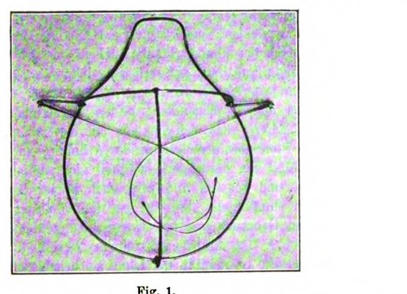
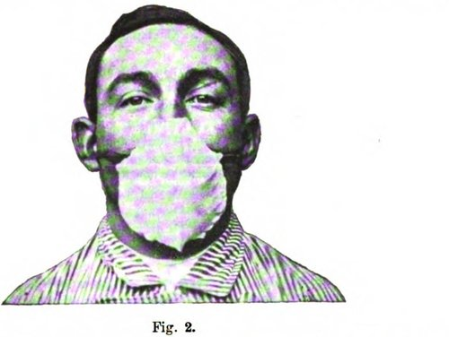

By the summer of 1897 the surgeons at the university clinic in Breslau, now Wrocław, were operating with a veil of gauze over the mouth and beard. Their chief, **[Jan Mikulicz-Radecki](kloom:e/jan-mikulicz-radecki)**, had been working to make aseptic surgery truly germ-free, and a colleague at the university's Institute of Hygiene had found a new gap. **[Carl Flügge](kloom:e/carl-flugge)**, studying how **[tuberculosis](kloom:e/tuberculosis)** spread, showed that talking, coughing and sneezing throw out fine droplets of saliva that carry living bacteria, and that the slightest draft carries them across a room. Mikulicz's clinic already kept talk to a minimum. "In Breslau we have the habit of almost not speaking at all during surgery," he wrote; "the necessary communication is done through hand signals." But a word had to be said now and then, so he tied gauze over it, and wrote in 1897 that they now breathed through it "as easily as a lady who wears a veil in the street". It was the first **[surgical mask](kloom:e/surgical-mask)**.

## Counting what speech throws out

Flügge's paper of 1897, "Ueber Luftinfection", found that after every rather loud and lively speech, agar plates several meters away were covered with colonies, as Mikulicz's assistant Wilhelm Hübener summarized it. His laboratory traced droplets with _Bacillus prodigiosus_, now called **[_Serratia marcescens_](kloom:e/serratia-marcescens)**, whose colonies are bright red and easy to tell from anything that falls out of the air. Hübener used the same tracer in 1898 to test the veil, and set out his method precisely:

| Step | What Hübener did                                                                                                       |
| ---- | ---------------------------------------------------------------------------------------------------------------------- |
| 1    | Rinsed and gargled with a fresh suspension of the bacillus, one loop of culture to 2 ml of tap water, wetting the lips |
| 2    | Set four agar plates about 50 cm below the mouth, numbered from the nearest                                            |
| 3    | Bent the head a little over them, moving it as at an operation                                                         |
| 4    | Counted aloud for exactly ten minutes, to about 550 in an ordinary voice, each test in a fresh room                    |
| 5    | Covered the plates, grew them and counted every red colony                                                             |
| 6    | Spat on a control plate afterwards, to show the mouth was still full of bacilli                                        |

A fresh room mattered because Flügge had found droplets hanging in the air for five hours. Whispering threw out the fewest bacilli and a loud voice the most. The first veils, a single layer of fine gauze tied to the sterilized linen cap with ribbons, slipped off the nose, tickled it, and soaked with saliva. Hübener's answer was the mask in the photographs: a light wire frame after Friedrich von Esmarch's chloroform mask, with two spectacle earpieces, covered with two layers of fine absorbent gauze sewn on, resting on the bridge of the nose and round the chin. It stood off the lips on purpose: gauze pressed against them became a reservoir of saliva that every breath blew out again. Denser cloth made breathing too hard. The frame, earpieces and all, was of a nickel alloy that did not rust, so the whole mask went into the steam, and the clinic had used it for six months.

| Ten minutes' counting, ordinary voice | No mask | One layer | Two layers |
| ------------------------------------- | ------- | --------- | ---------- |
| Hübener, table VII                    | 362     | 20        | 0          |
| Hübener, table VIII                   | 679     | 42        | 0          |

The sources disagree on one quotation. Bruno Strasser and Thomas Schlich, writing in 2020, gave Mikulicz the description of "a piece of gauze tied by two strings to the cap, and sweeping across the face so as to cover the nose and mouth and beard". Their fuller article of 2022 gives those words to the American surgeon **[William Williams Keen](kloom:e/william-williams-keen)**, to whom Mikulicz sent a mask with a pair of gloves in 1898. We follow the later article.

## Into every operating room

Paul Berger began wearing a mask in Paris the same year. Not everyone was persuaded: Alexander Fraenkel, reporting on the German surgeons' congress of 1898, mocked "a whole surgical costume with a bonnet, mouth mask and veil". In Chicago in 1905 **[Alice Hamilton](kloom:e/alice-hamilton)** found streptococci in droplets and concluded that surgeons and nurses should wear masks. A study of operating-room photographs from 1863 to 1969 put the even chance of a surgeon wearing a cap in 1900, gloves in 1907 and a mask in 1916; for whoever gave the anesthetic, the mask came in 1932. Gauze masks were washed, sterilized and worn again for decades; paper ones appeared in the 1930s, and in the 1960s disposable masks of synthetic fiber replaced the washable kind.

## The evidence

Whether the mask protects the patient has been tested surprisingly little. In 1981 N. W. Orr reported that one operating theater had gone six months without masks and wound infections had not risen. A trial in 41 gynecological operations in 1984 found infections in three of five unmasked major cases and none of four masked ones, too few to settle anything. In Sweden the surgeon T. G. Tunevall assigned 115 weeks at random to masked or unmasked general surgery: 73 infections after 1,537 masked operations, 4.7 percent, and 55 after 1,551 unmasked, 3.5 percent, no significant difference. A **[Cochrane](kloom:e/cochrane-organisation)** review of 2016 found three trials with 2,106 patients and called the effect on clean surgery unclear. Masks, Tunevall concluded, may still protect the team from drops of infected blood.

## In the scrub nurse's day

The texts made the mask a fixed step. The Navy's handbook of 1939 sterilized caps and masks in muslin wrappers against "dandruff or secretions from the mouth and nose"; the Army's scrub chart of 1943 began "Put on cap and mask"; by 1959 the Navy called them clean rather than sterile, put on before the scrub. The Army's later course for operating-room specialists still says what Breslau said: talk as little as possible, change the mask as often as necessary, and never let it become wet. The habit of hand signals behind it belongs to the next frame, at the instrument table.
