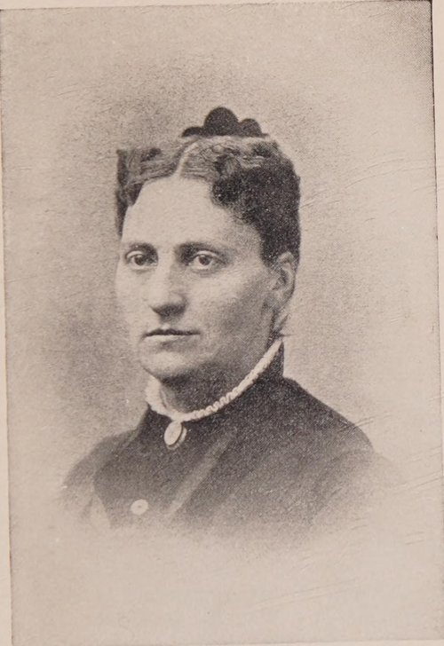
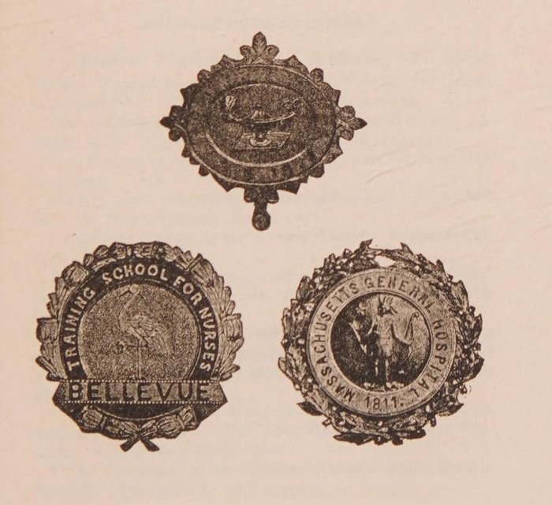

In 1873 three American hospitals opened schools to train nurses on the model **[Florence Nightingale](kloom:e/florence-nightingale)** had set up at St Thomas' in London: **[Bellevue](kloom:e/bellevue-hospital)** in New York on 1 May, the Connecticut Training School at the State Hospital in New Haven on 1 October, and the Boston Training School at **[Massachusetts General Hospital](kloom:e/massachusetts-general-hospital)** on 1 November. Each was the work of a committee of women and their allies, not of a hospital board. At Bellevue, the city's pauper hospital, the visiting committee of Louisa Lee Schuyler's State Charities Aid Association had seen the filth of the wards, asked the commissioners for six wards to nurse, raised $23,000 in six weeks and hired an English sister of the All Saints order, Sister Helen, to run them. A smaller school was already a year old. The **[New England Hospital for Women and Children](kloom:e/new-england-hospital-for-women-and-children)** in Boston, a hospital run by women physicians, had opened its training school in September 1872, and the first of its five pupils to enroll, and so the first to finish, was **[Linda Richards](kloom:e/linda-richards)**.

## The course

The New England Hospital's annual report, as the historians Adelaide Nutting and Lavinia Dock quote it, set out what a pupil got for her year:

| The announcement | What it promised                                                                                        |
| ---------------- | ------------------------------------------------------------------------------------------------------- |
| Length           | One year, in four periods of three months: medical, surgical and maternity wards, and nights            |
| On the ward      | The pupil "will aid the head nurse in all the care and work of the ward"                                |
| Pay              | One to four dollars a week after the first fortnight, "according to the actual value of their services" |
| Lectures         | A winter course by the hospital's physicians                                                            |
| At the end       | A certificate for a satisfactory year                                                                   |

Richards's own account, written in 1911, fills in the day. The pupils rose at 5.30 and left the wards at 9 at night; each nurse had a ward of six patients "both day and night", and slept in a little room between the wards, and "many a time I have got up nine times in the night." Every second week she had one afternoon off, from two to five. There were twelve lectures in the year. The only bedside teaching came from the young women interns, who taught the pupils "to read and register temperature, to count the pulse and respiration." There were no textbooks and no examinations, and the medicine bottles were numbered, not labeled, so that the nurses would not know what they gave.

Bellevue asked more. Its pupils trained for a year and then served a second year under contract before they received a certificate, so the course was in practice two years. Class teaching began only in the autumn of 1874. The managers had written that "a uniform, however simple, is indispensable", but the first pupils resisted one until a probationer from an old New York family came back from leave in a grey-blue stripe with a white apron and cap, and the rest followed. In New Haven the committee brought in caps when a pupil came to breakfast with her long hair curled down her back.

## Writing it down

In October 1873 Richards went to Bellevue as night superintendent, with a hundred patients in five wards. Orders passed from the day nurses to her and on to the night nurses by word of mouth, and back again in the morning. When she wrote up the notes of one case, as Sister Helen required of each pupil, the physician of the division found them and asked her to write reports on all his serious cases; the written day and night report followed through the hospital. In her own telling, this was "the beginning in Bellevue" of a custom. Later accounts, Wikipedia's among them, make her the creator of the first system of individual patient records, a larger claim than she made. In 1874 she took over the failing school at Massachusetts General, where the trustees gave it a year to prove that trained nurses were better than untrained ones, and she did it, she said, by taking every serious case at night herself.

## The bargain

The schools spread because they paid. The managers of the first three relied, as Nutting and Dock put it, "almost entirely on the service given in exchange for training": the pupils were the nursing staff, and graduates left to earn their living in private duty. Any hospital could staff its wards with pupils, and by the Bureau of Education's count the schools grew from 15 in 1880 to 432 in 1899–1900 and 1,755 in 1919–20.

| Year      | Schools | Pupils |
| --------- | ------: | -----: |
| 1880      |      15 |    323 |
| 1889–90   |      35 |  1,552 |
| 1899–1900 |     432 | 11,164 |
| 1909–10   |   1,129 | 32,636 |
| 1919–20   |   1,755 | 54,953 |

The cost fell on the pupils. When Nutting surveyed 111 schools in 1890, nearly two-thirds kept them on day duty ten hours or more, and night duty was twelve hours in 70 percent of them and longer in the rest. The historian Bonnie Bullough's verdict is that students "quickly demonstrated themselves to be a lucrative source of cheap labor". What a graduate took away was a diploma and a badge of her school, like the three Nutting and Dock printed in 1907: Bellevue's with a wading bird, Massachusetts General's with the hospital's seal.

The plate draws two six-bed wards with the nurse's room between them, and the day Richards kept on its dial. Who could enter a school at all was decided school by school: **[Mary Eliza Mahoney](kloom:e/mary-eliza-mahoney)** graduated from the New England Hospital in 1879, and the trail _Who was let in_ follows who could become a nurse. The next frame on the spine leaves the hospital for the tenements, with Lillian Wald.
