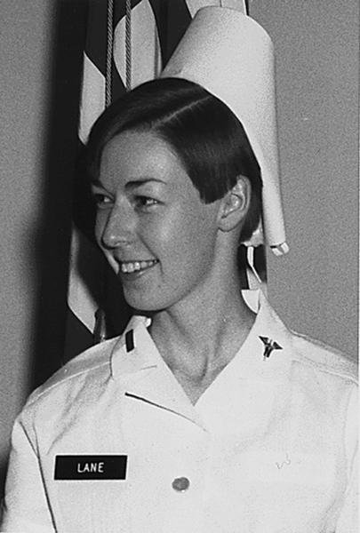

In March 1962 thirteen Army nurses arrived at Nha Trang with the 8th Field Hospital, for three years the only Army hospital in South Vietnam. By January 1969 there were about 900, and when the last of them left on 29 March 1973 more than five thousand had served in the **[Vietnam War](kloom:e/vietnam-war)**. The official history of the Army's medical support there, written by **[Spurgeon Neel](kloom:e/spurgeon-neel)**, says that 60 percent of them had less than six months of active duty when they arrived, and that the operating-room course at home was cut from 22 weeks to 16 to train them faster. Men had been commissioned in the **[Army Nurse Corps](kloom:e/united-states-army-nurse-corps)** since 1955, and half of the men who went were nurse anesthetists, operating-room nurses or psychiatric nurses. Navy nurses worked at the Navy's hospitals in Saigon and Da Nang and aboard the hospital ships **[_Repose_](kloom:e/uss-repose-ah-16)** and _Sanctuary_, twenty-nine to a ship, whose story belongs to the Navy trail's frame on the hospital ship Repose.

## From the field to the table

The war's hospitals were reached by air. At the peak of the fighting in 1968 the Army had 116 air ambulances, the **[dust-off](kloom:e/casualty-evacuation)** helicopters, each able to carry six to nine patients. Neel gives the average flight as about 35 minutes; the more seriously wounded usually reached a hospital within one to two hours of being hit, and 97.5 percent of the wounded who reached a hospital survived. Helicopters brought men who would once have died on the way, so the hospitals' own death rate, 2.6 percent from 1965 to 1970, was a little above Korea's 2.5.

The report of the 12th Evacuation Hospital at Cu Chi for 1970 shows how the work was staffed. It had 63 nurses. Its emergency room, "the busiest service in the hospital", was staffed by five nurses, eight enlisted medical specialists and seven litter bearers, with the doctors; between January and November it saw 12,559 patients, 4,787 of them wounded in action, and its staff inserted 244 chest tubes and performed 128 cutdowns, opening a vein to run in fluid and blood. The chief of surgery acted as triage officer. The five-room operating suite was run by five nurse anesthetists, ten operating-room nurses and thirteen enlisted operating-room specialists; four rooms worked by day and two or three at night, and in an emergency the staff could keep three going around the clock for five to seven days. Between January and mid-November the hospital transfused 11,097 units of whole blood. Nurses also rode the helicopters with the critically ill when they were moved to other hospitals, and three nurses with an interpreter taught Vietnamese civilians on a thirty-bed ward to care for their own tracheostomy tubes and feeding tubes.

## Triage

The war's lessons went into the first American revision of the NATO handbook _Emergency War Surgery_, in 1975. The triage area was to sit beside the helicopter pad and close to the operating rooms, open enough for the triage officer "to see the whole situation at a glance from one place", with a litter frame for every stretcher and a bottle of intravenous fluid already hanging over each. The handbook's order of operation:

| Priority | Wounds                                                                                               |
| -------- | ---------------------------------------------------------------------------------------------------- |
| First    | blocked airways, sucking chest wounds; shock from bleeding, outside or within; burns over 20 percent |
| Second   | wounds of the gut and other organs; vessels needing repair; head injuries with consciousness failing |
| Third    | spinal and brain injuries needing decompression; lesser fractures; eyes; smaller burns               |

In Vietnam, it says, no patient was at once considered beyond saving; after evaluation, only "the most severe head wounds" were. Neel writes that 20 to 30 percent of the penetrating head wounds brought in from the field were classed as _expectant_, cases for which little could have been done.

## Sharon Lane

**[Sharon Lane](kloom:e/sharon-ann-lane)** graduated from the Aultman Hospital School of Nursing in Canton, Ohio, in 1965, joined the Army Nurse Corps Reserve in April 1968, and reached Vietnam on 24 April 1969. She was posted to the 312th Evacuation Hospital at Chu Lai, a reserve unit, and nursed on its intensive care ward and its ward for Vietnamese patients. On 8 June 1969 a rocket struck between the huts of the Vietnamese ward and killed her, and a Vietnamese child with her. She was 25. She was the only Army nurse killed by enemy fire in the war; nine Army nurses died in Vietnam, among them Carol Drazba and Elizabeth Jones in a helicopter crash near Saigon in 1966, and Eleanor Alexander, Jerome Olmstead, Hedwig Orlowski and Kenneth Shoemaker in a plane crash near Qui Nhon in 1967.

## What they carried home

The women who came back were not studied for a long time. The Health of Vietnam-Era Women's Study surveyed 8,742 women veterans in 2011 and 2012, and in its abstract reports a lifetime prevalence of **[post-traumatic stress disorder](kloom:e/post-traumatic-stress-disorder)** of 20.1 percent among those who had served in Vietnam, against 14.1 percent among those who served at home, and 15.9 against 9.1 percent still with it. Most of the difference went with what they had lived through, in the authors' reading, especially sexual discrimination or harassment and the pressure to perform. On Veterans Day 1993 the **[Vietnam Women's Memorial](kloom:e/vietnam-womens-memorial)** was dedicated near the Wall in Washington: Glenna Goodacre's bronze of three women in uniform with a wounded soldier, raised through a campaign begun in 1984 by a former Army nurse, Diane Carlson Evans.

The main spine now goes back to 1873 and the first American training schools, in the next segment, The modern profession.
