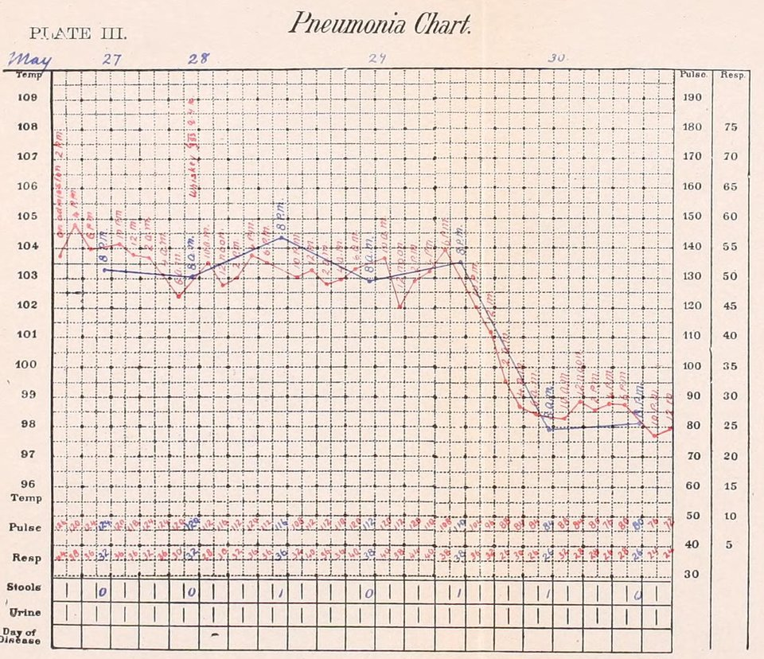

In 1868 **[Carl Wunderlich](kloom:e/carl-reinhold-august-wunderlich)**, professor of medicine at Leipzig and head of its university hospital, published _Das Verhalten der Eigenwärme in Krankheiten_, "the behaviour of the body's own heat in disease". For years no patient had entered his wards without having his temperature taken, at first twice a day and later four to six times in fevers. By the second edition, translated into English in 1871 as _On the Temperature in Diseases_, he counted nearly 25,000 patients and "some millions" of single readings. (Wikipedia's article on the medical thermometer has "more than one million"; his own words are vaguer and larger.) From them he drew a rule: the healthy body keeps "an almost identical temperature", about 37 °C, 98.6 °F, "in the well-closed axilla", varying by about half a degree over the day, and any armpit reading above 37.5 °C was "always very suspicious". Fever was not a disease but a sign, and its course, written down, could be read.

## Who held the thermometer

Wunderlich's instrument was about a foot long, and in the armpit the mercury seldom settled in less than ten minutes, more often a quarter of an hour. He described his ward round: thermometers placed in every patient's armpit, and after about twenty minutes "a clinical assistant, or an intelligent nurse or wardsman" went round and noted each reading, five minutes before the doctor read them again himself. Twenty beds took under an hour. He wrote that a trustworthy attendant "without any special medical knowledge" often made fewer errors than many medical men. In 1867 **[Clifford Allbutt](kloom:e/clifford-allbutt)**, a physician at Leeds, designed a **[clinical thermometer](kloom:e/medical-thermometer)** about six inches long that registered in some five minutes and went in a pocket. With it the temperature became something a nurse could take at every bedside, several times a day.

By 1906 it was hers to take. **[Isabel Hampton Robb](kloom:e/isabel-hampton-robb)**, who had been superintendent of nurses at the Johns Hopkins Hospital from 1889, set out the method in _Nursing: Its Principles and Practice_ under "Temperature, Pulse, Respiration", the three **[vital signs](kloom:e/vital-signs)** still abbreviated TPR:

| Step             | Robb's instruction (1906)                                                                                                        |
| ---------------- | -------------------------------------------------------------------------------------------------------------------------------- |
| Prepare          | Shake the mercury down below 95 °F; test each thermometer often against one of known accuracy                                    |
| By mouth (usual) | Under the tongue, lips closed, breathing through the nose, not biting; three to five minutes; not just after a hot or cold drink |
| By armpit        | Wipe it dry; arm held to the side, elbow bent, hand on the opposite collarbone; one to three tenths lower than the mouth         |
| By rectum        | Bulb oiled, about one and a half inches; the most accurate, and the only reliable way for children                               |
| Between patients | Soak three minutes in 1:1,000 bichloride of mercury, rinse in clean water                                                        |
| Pulse            | Index and middle fingers on the radial artery; count for half a minute; men 60–70, women 65–80, children 90–120                  |
| Respiration      | Count without the patient knowing; adult about 18 a minute, child 20–24; over 40 is grave                                        |
| Record           | Say where the temperature was taken; a question mark after any doubtful reading; report at once anything above 103 °F            |

Temperature was taken at least twice a day, more often in fever, and in a hospital one nurse at a time was "set apart to take temperatures and pulse-rates and record the same for the whole ward".

## The chart

Robb's charts put a small dot for each reading on a grid, joined by light, even lines, the night and morning readings in one ink and those between in another, with the pulse and respiration counts written along the foot. The joined dots make what she called the temperature curve, "often so characteristic as to be of distinct assistance in diagnosis". Her specimen chart of pneumonia shows a fever held near 103 to 104 °F for days and then, within about half a day, the crisis: a fall to normal, pulse falling with it. A typhoid fever came down by lysis, gradually, over days.

## Was 98.6 right?

In 1992 Philip Mackowiak and two colleagues at Baltimore tested Wunderlich's axioms on 148 healthy adults, taking their temperatures by mouth with an electronic thermometer up to four times a day for three days. The mean was 36.8 °C (98.2 °F), not 37.0 °C, and the upper limit of normal 37.7 °C (99.9 °F), not 38.0 °C. They confirmed his daily rhythm: lowest about 6 a.m., highest about 4 to 6 p.m., swinging about half a degree. Their figures came from the mouth and his from the armpit, which Robb put a few tenths lower, so the two cannot be compared directly, but the authors concluded that 98.6 °F "should be abandoned as a concept relevant to clinical thermometry". English thermometers of 1871 had their own idea: their translator noted that most marked normal with an arrow at 98.4 °F.

The fourth vital sign came later. **[Blood pressure](kloom:e/blood-pressure)** had been measured in a living animal by Stephen Hales in the early eighteenth century, with a glass tube in a mare's artery. At the bedside it waited for **[Scipione Riva-Rocci](kloom:e/scipione-riva-rocci)**'s arm cuff and mercury column of 1896, which Harvey Cushing brought to the United States in 1901, and for **[Nikolai Korotkov](kloom:e/nikolai-korotkov)**'s report in 1905 of the sounds heard below the cuff. Robb's chapter of 1906 does not yet ask the nurse to take it. The next segment goes back to 1846, to the operating room.
