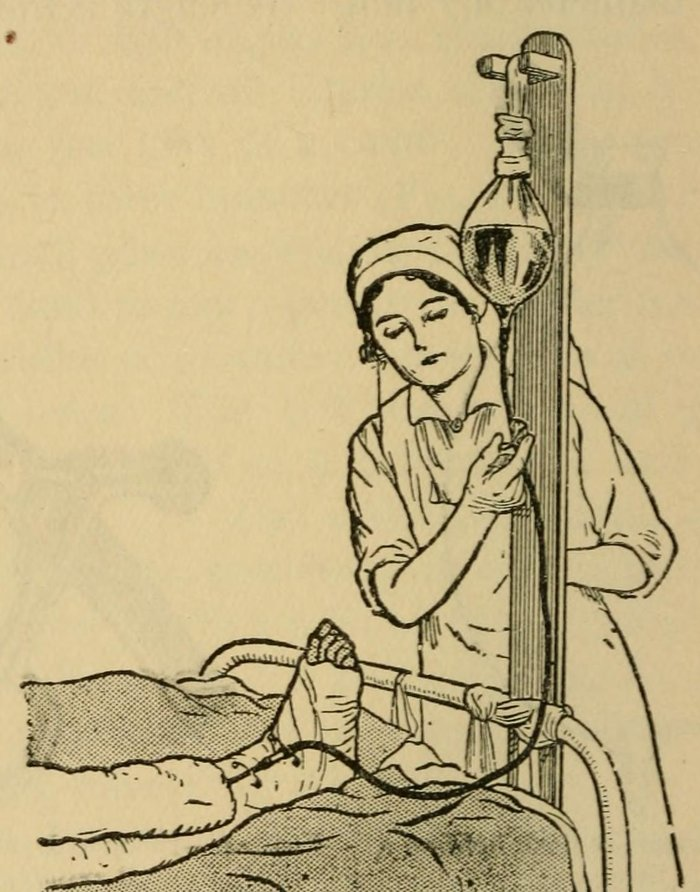

When the United States declared war on Germany in April 1917, the **[Army Nurse Corps](kloom:e/united-states-army-nurse-corps)** had 403 nurses. At its peak, in November 1918, it had 21,480, and 10,066 of them served overseas with the American Expeditionary Forces in **[World War I](kloom:e/world-war-i)**, nursing at a ratio of one nurse to ten beds. The **Navy Nurse Corps** grew from a few hundred to about 1,500. Most of these women did not come from the Army or the Navy. Of the Army's 21,480, 17,931 were enrolled nurses of the **[American Red Cross](kloom:e/american-red-cross)**, and two-thirds of the Navy's were too.

## The reserve

That they could be called at all was the work of **[Jane Delano](kloom:e/jane-delano)**. She became superintendent of the Army Nurse Corps in 1909 and, the same year, chairman of the new National Committee on Red Cross Nursing Service. In 1912 she resigned from the Army so that she might give her time, she wrote, "to the development and maintenance of an efficient reserve of Red Cross nurses for the service of the Army." The rule she drafted, printed in the Army's medical manual of 1916, made it so: "The enrolled nurses of the American National Red Cross Nursing Service will constitute the reserve of the Army Nurse Corps, and in time of war or other emergency may with their own consent be assigned to active duty in the Military Establishment." In all, the Red Cross assigned 18,989 of its nurses to the Army and Navy.

The Red Cross also organized base hospitals inside American hospitals and medical schools, each with its own surgeons, nurses and enlisted men, ready to sail as a unit. The plan began at 500 beds and 50 nurses and grew to 1,000 beds and 100 nurses. Delano went to France in the winter after the Armistice to inspect the nursing, fell ill on her rounds with an infection behind the ear, and died after several operations at the Savenay hospital center on 15 April 1919.

## A hospital at Rouen

Base Hospital No. 21, from Washington University in St. Louis, sailed on 19 May 1917 and took over a British general hospital at Rouen: a racecourse covered with rows of tents, each holding about 14 beds. Its chief nurse, **[Julia Stimson](kloom:e/julia-catherine-stimson)**, wrote home often, and her letters were published in 1918. In June a new night nurse was "responsible for 90 men", and one night 64 men, most of them stretcher cases, were brought in, given soup and carried to their tents in 25 minutes. In late July 1917 the wards filled with men burned under their clothing, worst where the skin was moist with sweat; "the men say it is oil of mustard." One man coughed in paroxysms "every minute and a half by the clock" until the nurses rigged a croup tent over him and kept steam coming from a kettle on a stove they held in their hands. One day that week "many of the nurses have worked 14 straight hours."

Nurses also went forward, in surgical teams lent to British casualty clearing stations. At No. 61, in Belgium, a bomb fragment from a night raid on 17 August 1917 cost Beatrice MacDonald of Base Hospital No. 2 an eye; the Red Cross's history calls her the first American nurse wounded in the war. Stimson went on to direct the nursing service of the whole Expeditionary Forces, and was superintendent of the Army Nurse Corps from 1919 to 1937.

## Dakin's solution, every two hours

The wounds that reached Rouen were often infected, and X-ray plates showed the bubbles of gas gangrene. Stimson's surgeons used the method of the French surgeon **[Alexis Carrel](kloom:e/alexis-carrel)** and the British chemist Henry Dakin, who washed wounds with **[Dakin's solution](kloom:e/dakins-solution)**, and by March 1918 she was using Carrel tubing "by the mile". The manual Carrel wrote with G. Dehelly in 1917 sets out the nurse's part:

| Step | What was done                                                                                                     |
| ---- | ----------------------------------------------------------------------------------------------------------------- |
| 1    | The solution: Dakin's, sodium hypochlorite at 0.45 to 0.5 percent; weaker does not act, stronger irritates        |
| 2    | A one-litre flask on a wooden standard at the bed, 50 cm to 1 m above it, with a pinchcock on its tube            |
| 3    | Red rubber tubes, 4 mm bore, closed at the end and pierced with small holes, laid into every recess of the wound  |
| 4    | Every two hours, the nurse at the foot of the bed presses the pinchcock for a few seconds: 20 to 100 cc each time |
| 5    | A smear from the wound counted under the microscope and charted daily as microbes over fields seen                |
| 6    | When there are none, or one in five or six fields, the surgeon is told the wound may be closed                    |

The manual warns what goes wrong: instillations skipped or spaced out through the night, a tube blocked in a narrow track, a patient soaked by too much liquid. The nurse, it says, "must learn how to regulate the quantity of liquid".

## The dead

The first deaths came before Rouen. On 20 May 1917, the day after Base Hospital No. 12 sailed in the SS _Mongolia_, a shell burst during gun drill. Edith Ayres and Helen Wood were killed (instantly, a nurse of the unit wrote; on the next day, by the Army's history), and Emma Matzen was wounded. The Army's history says no nurse was killed by the enemy. The **[Spanish flu](kloom:e/spanish-flu)** did what the enemy did not:

| 1918 | Jan | Feb | Mar | Apr | May | Jun | Jul | Aug | Sep | Oct | Nov | Dec |
| ---- | --: | --: | --: | --: | --: | --: | --: | --: | --: | --: | --: | --: |
| Died |   3 |   1 |   0 |   0 |   1 |   3 |   2 |   1 |   8 |  41 |  12 |   4 |

With 4 in 1917 and 22 in 1919, by our arithmetic 102 Army nurses died overseas by June 1919, and the Army counted 134 more deaths at home by the Armistice, most of influenza and pneumonia. Nineteen Navy nurses died, over half of influenza. The Navy gave the Navy Cross to four nurses: posthumously to Marie Louise Hidell, Lillian Murphy and Edna Place, and to the superintendent, Lenah Higbee, the first living woman to receive it.

The next war began for the nurses on a Sunday morning, in a Hawaiian harbor.
