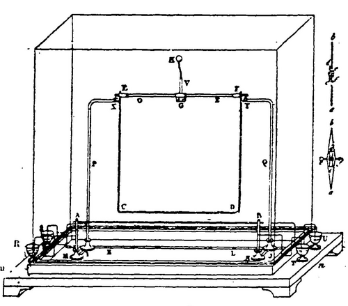

When the news of Ørsted's compass needle reached the [Academy of Sciences](kloom:e/french-academy-of-sciences)
in Paris in September 1820, most of its members did not believe it. **[André-Marie
Ampère](kloom:e/andre-marie-ampere)** did. He was forty-five, a professor of mathematics at the École
Polytechnique, self-taught from his father's library in Lyon, and known
until then for work on probability, partial differential equations and
chemistry. Within three weeks he had founded a new science, and within six
years he had given it a mathematical theory so finished that Maxwell called
him "the Newton of electricity".

## Three weeks in September

[François Arago](kloom:e/francois-arago) reported Ørsted's experiment to the Academy on 4
September by one account, the _Dictionary of Scientific Biography_'s, and
on 11 September by others. Ampère read his first paper on the subject on 18 September.
On the 25th he showed something Ørsted had not: two wires carrying
currents act on each other. When the currents run the same way the wires
attract; when they run opposite ways the wires repel. He announced at the
same meeting that two coils of wire, which he later named _solenoids_, attract
and repel like two magnets.

It was not the obvious next step, and he said why. A current acts on a
magnet, but so does a bar of soft iron, and two bars of soft iron do not act
on each other; so nothing in Ørsted's result required that two currents
should. He tried it, and they did.

The apparatus is in his first memoir. One wire is fixed; the other is part
of a rectangle hung from a glass axis on fine steel points, resting in cups
of mercury that carry the current, under a glass case to keep off
draughts. The two stay parallel, and the hanging one swings towards the
fixed one or away from it. The top half of the plate draws the same pair
end-on, each wire ringed by its own magnetic circles.

## Currents inside magnets

If currents act like magnets, Ampère argued, magnets might be currents. His
first idea was that a bar magnet carries currents circling its axis.
**[Augustin Fresnel](kloom:e/augustin-jean-fresnel)**, his friend and the maker of the wave theory of light,
objected that iron conducts poorly and such currents would heat the magnet,
and suggested instead a tiny current round each molecule. Ampère took the
idea at once. Lined up, the molecular currents cancel where neighbours
touch and add up round the edge, as the lower half of the plate draws. The
_electrodynamic molecule_ was a hypothesis with nothing to show for it, and
Faraday among others distrusted it for that reason.

It was tested ninety years later. In 1915 Albert Einstein and Wander de
Haas reversed the magnetism of a hanging iron bar and measured the twist it
gave the bar, the **[Einstein–de Haas effect](kloom:e/einstein-de-haas-effect)**, and published the result as "experimental proof of the
existence of Ampère's molecular currents". Their number fitted charges
circling in orbits, to within 3 per cent. It was wrong: later experiments,
by 1918, found about twice the ratio, a g-factor close to 2, which was
explained only after the electron was found in 1925 to have a _spin_.
Iron's magnetism comes chiefly from that, not from anything going round.

## The Mémoire

Between 1821 and 1825 Ampère turned his results into a law of force between
any two short elements of current. He found it with _null_ experiments, in
which a free wire stays where it is because two forces on it cancel, and
which can be judged far more exactly than a force can be measured. His great memoir, the _Mémoire sur la théorie mathématique des
phénomènes électrodynamiques, uniquement déduite de l'expérience_,
"deduced from experiment alone", gave the name _electrodynamics_ to the
subject. The sources date it 1825, 1826 or 1827, between the reading of
its parts and their printing; at its end
Ampère mentions that he had not actually performed the fourth of its four
experiments.

Maxwell admired it and doubted its story. "The whole, theory and
experiment, seems as if it had leaped, full grown and full armed, from the
brain of the 'Newton of electricity'," he wrote in 1873, but "we can
scarcely believe that Ampère really discovered the law of action by means
of the experiments which he describes." And it was Newtonian in the deeper
sense: a force acting at a distance along the line between two elements,
with explanations by an aether set aside, which is the view the rest of this trail takes apart. For
a closed circuit it agrees with the form taught today; between two isolated
elements they differ, and no experiment with closed circuits can tell
them apart.

## A unit made from his experiment

An international congress in Paris in 1881 gave his name to the unit of
current. In 1946 the International Committee for Weights and Measures
defined the [ampere](kloom:e/ampere) by his experiment, and the General Conference ratified
it in 1948:

| From | The ampere is the current that…                                              |
| ---- | ---------------------------------------------------------------------------- |
| 1948 | in two long parallel wires 1 metre apart pulls them together at 2 × 10⁻⁷ N/m |
| 2019 | carries 10¹⁹ ÷ 1.602176634 elementary charges past a point each second       |

The wire definition fixed the magnetic constant exactly but was hard to
realise, and laboratories came to keep the ampere through quantum
electrical standards instead. Since 20 May 2019 the ampere has been
defined by fixing the elementary charge, _e_ = 1.602176634 × 10⁻¹⁹
coulomb: about 6.24 × 10¹⁸ charges a second. Ampère's parallel wires are
no longer in the definition; his name is.

The man who could not follow Ampère's mathematics, and did not believe in
forces across empty space, is the trail's next frame: Faraday and his
lines of force.
