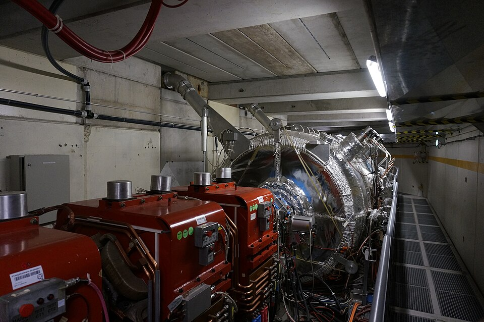

In 1928 **[Paul Dirac](kloom:e/paul-dirac)**, at Cambridge, wrote down an equation for the
electron that obeyed both quantum mechanics and special relativity. The
**[Dirac equation](kloom:e/dirac-equation)** explained the electron's spin, and it had a flaw that
would not go away: for every solution with positive energy there was one
with negative energy. Quantum mechanics does not let such states be
ignored. An ordinary electron ought to fall into them, giving off light,
and every atom should collapse.

## A hole in a full sea

Dirac's answer, published in 1930, was that the negative-energy states
are already full. By Pauli's exclusion principle no two electrons share a
state, so a sea of electrons filling every negative level would be
invisible and would stop the rest from falling in. A gap in the sea, a
missing electron of negative energy, would behave as a particle of
positive energy and positive charge. At first Dirac hoped that the gap
was the proton. Robert Oppenheimer objected that hydrogen would then
destroy itself, since an electron would fall into its own proton's hole;
Hermann Weyl showed that a hole must have the electron's mass. In May 1931
Dirac gave way, in a paper chiefly about magnetic monopoles:

> A hole, if there were one, would be a new kind of particle, unknown to
> experimental physics, having the same mass and opposite charge to an
> electron. We may call such a particle an anti-electron.

The same page supposed that protons had their own sea, "an unoccupied one
appearing as an anti-proton". The plate draws the idea: a gamma ray of at
least 2mc², about a million electron-volts, lifts an electron out of the
sea, and leaves a hole behind.

On 2 August 1932, at Caltech in Pasadena, **[Carl Anderson](kloom:e/carl-david-anderson)** photographed
a track in a cloud chamber that he had built with Robert Millikan to study
cosmic rays. It crossed a lead plate 6 mm thick and curved more tightly
above it than below: a particle of 63 million electron-volts going in and
23 coming out, too light to be a proton and bending the way a positive
charge bends. In the paper of 1933 in which he named it the [_positron_](kloom:e/positron),
15 of 1,300 photographs showed such tracks. It does not mention Dirac.
Patrick Blackett and Giuseppe Occhialini in Cambridge had found the same
particles and waited for firmer evidence, so Anderson published first.

Hole theory has a rival telling, in which the positron is no hole at all
but an electron running backwards in time. It is Feynman's, after Ernst Stückelberg, and it
gives the same answers.

## Making it

The next antiparticle took twenty-two years, because a proton is 1,836
times heavier than an electron. Making a proton and an [antiproton](kloom:e/antiproton) by
striking a fixed target needs a beam of about 6.2 GeV, and the
**Bevatron** at Berkeley was built to reach it. In 1955 Owen Chamberlain,
**Emilio Segrè**, Clyde Wiegand and Thomas Ypsilantis found the
**antiproton** there; the antineutron followed in 1956.

| Antiparticle  | Predicted | Found      | Where                    |
| ------------- | --------- | ---------- | ------------------------ |
| Positron      | 1931      | 1932       | Caltech, in cosmic rays  |
| Antiproton    | 1931      | 1955       | Berkeley, the Bevatron   |
| Antineutron   | —         | 1956       | Berkeley, the Bevatron   |
| Antihydrogen  | —         | 1995       | CERN, nine fast atoms    |
| Cold, trapped | —         | 2002, 2010 | CERN, ATHENA, then ALPHA |

Putting a positron and an antiproton together into an atom of
**[antihydrogen](kloom:e/antihydrogen)** took until 1995, when an experiment at
CERN made nine, moving too fast to study. CERN's Antiproton Decelerator,
opened in 1999, slows antiprotons from 3.5 GeV to 5.3 MeV; from it the
ATHENA experiment made cold antihydrogen in 2002, and in 2010 its successor,
ALPHA, held 38 atoms in a magnetic trap for about a sixth of a second, the
first neutral antimatter ever kept. In 2011 it held some for a thousand
seconds.

## Does it fall?

Theory said antimatter should fall like matter: in 1958 Philip Morrison
argued that if it fell upward, one could make a pair low down, lift it for
free, annihilate it higher up, and gain energy. It had never been tested,
because gravity is feeble beside the fields that hold antimatter away
from the walls. In 2023 ALPHA's vertical trap, _ALPHA-g_, gathered about
a hundred antihydrogen atoms at a time in a cylinder 25.6 cm tall, then
slowly let the field go and counted where they annihilated. More came out
of the bottom than the top. Across the whole run the collaboration
measured the acceleration as 0.75 _g_, with uncertainties of 0.13 and 0.16
_g_: downward, like everything else, and not repelled.

## The missing half

The laws treat matter and antimatter almost alike, so the hot early
universe should have made them in equal amounts. Yet what we see is
matter. A region of antimatter would glow in gamma rays where it met
ours, and no such boundary has been found in the observable universe.
The imbalance was small: today there are about six protons and neutrons
for every ten billion photons of the cosmic background. In 1967 Andrei
Sakharov set out what any explanation needs, among them a difference in
how matter and antimatter behave; such a difference, _CP violation_, had
been found in 1964 in the decays of kaons. The Standard Model has some of
it, but far too little. The **[baryon asymmetry](kloom:e/baryon-asymmetry)** is still unexplained,
and it is the first of the things that model leaves out.
