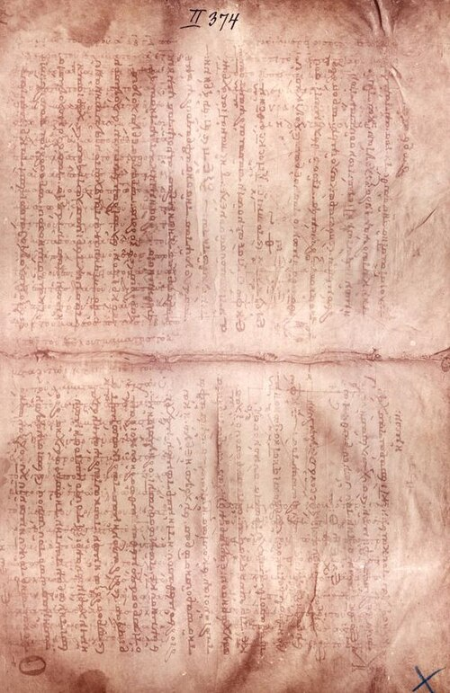

**[Archimedes](kloom:e/archimedes)** lived in Syracuse, the Greek city on Sicily, from about 287
to 212 BC, when a Roman soldier killed him in the sack of the city. He is
remembered as a mathematician, and was one of the greatest. For physics he
did something new: he took a question about how the world behaves, stated
it as a few postulates, and proved the answer as a theorem, as Euclid had
proved things about triangles. Two of his proofs, the law of the lever and
the law of floating bodies, are still taught in the form he gave them.

## The lever as a theorem

_On the Equilibrium of Planes_ starts from postulates any reader would
grant: equal weights at equal distances balance; if weights balance, equal
ones put in their place balance too. From these, in propositions 6 and 7
of its first book, it proves that two weights balance when their distances
from the fulcrum are in inverse ratio to the weights: three units of
weight four units out balance four units three units out.

The plate draws the heart of the proof. Cut the two weights into seven
equal pieces and hang them one unit apart along the beam. The row is
symmetrical about the fulcrum, so it balances; and the four pieces on one
side and three on the other have the same centers of gravity as the whole
weights they came from. The lever is reduced to symmetry.

It is not quite complete. Proposition 7, for weights with no common
measure, seems to have come down to us incomplete, and scholars have long
argued about which propositions of book I are Archimedes' own. Ernst Mach
objected in the nineteenth century that the argument smuggles in what it
proves; later historians, among them Dijksterhuis, rejected the objection.
Four centuries after Archimedes, Pappus of Alexandria credited him with the
boast "Give me a place to stand on, and I will move the Earth."

## A body in water

_On Floating Bodies_ does the same for fluids. From a postulate about how
fluid presses on fluid, it proves that a solid immersed in a fluid is
lightened by the weight of the fluid it pushes aside: **[Archimedes'
principle](kloom:e/archimedes-principle)**. Its second book, on when a floating paraboloid rights itself
and when it capsizes, was unmatched in antiquity and rarely equaled before
the late Renaissance.

The famous story is not in it. **[Vitruvius](kloom:e/vitruvius)**, writing some two centuries
after Archimedes died, says that King Hiero II suspected his goldsmith of
mixing silver into a gold wreath, and that Archimedes, stepping into a
bath, saw how to measure the wreath's volume by the water it displaced,
and ran through the streets crying "Eureka!" A fifth-century Latin poem
tells it differently: a balance with the wreath on one arm and pure gold on
the other, lowered into water. In 1586 Galileo built such a hydrostatic
balance and judged it the likelier method, "since, besides being very
accurate, it is based on demonstrations found by Archimedes himself."

A worked example shows why, with invented numbers. A wreath of 1,000 grams
of pure gold, which is 19.3 times as dense as water, displaces about 51.8
cubic centimeters. Make it of 700 grams of gold and 300 of silver (10.5)
and it displaces about 64.8. In a bath the difference is a rise in level
too small to see. On a balance under water it is about 13 grams of lost
weight, which a good balance shows at once.

| The wreath (invented)    | Volume, cm³ | Weight under water, g |
| ------------------------ | ----------: | --------------------: |
| 1,000 g of gold          |        51.8 |                 948.2 |
| 700 g gold, 300 g silver |        64.8 |                 935.2 |

## The Method, found twice

Archimedes also explained how he found his results before proving them, in
a letter to **[Eratosthenes](kloom:e/eratosthenes)**, the librarian at Alexandria. [_The Method_](kloom:e/the-method-of-mechanical-theorems)
slices a figure into lines, hangs each on an imaginary lever, and balances
them against a figure whose area or volume is known: finding by weighing,
then proving by geometry. It was lost for a thousand years.

It survived in one copy, made in Constantinople around 950. In 1229 its
parchment was scraped, washed and written over as a prayer book. The
Danish scholar Johan Ludvig Heiberg saw the older text under the prayers
in 1906 and read what he could from photographs. The book then vanished,
passed through a Paris cellar, and had forged gold-leaf pictures painted
over some of its pages. At an auction at Christie's in New York in 1998 an
anonymous buyer paid $2 million for it and lent it to the **[Walters Art
Museum](kloom:e/walters-art-museum)** in Baltimore for conservation and study.

From 1999 to 2008 the palimpsest was imaged in bands of ultraviolet,
visible and infrared light, and the pages under the forgeries were read by
X-ray fluorescence at the **[SLAC](kloom:e/slac-national-accelerator-laboratory)** accelerator laboratory at Stanford. A
machine built to study particles helped read Archimedes.

In the same Alexandria to which Archimedes wrote, four centuries later,
Ptolemy would do for the heavens what he had done for the lever.
