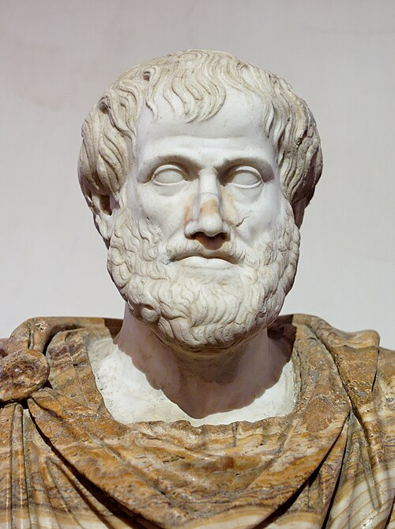

In the fourth century BC, teaching at the Lyceum in [Athens](kloom:e/athens), **[Aristotle](kloom:e/aristotle)**
gave the first account of motion that tried to cover everything: a falling
stone, a rising flame, a thrown spear and the turning stars. His lectures
survive as the [_Physics_](kloom:e/physics-aristotle) and the books on the heavens that go with it. They
were copied, taught, argued with and patched for nearly two thousand years,
first in Greek, then in Arabic and Latin, and the physics that replaced them
was built by arguing against them point by point.

## Every thing in its place

Aristotle took the four elements of Empedocles, earth, water, air and fire,
and gave each a **natural place**. Earth's is the centre of the universe,
which is why the Earth is there and why a stone falls. Water's is a shell
above earth; air's, a shell above water; fire's, a shell above air, just
under the sphere that carries the Moon. The plate draws a slice of this
arrangement. Left alone, every body moves straight towards its own place
and stops when it gets there: that is **natural motion**. Above the Moon
nothing is made of the four elements. The heavens are a fifth, the aether,
whose natural motion is to turn in circles forever.

Everything else is **forced**, or "violent", motion, and it needs a mover
in contact the whole time: "everything that moves is moved by something
else". A cart moves while the ox pulls, and stops when it stops. Its speed,
in Aristotle's rule, goes up with the force and down with the resistance of
what it moves through. A falling body obeys a rule of the same shape: a
heavier one falls faster, and any body falls faster through air than
through water.

The hard case was the thrown stone, which goes on moving after it leaves
the hand. Aristotle's answer, in book VIII of the _Physics_, was that the
hand also moves the air, and gives it a power to move things; each layer of
air pushes the stone and passes the power to the next, until it runs out.

## The case against the void

**[Democritus](kloom:e/democritus)** and the atomists had said that the world is atoms and empty
space. Aristotle argued that empty space could not exist, and one of his
arguments turns on motion. If speed goes down as the medium thickens, then
in a void, with no medium at all, a body would move infinitely fast. And
there would be nothing to stop it. In the translation by R. P. Hardie and
R. K. Gaye, he says that in a void "no one could say why a thing once set
in motion should stop anywhere; for why should it stop here rather than
here? So that a thing will either be at rest or must be moved _ad
infinitum_, unless something more powerful get in its way."

He meant it as an absurdity, and as proof that there is no void. Two
thousand years later, as the first law of motion, it was the foundation of
mechanics.

## Wrong, or right in its place?

The first serious attacks came from inside the tradition. In the sixth
century **[John Philoponus](kloom:e/john-philoponus)** of Alexandria pointed out that two weights, one
much heavier than the other, dropped together from a height land at almost
the same time, and argued that the thrower gives the stone a force of its
own, not the air. Such an impressed force, later called _impetus_, runs
through Arabic and Latin commentaries for eight centuries. In 1638
**[Galileo Galilei](kloom:e/galileo-galilei)** argued that without a medium all bodies would fall at the
same rate, and weighed air to show that Aristotle, who seems to have taken
water to be about ten times as dense as air, had overestimated air's
density by a factor of about forty.

That is the textbook story: Aristotle wrong, Galileo right. The physicist
**[Carlo Rovelli](kloom:e/carlo-rovelli)** read the _Physics_ again in 2015 and argued that it is
the other way about in Aristotle's own domain. On Earth, bodies move
through air and water, and a falling body quickly reaches the steady speed
at which drag balances its weight. At that speed Aristotle's rules hold:
of two bodies of the same shape the heavier falls faster, and every body
falls slower through a denser medium.

| Aristotle's claim                        | In Newton's physics                                  |
| ---------------------------------------- | ---------------------------------------------------- |
| Heavier bodies fall faster               | True at terminal speed, for bodies of one shape      |
| Speed falls as the medium thickens       | Drag grows with the density of the medium            |
| Forced motion stops when the mover stops | Friction stops it fast, in a world of air and ground |
| In a void, motion would never stop       | The first law of motion, offered as an absurdity     |

Rovelli's claim is that Aristotle's physics relates to Newton's as Newton's
does to Einstein's: an approximation, correct in a domain, that lasted
because it matched what people saw. Historians who read Aristotle in his
own terms, as philosophy rather than as a forerunner of mechanics, would
put it differently; the table is a physicist's reading, not his.

Aristotle made the questions; what he could not make was measurements.
The first to turn physics into geometry, with results that a balance could
check, worked in Syracuse a century later: **Archimedes**.
