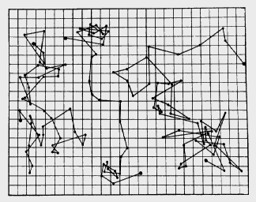

By 1900 chemists had worked with atoms for a century, and physicists had
built the theory of heat on molecules in motion. Nobody had seen one, and
some of the ablest scientists in Europe held that nobody should believe in
them. Within ten years the argument was over. It was settled by the jiggling of specks in water, a motion a botanist
had noticed eighty years before, and by a count of it.

## A botanist's specks

In 1827 **[Robert Brown](kloom:e/robert-brown-botanist-born-1773)**, looking through a microscope at pollen grains of
the plant _Clarkia pulchella_ in water, saw the tiny particles inside them
move in a ceaseless, jittery way. He repeated it with particles of glass
and ground rock, which were never alive, and found the same motion. So it
was not life. What it was, **[Brownian motion](kloom:e/brownian-motion)**, he could not say, and for
most of the century nobody could say with numbers.

The dispute over atoms was older still. The frame on Aristotle opens with
Democritus's atoms and void, and Aristotle's case against them. In the
1890s the case against was made again, with thermodynamics. **[Wilhelm
Ostwald](kloom:e/wilhelm-ostwald)** in Leipzig argued that energy, not matter, was what was real, and
that chemistry should do without the atomic hypothesis; Ernst Mach held
that science should speak only of what can be observed. Ludwig Boltzmann,
whose statistics needed atoms, argued against them for the rest of his
life, as the frame on Boltzmann tells.

## A prediction from Bern

In May 1905 **[Albert Einstein](kloom:e/albert-einstein)**, an examiner at the patent office in Bern, sent the
_Annalen der Physik_ a paper that turned the argument into a measurement.
If heat is the motion of molecules, he showed, a particle big enough to see
in a microscope, suspended in a liquid, must be knocked about by them and
wander. It wanders slowly and irregularly: its average distance from where
it started grows not with the time but with the square root of the time.
And the rate depends on the number of molecules in a gram-molecule, the
**[Avogadro constant](kloom:e/avogadro-constant)**, so that watching the wandering would count them. For
grains a thousandth of a millimeter across in water at 17 °C he worked out
about 0.8 thousandths of a millimeter in a second, and about 6 in a minute.

He did not claim to have explained Brown's specks. "It is possible", he
wrote, that the two are the same, but what he knew of Brownian motion was
"so lacking in precision" that he could not judge. If the motion was not
seen, it would be "a weighty argument" against the molecular theory of
heat. In 1906 **[Marian Smoluchowski](kloom:e/marian-smoluchowski)**, in Lwów, reached the same law
independently, by a different route and with a slightly different factor.

## Perrin counts

The experiments that answered were made in Paris by **[Jean Perrin](kloom:e/jean-perrin)**. He
needed grains all of one size, and made them from gamboge, a resin used for
watercolors, and from mastic, sorting them by spinning them in a
centrifuge again and again. A drop of such an emulsion, he reasoned, is a
tiny atmosphere: the grains settle under gravity and are kicked back up by
the molecules, and should thin out with height as air does. The plate
draws his most careful series. In a cell a tenth of a millimeter deep he
counted 13,000 grains of radius 0.212 thousandths of a millimeter at four
levels, and they fell as 100, 47, 22.6 and 12, halving every 30
thousandths of a millimeter. Air halves in about 6 kilometers. From the
ratio and the weight of a grain came the Avogadro constant: in 1909, 70.5 ×
10²² in a gram-molecule.

With Joseph Chaudesaigues in his laboratory, Perrin also tested Einstein's
formula directly, marking a grain's position every 30 seconds through a
_camera lucida_. The tracings, he wrote, give "a very feeble idea of the
prodigiously entangled character of the real trajectory": marked every
second, each straight segment would become a path as tangled as the whole.
It was Perrin who, in 1909, named the number after Avogadro.

## Thirteen roads to one number

In _Les Atomes_ of 1913 Perrin set out every determination he knew, by
methods that had nothing to do with each other.

| Phenomenon                            | Avogadro constant, × 10²² |
| ------------------------------------- | ------------------------: |
| Viscosity of gases                    |                        62 |
| Brownian motion: grains' distribution |                      68.3 |
| Brownian motion: displacements        |                      68.8 |
| Brownian motion: rotations            |                        65 |
| Brownian motion: diffusion            |                        69 |
| Critical opalescence                  |                        75 |
| The blue of the sky                   |                    60 (?) |
| Black-body spectrum                   |                        64 |
| Charged spheres in a gas              |                        68 |
| Radioactivity: charges produced       |                      62.5 |
| Radioactivity: helium produced        |                        64 |
| Radioactivity: radium lost            |                        71 |
| Radioactivity: energy radiated        |                        60 |
| Exact since 2019                      |                60.2214076 |

The agreement, he concluded, gives "the real existence of the molecule" a
"probability bordering on certainty". Among the thirteen is Planck's, from
the black-body curve of the frame before. By our arithmetic the value from his
grains' distribution, 68.3, was about 13 per cent high.

Ostwald gave way in 1908, crediting J. J. Thomson's counting of charged
gas molecules and Perrin's work on Brownian motion, and said so in the
preface to the fourth edition of his textbook of general chemistry: dated
1908 in one account, 1909 in the historians Pereira, Freire and their
colleagues'. Boltzmann did not see the end of
the argument; he had died in 1906. Perrin's Nobel Prize, in 1926, was "for
his work on the discontinuous structure of matter". Since 2019 the number
he measured has been fixed exactly, and it defines the mole.

In 1961 Feynman began his lectures to Caltech's freshmen by asking what one
sentence of science he would pass on if all the rest were lost. His answer
was the atomic hypothesis: "all things are made of atoms". In the same
year as the paper on Brownian motion, Einstein sent the _Annalen_ another,
on moving bodies: the next frame.
