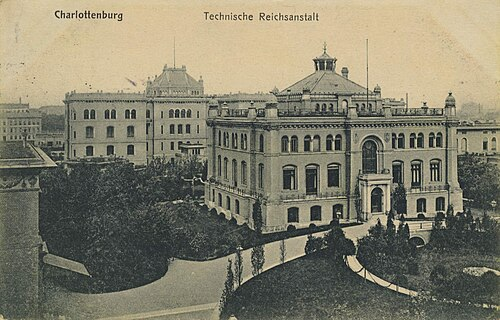

On 14 December 1900, at a meeting of the German Physical Society in
Berlin, **[Max Planck](kloom:e/max-planck)** read a short paper on the light given off by hot
bodies. To make his formula come out of a proper derivation, he divided
the energy of the radiation's sources into "a completely determinate
number of finite equal parts", each of a size set by a new constant of
nature, _h_, now called the [Planck constant](kloom:e/planck-constant). Nobody in the room, Planck
included, took it for the start of a new physics. It was.

## Kirchhoff's challenge

The problem was forty years old. In 1859–60 **[Gustav Kirchhoff](kloom:e/gustav-kirchhoff)**,
Planck's predecessor as professor of physics in Berlin, argued that for
anything in thermal equilibrium, the ratio of the light it gives off at a
wavelength to the light it absorbs there is the same for every material.
It equals what a perfectly **[black body](kloom:e/black-body)**, one that absorbs everything,
would emit. So the spectrum of a black body depends on nothing but its
temperature: a universal function, which Kirchhoff called a problem of the
highest importance, and which he expected to be hard to measure.

The practical black body is a hollow box with a small hole, drawn in the
plate's inset. Light that goes in bounces about inside and almost never
finds its way out, so the glow that leaves the hole, when the box is hot,
is black-body radiation.

## The Reichsanstalt measures

The measurements came from the **[Physikalisch-Technische Reichsanstalt](kloom:e/physikalisch-technische-bundesanstalt)**,
the imperial institute of metrology that Werner von Siemens and Hermann
von Helmholtz founded in Charlottenburg in 1887. It wanted a better
standard of luminous intensity, partly to settle whether electricity or
gas should light Berlin's streets, and in 1895 Otto Lummer and **[Wilhelm
Wien](kloom:e/wilhelm-wien)** built it a cavity radiator. Lummer and Ferdinand Kurlbaum's
blackened platinum box of 1898 is, in its design, still in use.

Wien's law of 1896 fitted their data well, and in 1899 Planck derived it
from an argument about entropy, his lifelong subject; for a while it was
called the Wien–Planck law. Then it failed. Lummer and Ernst Pringsheim
found it too low at long wavelengths, and **[Heinrich Rubens](kloom:e/heinrich-rubens)** and Kurlbaum,
filtering infrared light by reflecting it again and again off crystals of
fluorite and rock salt, found that far into the infrared the radiation
simply grew in proportion to the temperature.

## Two months in 1900

On 7 October Rubens told Planck. Planck, in his own telling in his Nobel
lecture of 1920, joined the two limits in the simplest way he could, and on
19 October presented a formula that fitted every wavelength; Rubens and
Kurlbaum confirmed it within a week. The plate draws it at three
temperatures, with Wien's law beside the hottest.

A formula that fits is not an explanation, and what followed were, in
Planck's words, "some weeks of the most strenuous work of my life". The
one route that worked was **Ludwig Boltzmann**'s way of counting, which
Planck had long resisted. To count, he needed his energy elements, _ε_ =
_hν_: that was the paper of 14 December, with _h_ = 6.55 × 10⁻²⁷ erg-seconds.
He later called the step "an act of desperation", and wrote in a letter of
1931 that it was "a purely formal assumption". The same paper put the
constant _k_ into Boltzmann's formula for entropy, a story the frame on
Boltzmann tells, and gave both a value. From _k_ he could compute the mass of a molecule and the charge of the electron,
and Rutherford and Geiger's count of alpha particles later matched his charge.

| Constant              | Planck, 1900–01 | Exact since 2019    |
| --------------------- | --------------- | ------------------- |
| _h_ (J s)             | 6.55 × 10⁻³⁴    | 6.62607015 × 10⁻³⁴  |
| _k_ (J/K)             | 1.346 × 10⁻²³   | 1.380649 × 10⁻²³    |
| electron's charge (C) | 1.56 × 10⁻¹⁹    | 1.602176634 × 10⁻¹⁹ |

Planck gave the charge as 4.69 × 10⁻¹⁰ electrostatic units; the value in
coulombs is our conversion, and so are the errors: by our arithmetic all
three were low, by 1.1, 2.5 and 2.4 per cent.

## A catastrophe named later

The textbook story is that classical physics predicted a black body would
pour out unlimited energy at short wavelengths, and that Planck rescued
physics from this **[ultraviolet catastrophe](kloom:e/ultraviolet-catastrophe)**. The historian Helge Kragh
calls it "a myth, closer to a fairytale". Rayleigh did point out in June
1900 that classical mechanics gives radiation growing as the square of the
frequency, and the full Rayleigh–Jeans law, the curve that runs off the top
of the plate, came in 1905. But Planck did not accept the equipartition of
energy it rests on and ignored it, and the phrase was Paul Ehrenfest's, in 1911. What drove Planck was entropy and the Berlin measurements.

## Did Planck quantise?

Whether he meant energy really comes in lumps is disputed. In 1978 the
historian Thomas Kuhn argued that he did not: nowhere in 1900–01 does
Planck say that an oscillator's energy can only be a whole number of
elements, he published nothing on the subject for years after, and his
lectures of 1906 argued for a continuum. Kragh finds evidence both ways,
and a strong case that Einstein, in 1905, was the first to see the
discontinuity as essential; the trail on the quantum revolution begins
there. Planck came round by about 1908, and his Nobel Prize of 1918 was for
"his discovery of energy quanta".

Since 20 May 2019 _h_ has been exact, 6.62607015 × 10⁻³⁴ joule-seconds, and
it defines the kilogram. The same years settled a quieter argument, over
whether atoms were real: the next frame.
