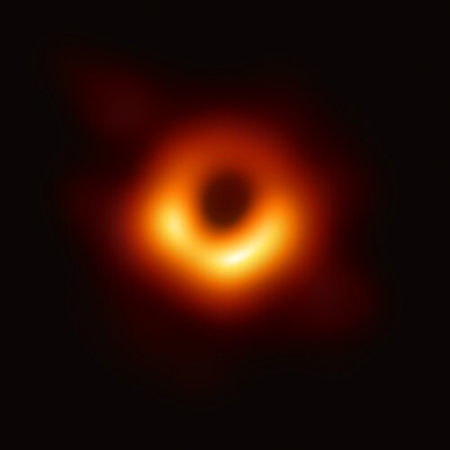
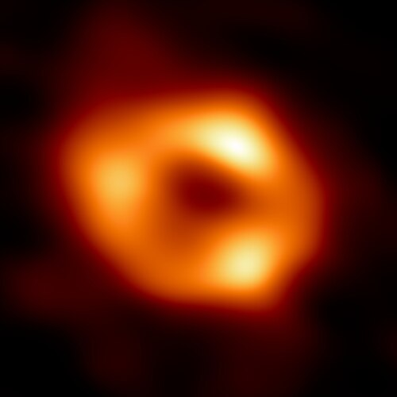

A black hole is a region of spacetime from which nothing, not even light, can get out. For half a century after general relativity allowed one, most physicists, Einstein among them, took it for a flaw in the mathematics. Then the sky began to fill with them: a companion to a blue star in Cygnus, a dark mass at the centre of our galaxy that its stars orbit, and in 2019 and 2022 two pictures of the dark itself.

## A solution nobody believed

Within weeks of the November 1915 field equations, **[Karl Schwarzschild](kloom:e/karl-schwarzschild)**, an astronomer serving as an artillery officer on the Russian front, found their exact solution for the space outside a single round, non-rotating mass, and it was published in 1916. Einstein, who had managed only an approximation, was pleasantly surprised. Schwarzschild died in May of that year, of a disease he had caught at the front. His solution held a strange radius, now named after him: squeeze a mass inside it (about 3 km for the Sun) and the mathematics misbehaves. What that meant was not understood for decades.

The physics of stars forced the question. In 1930, on the voyage from India to England, the nineteen-year-old **[Subrahmanyan Chandrasekhar](kloom:e/subrahmanyan-chandrasekhar)** worked out that a white dwarf, a burnt-out star held up by the quantum pressure of its electrons, cannot be heavier than a limit now put at about 1.4 Suns. (Wilhelm Anderson and Edmund Stoner had reached related limits in 1929, and historians still argue over the credit.) Above it, nothing he knew could stop the collapse. Arthur Eddington, then the most eminent astrophysicist in Britain, said in public in 1935 that "there should be a law of Nature to prevent a star from behaving in this absurd way!"

In 1939 **[J. Robert Oppenheimer](kloom:e/j-robert-oppenheimer)** and his student Hartland Snyder followed an idealised star of dust as it collapsed under its own weight. Seen from far away, the collapse slows and seems to freeze at the Schwarzschild radius; for someone riding with the star it goes straight through, in a finite time, and never comes back. The same year Einstein published a paper arguing that such collapse could not happen. Only in 1958 did David Finkelstein show that the Schwarzschild radius is an _event horizon_, a membrane that lets things through one way only.

## A name and a first candidate

The word came from the United States in the 1960s. **[John Wheeler](kloom:e/john-archibald-wheeler)** began to use "black hole" in a lecture in December 1967, reportedly after someone in the audience suggested it, and his standing made it stick. It was not new: the science writer Ann Ewing had used it in print in January 1964, reporting a meeting of the American Association for the Advancement of Science, and the historian Marcia Bartusiak traces it to Robert Dicke, who compared such objects to the Black Hole of Calcutta.

The first to be widely believed was **[Cygnus X-1](kloom:e/cygnus-x-1)**, an X-ray source found by a rocket flight in 1964. In 1972 Louise Webster and Paul Murdin at Greenwich, and Charles Bolton in Toronto, found that a blue supergiant there orbits an unseen companion too heavy to be a neutron star. Kip Thorne bet Stephen Hawking in 1975 that it was a black hole; Hawking, who had bet against in the hope of losing, conceded in 1990. The companion is now put at about 21 times the Sun's mass.

Hawking had meanwhile shown, in 1974, that a black hole is not quite black. Quantum theory near the horizon makes it glow faintly, as a hot body does, at a temperature that falls as the mass rises: **[Hawking radiation](kloom:e/hawking-radiation)**. For black holes of a star's mass it is far too faint to see, and it has never been detected.

## The dark at the centre

From the 1990s two teams, **Reinhard Genzel**'s at the Max Planck Institute for Extraterrestrial Physics and **Andrea Ghez**'s at UCLA with the Keck telescopes, tracked single stars through the dust at the centre of the Milky Way, where a radio source, **[Sagittarius A*](kloom:e/sagittarius-a)**, had been found in 1974. The stars move in ellipses round an invisible point. One, S2, passed within 120 astronomical units of it in May 2018, at 7,650 km/s. Kepler's third law weighs what they orbit: about 4.3 million Suns, packed inside the path of S2. Genzel and Ghez shared half the 2020 Nobel Prize in Physics; Roger Penrose had the other half, for showing that general relativity makes black holes form.

To see one needs a telescope the size of the Earth. The **[Event Horizon Telescope](kloom:e/event-horizon-telescope)** links radio dishes on several continents to observe at a wavelength of 1.3 mm. On 10 April 2019 it showed the black hole in the galaxy M87: a lopsided ring of glowing gas 42 millionths of a second of arc across, round a dark centre, the shadow that light bending and capture near the horizon produce. The plate draws that bending: rays that come closer than about 2.6 Schwarzschild radii fall in. On 12 May 2022 it showed Sagittarius A*, from data taken in 2017.

| Black hole      | Mass, in Suns | Distance, light-years |
| --------------- | ------------: | --------------------: |
| Cygnus X-1      |           ~21 |                ~7,000 |
| Sagittarius A\* |     4,300,000 |               ~27,000 |
| M87\*           | 6,500,000,000 |           ~53,000,000 |

When two black holes orbit each other, they shake spacetime as they spiral together. Those ripples, and the machines built to catch them, are the next frame, **gravitational waves**.
