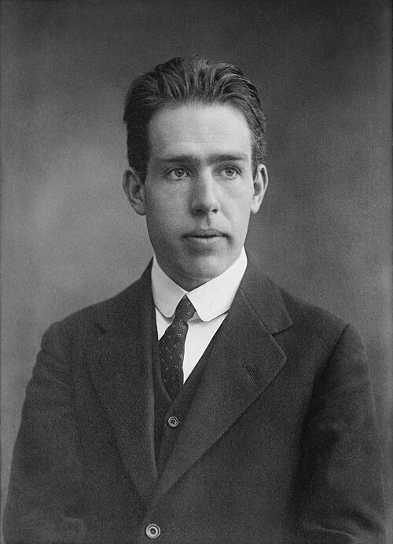

In 1912 **[Niels Bohr](kloom:e/niels-bohr)**, a Danish physicist of twenty-six,
went to work in Manchester with **[Ernest Rutherford](kloom:e/ernest-rutherford)**, who had just shown
that an atom's positive charge and nearly all its mass sit in a tiny
nucleus, with the electrons somewhere around it. That atom had a flaw
Rutherford's scattering experiments could not touch. By Maxwell's theory
an electron going round a nucleus is an accelerating charge, so it must
radiate, lose energy and spiral inwards almost at once. Atoms
do not collapse. Bohr's answer, published in the _Philosophical Magazine_
in 1913 in three parts under the title "On the Constitution of Atoms and
Molecules", was to stop asking classical physics for permission.

## Stationary states

Bohr laid down rules that made no pretence of following from anything. An
electron in an atom can move only in certain orbits, **stationary states**,
and in them it does not radiate at all. It gives off light only when it
jumps from one stationary state to another, and then as a single quantum
whose energy _hf_ is the difference between the two. Which orbits are
allowed he fixed with the Planck constant: in the form that became
standard, the electron's angular momentum must be a whole number of
_h_/2π.

For hydrogen, one electron round one proton, the rules give a ladder of
energies, −13.6 electronvolts divided by _n_², where _n_ is 1, 2, 3 and
so on, and orbits whose radii grow as _n_². The plate draws both, to scale.
The **[Bohr model](kloom:e/bohr-model)** had a ground state, from which an atom could not fall
further, and it said why every hydrogen atom is the same size.

## The Balmer formula explained

Since 1885 spectroscopists had had Johann Balmer's formula for the visible
lines of hydrogen, with no idea why it worked. Bohr's ladder produced it at
once: the **[Balmer series](kloom:e/balmer-series)** is the jumps that end on the second rung, and
the red line at 656 nanometres is the jump from 3 to 2. Jumps ending on
the third rung gave the infrared series Paschen had found, and Bohr
predicted series ending on the first, in the far ultraviolet, that no one
had yet seen.

The formula's constant was the real test. Balmer and Rydberg had fitted
it to the lines; Bohr computed it from the charge and mass of the electron
and the Planck constant.

| The constant in Balmer's formula, per second | Value         |
| -------------------------------------------- | ------------- |
| Bohr's calculation, 1913                     | 3.1 × 10¹⁵    |
| Measured from the lines, as Bohr quoted it   | 3.290 × 10¹⁵  |
| Calculated today from the same constants     | 3.2898 × 10¹⁵ |

His value, about 6 per cent low by our arithmetic, was within the errors of
the constants he had, and he said so. The **[Rydberg constant](kloom:e/rydberg-constant)** calculated
from today's values of _e_, _m_ and _h_ agrees with the lines. The paper added two smaller triumphs. Only 12 Balmer lines could
be seen in laboratory tubes but 33 in some stars: the high orbits are huge,
and only a very thin gas leaves room for them. And lines seen in the star
ζ Puppis and credited to hydrogen, Bohr said, belonged to helium that had
lost one electron. When the helium lines came out a fraction off, allowing for
the motion of the nucleus itself made them agree, and that helped
convince Rutherford.

## Tests, and limits

In 1914 **James Franck** and **Gustav Hertz**, in Berlin, fired electrons
through mercury vapour and found that they lost energy only in lumps of 4.9
electronvolts, and that the vapour then glowed at 254 nanometres, the
wavelength that energy gives. They took 4.9 volts for mercury's ionisation
energy, and, Franck said in 1960, had not known Bohr's work. Bohr read the
**[Franck–Hertz experiment](kloom:e/franck-hertz-experiment)** as the jump to a stationary state, and that
reading won; they shared the Nobel Prize for 1925.

In 1916 **[Arnold Sommerfeld](kloom:e/arnold-sommerfeld)** in Munich let the orbits be ellipses, with
a second whole number for their shape, and added relativity to explain the
fine splitting of hydrogen's lines. The patched theory, now called the old
quantum theory, explained much, but it was a set of rules laid over
classical mechanics, not a mechanics. It could not do helium's two
electrons, the odd splitting of lines in a magnetic field or the brightness of
a line, and it gave different answers in different coordinates. By 1925 it
had run out.

Bohr's orbits turned out not to exist. His stationary states and jumps
survived into quantum mechanics unchanged. Why only those orbits was the
question a French graduate student answered in 1924, with waves: de
Broglie.
