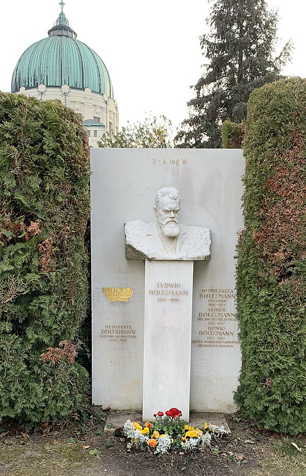

As a student in Vienna in the 1860s, **[Ludwig Boltzmann](kloom:e/ludwig-boltzmann)** was shown
Maxwell's work on the speeds of molecules by his teacher, Josef Stefan. He
spent the rest of his life on the question the
demon had opened: if a gas is molecules obeying Newton's laws, where does
the second law come from? His answer, reached in two steps in 1872 and
1877, is the one physics still gives. Entropy counts the ways a thing can
be arranged, and things drift towards the arrangements there are most of.

## A proof, and a reversal

In 1872 Boltzmann published a long paper, "Further studies on the thermal
equilibrium of gas molecules". It followed how collisions change the
spread of speeds in a gas, and it defined a quantity, built from that
spread, which collisions can only lower, reaching its least value when
the speeds settle into Maxwell's distribution. Boltzmann wrote it _E_; a
later English critic, Samuel Burbury, wrote _H_, and the result has been
the **[H-theorem](kloom:e/h-theorem)** since. Minus that quantity behaves like Clausius's
entropy. It seemed to be what Clausius could not give: the second law,
proved from mechanics.

His older colleague in Vienna, **[Josef Loschmidt](kloom:e/johann-josef-loschmidt)**, objected in 1876.
Newton's laws run equally well backwards. Take a gas whose _H_ is falling,
reverse every molecule's velocity, and it retraces its path, _H_ rising
all the way. So no argument from mechanics alone can show that _H_ must
fall. Thomson had made the same point two years before, in the paper that
named Maxwell's demon. The flaw was in an assumption Boltzmann had built
into his counting of collisions, that molecules about to collide are
unrelated to each other, which slips time's direction in at the start.

## Counting complexions

Boltzmann conceded that the reversed motions exist, and argued that they
are rare. In a reply of 1877 he compared the gas to a lottery, in which
any one draw is "as improbable as the quintet 12345"; a gas becomes
uniform "only because there are far more uniform than nonuniform state
distributions". Later that year he turned the remark into a method. He
gave each molecule one of a ladder of energies, 0, 1, 2 and so on in some
small unit, and counted. An arrangement naming every molecule's energy he
called a _complexion_. How many molecules sit on each rung, whichever
they are, is a _state distribution_. The likelihood of a distribution is
the number of complexions that make it.

His first example has seven molecules sharing seven units. There are
1,716 complexions and fifteen distributions. All seven units on one
molecule can happen 7 ways; one unit each, only 1 way; three molecules
with nothing, two with one unit, one with two and one with three, 420
ways. The plate draws that winner and the counts of all fifteen.

| Energies of the seven molecules | Complexions |
| ------------------------------- | ----------: |
| 0, 0, 0, 0, 0, 0, 7             |           7 |
| 0, 0, 0, 0, 1, 2, 4             |         210 |
| 0, 0, 0, 1, 1, 2, 3             |         420 |
| 0, 0, 1, 1, 1, 2, 2             |         210 |
| 1, 1, 1, 1, 1, 1, 1             |           1 |
| All fifteen distributions       |       1,716 |

In the winner the molecules thin out as the energy climbs, and with more
molecules and finer rungs the thinning becomes exact: the number at each
energy falls off exponentially, as e^(−*E*/_kT_). This is the
[Boltzmann distribution](kloom:e/boltzmann-distribution), derived in the same paper. For
an actual gas the numbers are so vast that the likeliest distribution
is, in practice, the only one ever seen: equilibrium. Boltzmann then
showed that the logarithm of the number of complexions in it, suitably
scaled, is Clausius's entropy. The second law became a statement about
likelihood: a system left alone moves from few ways to many.

## The formula on the grave

Boltzmann did not write _S_ = _k_ log _W_. **[Max Planck](kloom:e/max-planck)** did, in his
work on black-body radiation of 1900–01, where he also introduced the
constant _k_ and first gave it a value. The paper's translators, Kim Sharp
and Franz Matschinsky, point out that Boltzmann's _W_ was a probability
he defined and never used, and that his own measure was the logarithm of
a count. Wikipedia's article on Boltzmann still says he provided the
current definition in 1877; both are right about the idea, and only the
second about the notation. Planck said in his Nobel lecture of 1920 that
Boltzmann himself never introduced the constant that bears his name.

Boltzmann's physics needed atoms, and in the 1890s many German-speaking
scientists doubted them: **[Ernst Mach](kloom:e/ernst-mach)** as a matter of method, **Wilhelm
Ostwald** and the "energeticists" because they thought energy, not
matter, the real stuff. Boltzmann argued for atoms for the rest of his
life. Ill and depressed, he took his own life at Duino, near Trieste, on
5 September 1906. He is buried in Vienna's Central Cemetery, under the
formula Planck wrote for him. Within a few years the argument over atoms
was settled in his favour, the story of the frame on Einstein and Perrin.
On this trail the next question is Maxwell's again, now in Boltzmann's
terms: if entropy counts the arrangements we cannot see, what does it
cost to see one? Szilard's engine answered in 1929.
