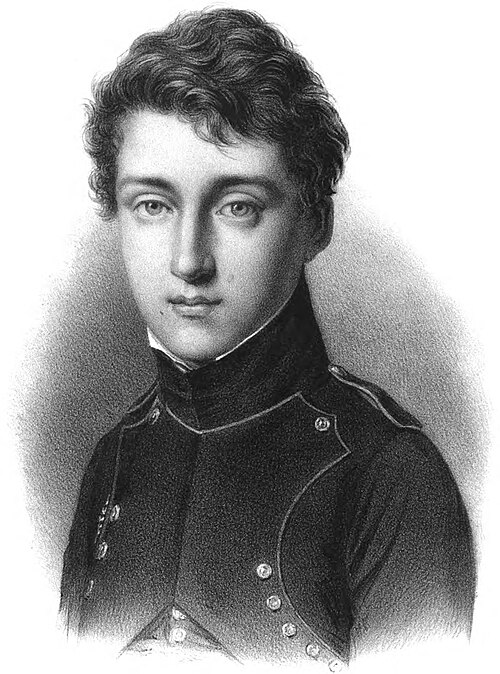

In June 1824 a Paris bookseller, Bachelier, put out a book of 118 pages
by an army engineer on half pay, printed at the author's own expense in
600 copies: [_Réflexions sur la puissance motrice du feu_](kloom:e/reflections-on-the-motive-power-of-fire), reflections on
the motive power of fire. Its author, **[Sadi Carnot](kloom:e/nicolas-leonard-sadi-carnot)**, was twenty-eight,
the son of Lazare Carnot, who had commanded the Revolution's armies, and a
graduate of the École polytechnique. It was his only publication. It was
presented to the Academy of Sciences, praised in one review, and forgotten.
It is where the science of heat engines, and of heat itself, begins.

## Why England won

Carnot began with the machine that was changing the world, and with the
country that had built it. "To take away to-day from England her
steam-engines," runs the English translation of 1890, "would be to take
away at the same time her coal and iron." Savery, Newcomen, Watt and
their successors had made the engine by trial and ingenuity. Nobody could
say how good an engine could ever be, or whether steam was the best thing
to run it on. A typical engine of the day turned only about 5 to 7 per cent of
its fuel's heat into work.

Carnot asked the two questions in general form. Is there a limit to the
work a given heat can do? And does it depend on what the engine uses,
steam, air or anything else? To answer them he set aside every practical
detail and imagined an engine that did nothing wasteful at all.

## A waterfall of caloric

Carnot, like most French physicists, took heat to be a weightless fluid,
_caloric_, which flows from hot bodies to cold ones and is never created
or destroyed: the **[caloric theory](kloom:e/caloric-theory)**. An engine, in this picture, does not
use heat up. It lets heat fall. "The motive power of a waterfall depends on
its height and on the quantity of the liquid," he wrote; "the motive power
of heat depends also on the quantity of caloric used, and on what may be
termed … the height of its fall, that is to say, the difference of
temperature of the bodies between which the exchange of caloric is made."

His ideal engine, the **[Carnot cycle](kloom:e/carnot-cycle)**, is a gas in a cylinder with a
piston, and two bodies, one hot and one cold. The gas expands while
touching the hot body, taking in heat at its temperature. Cut off, it
expands further and cools until it is as cold as the cold body. Touching
the cold body, it is compressed and gives up heat. Cut off again, it is
compressed until it is as hot as the hot body, and the cycle closes. Heat
never passes between things at different temperatures, which Carnot saw
was the one sure waste. So the cycle can be run backwards, as a heat pump,
with every step reversed.

That gave him his proof. If any engine working between the same two
temperatures did more work than his, it could drive his cycle backwards
and return all the caloric to the hot body with work to spare, forever:
perpetual motion. So none can. "The motive power of heat is independent of
the agents employed to realize it; its quantity is fixed solely by the
temperatures of the bodies between which is effected, finally, the
transfer of caloric." Steam, air or alcohol: the limit is the same.

What he could not say was how the limit depended on the two temperatures.
He knew only that the fall of caloric does more work lower down the
thermometer. Later physics gave the answer, 1 − _T_₂/_T_₁ with
temperatures counted from absolute zero. Carnot's own example was an
engine with its boiler at 160 °C and its condenser at 40 °C, using a fall
of 120 degrees out of the thousand that a coal fire offers. The chart puts
his numbers into the later formula; the two limits are our arithmetic.

| Heat falls             | Share that can become work |
| ---------------------- | -------------------------: |
| An engine of the 1820s |                 about 5–7% |
| From 160 °C to 40 °C   |          27.7%, our figure |
| From 1,000 °C to 10 °C |          77.8%, our figure |

His advice to engineers followed: take the heat in as hot as possible and
let it out as cold as possible. High-pressure steam was better because it
was hotter, and at the end of the century Rudolf Diesel used Carnot's
analysis in designing his engine.

## The book that was found again

Carnot died of cholera in August 1832, aged thirty-six. In 1834 another
engineer from the École polytechnique, **[Émile Clapeyron](kloom:e/emile-clapeyron)**, restated the
argument in mathematics and drew the cycle as a closed curve on a graph of
pressure against volume, the form the plate draws. The work done in one
turn is the area inside it. Clapeyron's paper reached English in 1837 and
German in 1843, and through it William Thomson in Glasgow and Rudolf
Clausius in Berlin. Thomson found a copy of Carnot's book itself only at
the end of 1848.

Carnot had already begun to doubt caloric. His brother Hippolyte, who kept
and then destroyed most of his papers, published some notes in 1878. In
them, by the spring of 1832, Carnot writes that heat is "motion that has
changed form", and puts a figure on how much work a given heat is worth:
370 kilogram-metres to the kilocalorie, against about 427 today. He
published none of it. Others found the figure again in the 1840s, and the
waterfall had to be rebuilt on it: heat does not only fall through an
engine, some of it is used up.
