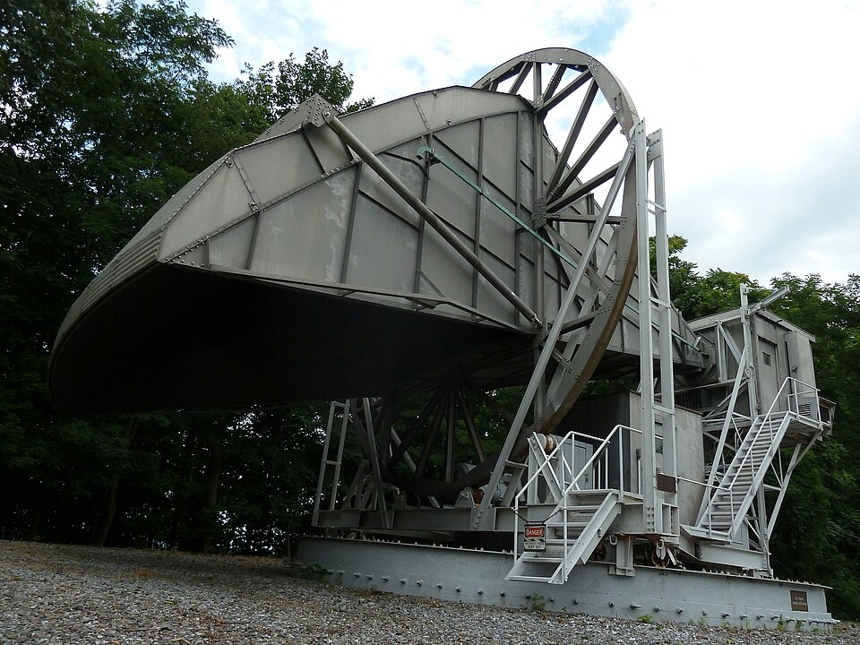
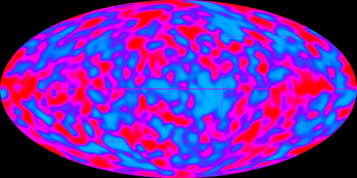

In 1964 two radio astronomers at **[Bell Labs](kloom:e/bell-labs)**, **[Arno Penzias](kloom:e/arno-allan-penzias)** and
**[Robert Woodrow Wilson](kloom:e/robert-woodrow-wilson)**, could not get rid of a hiss. Their antenna on
Crawford Hill, in Holmdel, New Jersey, picked up a faint microwave signal
from every direction, day and night, whatever they did. It was the oldest
light there is, the **[cosmic microwave background](kloom:e/cosmic-microwave-background)**: the glow of the universe as it was some 380,000 years after
its beginning, stretched and cooled by the expansion to under three degrees
above absolute zero. Its discovery ended a twenty-year argument about
whether the universe had a beginning at all.

## A hot beginning

The prediction came first, and was forgotten. In 1948 **[George Gamow](kloom:e/george-gamow)**, at
George Washington University, and his student **Ralph Alpher** asked what a
universe that began hot and dense would have made. Their paper, "The Origin
of Chemical Elements", carried the name of Hans Bethe too, added by Gamow
so that the authors read alpha, beta, gamma. The idea of building every
element in the first minutes failed beyond helium, since no stable nucleus
has five or eight nucleons, and the heavier elements turned out to be made
in stars. But the light ones were right: _big bang nucleosynthesis_ now
accounts for hydrogen, deuterium and about a quarter of the ordinary
matter's mass as helium.

The same year Alpher and Robert Herman worked out that the radiation of
that hot beginning should still fill space, cooled by now to about 5 K. No
one went looking.

## Steady state

The rival theory was younger and more elegant. In 1948 Hermann Bondi,
Thomas Gold and **[Fred Hoyle](kloom:e/fred-hoyle)** proposed a universe that expands but never
changes, new matter appearing to fill the gaps, with no beginning and no
end. On the BBC's Third Programme on 28 March 1949, Hoyle called the other
idea, that everything began at one moment, the **[Big Bang](kloom:e/big-bang)**. Gamow and his
allies heard mockery in it; Hoyle later denied that he meant any. The
name stuck, and for fifteen years the two theories agreed equally well
with Hubble's receding galaxies.

## The hiss at Holmdel

The antenna had been built in 1959 for Project Echo, to catch radio
signals bounced off a balloon in orbit: a horn fifty feet long with a
twenty-foot square mouth. The plate draws its trick. The horn's narrow end
sits at the focus of a curved reflector, so it sees the sky through its
side; the whole horn turns in a thirty-foot wheel to raise or lower its
gaze, and its base turns on a circular track. Penzias and
Wilson meant to use it for radio astronomy.

They accounted for everything. Their receiver was cooled with liquid
helium; they measured the air's contribution by tipping the antenna; they
cleaned out nesting pigeons and their droppings. At 4,080
megacycles, pointed straight up, the antenna still saw about 3.5 K more
than it should.

| Antenna temperature at the zenith, 1965  | Kelvin |
| ---------------------------------------- | -----: |
| The atmosphere                           |    2.3 |
| Losses in the antenna                    |    0.9 |
| Unexplained, the same in every direction |    3.5 |
| Total measured                           |    6.7 |

Sixty kilometers away, at Princeton, Robert Dicke, **Jim Peebles**, Peter
Roll and David Wilkinson were building a receiver to search for exactly
this, reasoning as Alpher and Herman had. A
friend told Penzias of Peebles's preprint; Penzias rang Dicke; and, as
the story is told, Dicke put down the phone and told his group they had
been scooped. The two teams published side by side in July 1965, Penzias
and Wilson reporting the measurement, the Princeton group explaining it.
The steady state had no place for such a glow, and most cosmologists
abandoned it. Penzias and Wilson shared the Nobel Prize in 1978; Peebles
had his in 2019. Lemaître, whose primeval atom it vindicated, heard of the
discovery shortly before he died in 1966.

## The spectrum and the ripples

Two tests would prove the glow was cosmic: it should have the spectrum of
a black body, the shape the black-body frame explains, and it should be
nearly the same in every direction. NASA's **[COBE](kloom:e/cosmic-background-explorer)** satellite, launched in
November 1989, settled the first within months. Its first spectrum, published
in 1990, matched a black body at 2.735 kelvin to within 1% of the peak.
The second took longer. In April 1992 COBE's team announced that the glow
is not perfectly smooth: it varies by about one part in 100,000 (Wikipedia
gives about one part in 25,000 for the variation at all scales), the
imprint of the slight overdensities that grew into galaxies.

COBE's map is blurry, because its beam was seven degrees wide. WMAP
(2001–2010) and the European **Planck** satellite (2009–2013) mapped the
same ripples ever finer.

| Satellite | Launched | Finest beam, arcminutes |
| --------- | -------: | ----------------------: |
| COBE      |     1989 |                420 (7°) |
| WMAP      |     2001 |                    13.2 |
| Planck    |     2009 |                       5 |

Read closely, the pattern of the ripples gives the age of the universe,
13.8 billion years, and what it is made of. By Planck's 2013 figures
ordinary matter is only 4.9%. Most of the rest of the matter does not shine
at all, and that is the story of dark matter.
