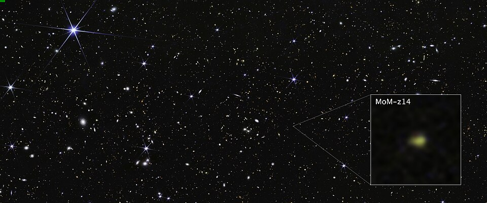
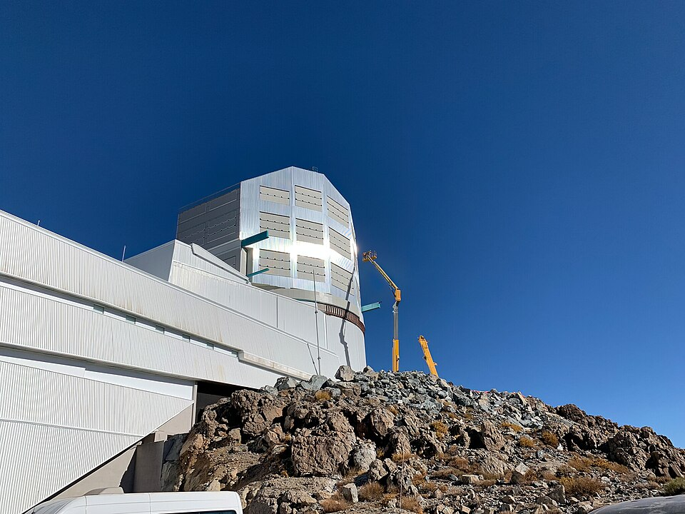

This frame describes cosmology as it stood on 29 September 2026. A model
with six numbers describes the universe from its first moments to today
remarkably well. Two measurements of how fast it is expanding disagree,
the first galaxies turned out brighter than expected, and the dark energy
of the frame before may be changing. Four surveys now under way were built
to settle such questions.

## Six numbers

The standard model of cosmology, the **[Lambda-CDM model](kloom:e/lambda-cdm-model)** (ΛCDM), has a
universe of ordinary matter, _cold dark matter_ (CDM) and a cosmological
constant (Λ), flat, and seeded with small random ripples. Six numbers fix
it, and the best measurement of them is still the one the European
satellite **[Planck](kloom:e/planck-spacecraft)** made of the cosmic microwave background between 2009
and 2013, in its final analysis of 2018.

| Planck 2018                               | Value              |
| ----------------------------------------- | ------------------ |
| Density of ordinary matter, Ωb h²         | 0.0224 ± 0.0001    |
| Density of cold dark matter, Ωc h²        | 0.120 ± 0.001      |
| Angular size of the sound horizon, 100 θ  | 1.04089            |
| Optical depth to reionization, τ          | 0.054 ± 0.007      |
| Amplitude of the ripples, ln(10¹⁰ As)     | 3.043 ± 0.014      |
| Tilt of the ripples, ns                   | 0.965 ± 0.004      |
| _Derived:_ Hubble constant, H₀ (km/s/Mpc) | 67.4 ± 0.5         |
| _Derived:_ age of the universe            | 13.787 ± 0.020 Gyr |
| _Derived:_ share of dark energy, ΩΛ       | 0.685              |

From the first two and H₀, by our own arithmetic, ordinary matter is about
5 percent of the universe's energy today and dark matter about 26 percent; dark energy is the rest. Everything else, the Hubble constant and
the age included, is derived: a prediction of the model from the early
universe for what we should measure nearby today.

## The Hubble tension

We should measure an expansion rate of about 67 kilometers a second for
every megaparsec of distance. Measured nearby, it comes out about 73. The
plate draws the two routes. The early one reads the size of sound waves in
the young universe from the microwave background and carries it forward
with ΛCDM. The late one is a ladder: parallax gives the distances to
nearby Cepheid variable stars, whose period tells their true brightness;
Cepheids in galaxies that also hosted type Ia supernovae calibrate the
supernovae; supernovae far off in the expansion give the rate.

The ladder team **SH0ES**, led by **[Adam Riess](kloom:e/adam-riess)**, has pushed this route furthest. The worry was that Cepheids in distant
galaxies are blended with crowds of other stars that the Hubble Space
Telescope's images could not fully separate.
The **[James Webb Space Telescope](kloom:e/james-webb-space-telescope)**, whose building and first images the
western-civ spine tells, sees them in sharper infrared. In September 2025
the team reported Webb's Cepheids in nineteen host galaxies and found no
bias: H₀ = 73.49 ± 0.93, about six standard deviations from the early
universe's value.

| Measurement                           | Route          | H₀ (km/s/Mpc) |
| ------------------------------------- | -------------- | ------------- |
| Planck (2018)                         | early universe | 67.4 ± 0.5    |
| SPT-3G, ACT and Planck (2025)         | early universe | 67.19 ± 0.38  |
| CCHP, red giants, HST and JWST (2024) | ladder         | 70.39 ± 1.94  |
| SH0ES, Cepheids, HST and JWST (2025)  | ladder         | 73.49 ± 0.93  |
| SH0ES, Cepheids and red giants (2025) | ladder         | 73.18 ± 0.88  |

Not everyone on the ladder agrees. The Chicago-Carnegie Hubble Program,
led by **[Wendy Freedman](kloom:e/wendy-freedman)**, calibrates the supernovae with red giants
instead and gets 70.39, with statistical and systematic errors that we
have combined into the ±1.94 in the chart; from Webb's data alone its two
methods give 68.81 and 67.80, which it calls consistent with ΛCDM. The
early side, meanwhile, no longer rests on Planck alone: the South Pole
Telescope and the Atacama Cosmology Telescope, combined with Planck in
2025, gave 67.19 ± 0.38. A review of the tension's first decade,
published in 2026, finds that it persists whichever microwave data
are used, and that explanations from our being in a local void have been
largely ruled out. As of this date it is unresolved: new physics before
the microwave background was released, or an error somewhere on a ladder,
and the ladder teams themselves disagree about how large the gap is.

## Too bright, too early

Webb was built to find the first galaxies, and it found more bright ones
than expected. The most distant confirmed by September 2026, **[MoM-z14](kloom:e/mom-z14)**,
is seen at a redshift of 14.44, about 280 million years after the Big
Bang. Its discoverers estimate that galaxies as bright as this, so early,
are more than a hundred times more common than predicted before Webb;
MoM-z14 is also richer in heavy elements than models of early galaxy
formation account for.

## What the next years test

**[Euclid](kloom:e/euclid-space-telescope)**, a European space telescope launched in July 2023, is mapping
up to two billion galaxies over more than a third of the sky; after two quick
releases, its first large data release, covering about 1,900 square
degrees, is planned for 12 November 2026. The **[Vera C. Rubin
Observatory](kloom:e/vera-c-rubin-observatory)** in Chile began its ten-year Legacy Survey of Space and Time
on 30 June 2026: a 3,200-megapixel camera returning to each point of the
southern sky about 800 times, gathering about ten terabytes a night and
millions of supernovae over the decade. NASA's Nancy Grace Roman Space
Telescope launched on 30 August 2026, with its first science images
expected early in 2027, and DESI expects results from its whole survey in 2027.

Between them they will measure the expansion and the growth of structure
across most of cosmic history. If dark energy is changing, or the Hubble
tension is new physics, it should show in their maps. What cosmology
cannot settle alone, the frame on the open questions takes up.
