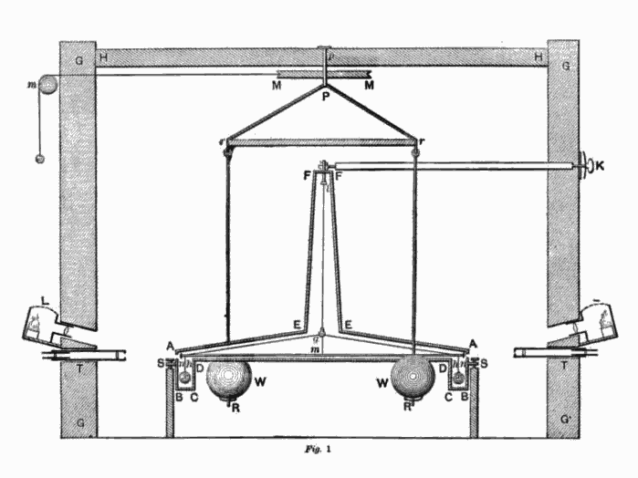

[Charles-Augustin de Coulomb](kloom:e/charles-augustin-de-coulomb) spent twenty years as a French army engineer,
eight of them building a fort on Martinique, and made his name in science
with work on friction and on the pressure of earth against walls. In 1785,
in the first of a series of memoirs on electricity and magnetism for the
Académie des sciences in Paris, he described an instrument for forces far too
small for any balance of weights, and used it to find how electric charges
push on one another. A few years later the Revolution called him back to
Paris to help set its new weights and measures.

## A twisted wire

The year before, Coulomb had shown that a fine metal wire resists twisting
with a force in proportion to the angle it is twisted through, to the fourth
power of its diameter and inversely to its length. A wire that fine is a
spring for the faintest forces. His electric balance hung a light needle
from a silver wire 28 French inches long inside a glass cylinder about a foot
across, with a pith ball at the needle's tip and a scale of degrees round the
glass. To twist the wire through a whole turn took, by his reckoning, a
three-hundred-and-fortieth of a grain.

A second ball, let down through the lid, touched the first. Coulomb charged
both with a pin, they flew apart, and he turned the head at the top of the
wire to twist them back together. The plate draws his three readings, which
he says he took in two minutes, before the charge could leak away.

| Separation | Twist at the head | Twist in all | Twist × separation² (ours) |
| ---------- | ----------------- | ------------ | -------------------------- |
| 36°        | 0°                | 36°          | 46,656                     |
| 18°        | 126°              | 144°         | 46,656                     |
| 8½°        | 567°              | 575½°        | 41,580                     |

Half the distance, four times the force, and nearly four times again at a
quarter. The last column is our arithmetic, not his: if the force were
exactly inverse-square it would stay the same, and the third reading falls
about 11% short. Coulomb read the three as following "la raison inverse du
carré des distances", the inverse square of the distance. In his second memoir he found the same law for the
attraction of opposite charges, and for the poles of magnets. He took
electricity and magnetism for two different fluids.

## Who had it first

**[Coulomb's law](kloom:e/coulombs-law)** was not a surprise, and he was not the first to find
it. **[Joseph Priestley](kloom:e/joseph-priestley)** conjectured it in 1767, by analogy with Newton's
gravitation. John Robison measured the repulsion in 1769 and got the
inverse 2.06th power. **[John Michell](kloom:e/john-michell)** had given the inverse square for
magnetic poles in 1750.

**[Henry Cavendish](kloom:e/henry-cavendish)**, in the early 1770s, did better than any of them
and told almost nobody. He charged a hollow globe of pasteboard, 13.3 inches
across, around a smaller globe joined to it by a wire, then drew the wire out
and opened the hemispheres: the inner globe held no charge. Only an exact
inverse square predicts none. He concluded that the law lay between the
powers "2 + 1/50th" and "2 − 1/50th", and that "there is no reason to think
that it differs at all from the inverse duplicate ratio". He never published
it. James Clerk Maxwell edited his papers in 1879 and found it there.

## Weighing the world

Cavendish did publish the other use of the torsion balance. Michell had
built one to weigh the Earth and died in 1793 before using it. Cavendish
rebuilt it in a shed at Clapham: a six-foot rod on a wire, with a small lead
ball at each end, and two lead balls of 348 pounds swung up beside them. Their
pull turned the rod through about a sixth of a degree, which he watched by
telescope through the wall. In 1798 he gave the Earth's density as 5.48
times water's. [Nevil Maskelyne](kloom:e/nevil-maskelyne) had tried in 1774 from the pull of a Scottish
mountain, Schiehallion; Cavendish's figure was 23% above the one Charles
Hutton worked out from it.

His own measurements average 5.448; the published 5.48 was a slip of
arithmetic, found by Francis Baily in 1821 by one account and noted by
John Henry Poynting by another. Today's value is 5.514. Newton, in the
_Principia_, had guessed "five or six". Cavendish never wrote down a
[gravitational constant](kloom:e/gravitational-constant): one of the first
mentions of _G_ is from 1873, its modern notation from the 1890s, and his
result is now read as the first good value of it, within about 1%.

| Year | Who       | Uncertainty in _G_ (parts per million) |
| ---- | --------- | -------------------------------------- |
| 1798 | Cavendish | about 6,000                            |
| 1891 | Poynting  | 5,500                                  |
| 1930 | Heyl      | 1,000                                  |
| 1942 | Heyl      | 450                                    |
| 1986 | NIST      | 120                                    |
| 1998 | NIST      | 1,500                                  |
| 2014 | CODATA    | 46                                     |
| 2022 | CODATA    | 22                                     |

Gravity is so weak that _G_ is still hard to pin down. In 1998 conflicting
experiments forced the recommended uncertainty up twelvefold. The electric
constant fared differently. Coulomb's law is now written
_F_ = _q_₁_q_₂ / (4π_ε_₀_r_²), and since the 2019 redefinition of the SI
fixed the elementary charge, _ε_₀ has been measured rather than defined:
CODATA 2022 gives it to 1.6 parts in ten billion, more than a hundred thousand
times better than _G_, a ratio worked out here.

Coulomb's law says how hard two charges push across empty space, and nothing
about how. The answer, that the space between them is filled with a field,
belongs to Faraday and the frame on the field.
