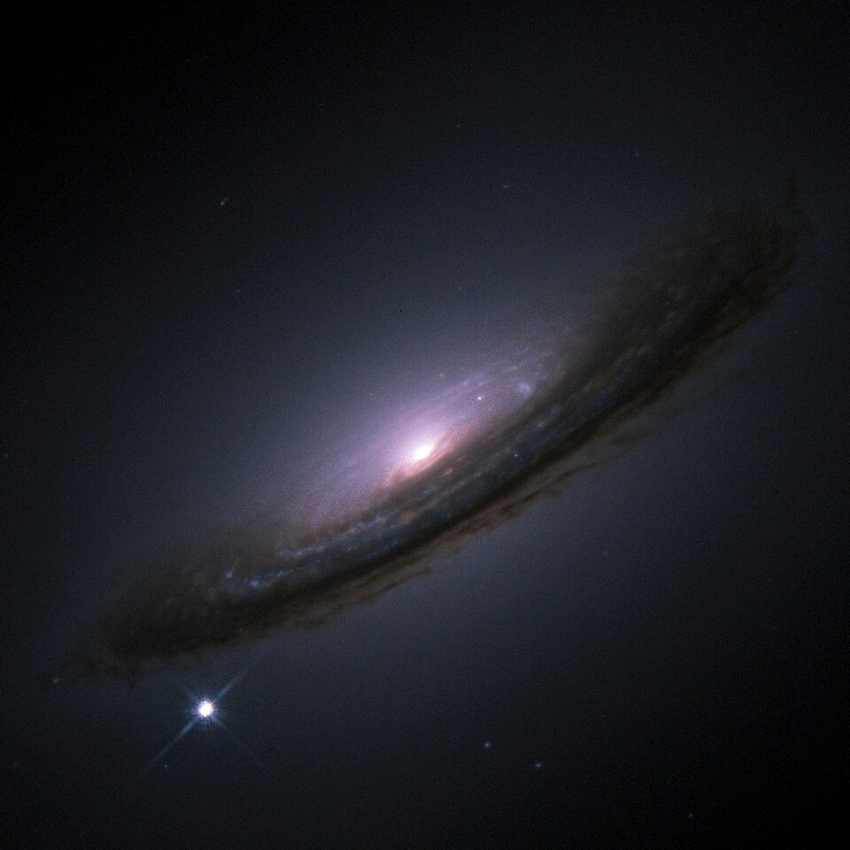
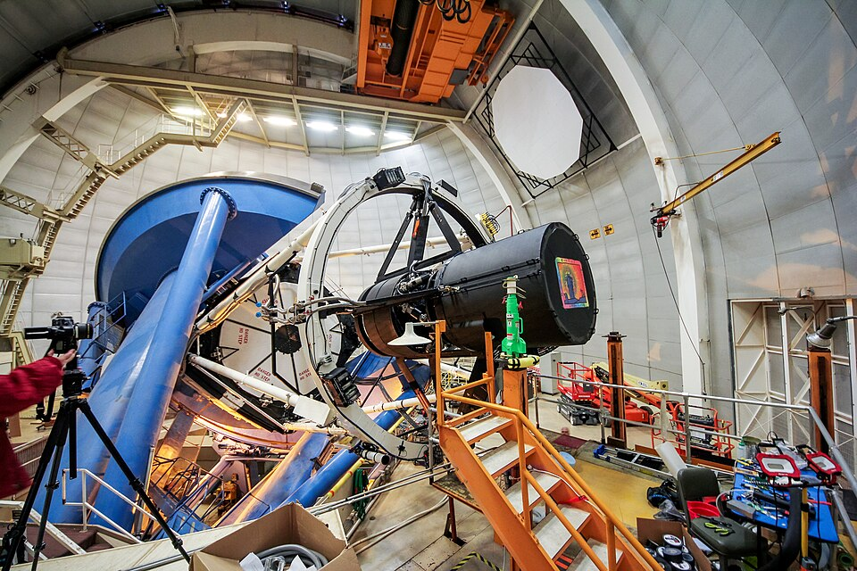

In 1998 two teams of astronomers, racing each other, measured how fast the
expansion of the universe was slowing down and found that it was not
slowing at all. It was speeding up. Whatever does the pushing was named
**[dark energy](kloom:e/dark-energy)**. It makes up about two-thirds of the energy in the
universe, and as of 29 September 2026 nobody knows what it is. The best
guess is the oldest one: a term that Einstein put into his equations in
1917 and took out again.

## Einstein's constant

When **[Albert Einstein](kloom:e/albert-einstein)** first applied general relativity to the whole
universe, in 1917, he found that it would not stand still: gravity would
pull it together. Like nearly everyone then, he believed the universe was
static, so he added a term to his equations, the **[cosmological constant](kloom:e/cosmological-constant)**
Λ, an energy of empty space whose gravity repels, tuned to hold the
matter in balance. The balance was unstable, and it was soon unnecessary.
After Edwin Hubble's measurements of 1929 showed the galaxies receding,
Einstein published a model of an expanding universe in 1931 with Λ set to
zero, and in 1932, with Willem de Sitter, another.

George Gamow later wrote that Einstein called the constant the biggest
blunder of his life. The astrophysicist Mario Livio could find no
record of the phrase that did not lead back to Gamow; the historians Cormac O'Raifeartaigh and Simon Mitton, who note that Ralph
Alpher and John Wheeler also said they heard it, conclude that Einstein
probably did say it, at least once, and certainly came to see the term as
a serious error. For most of the century physicists assumed that Λ was
zero.

## Supernovae that were too faint

The way to measure a slowdown is to compare distance with speed for
things very far away, whose light left them billions of years ago. The
teams used **[type Ia supernovae](kloom:e/type-ia-supernova)**, exploding white dwarfs that for a
few weeks can outshine their galaxy and reach nearly the same peak
brightness each time: how faint one looks says how far away it is.
The **Supernova Cosmology Project**, led by **[Saul Perlmutter](kloom:e/saul-perlmutter)** at Lawrence
Berkeley National Laboratory, had begun in 1988. The **High-Z Supernova
Search Team**, founded in 1994 by Brian Schmidt and Nicholas Suntzeff, grew
to about twenty astronomers on four continents.

In May 1998 the High-Z team's paper, led by **[Adam Riess](kloom:e/adam-riess)**, reported
that its sixteen distant supernovae, set against thirty-four nearby ones,
were "on average, 10% to 15% farther than expected" in a universe of
matter alone. Perlmutter's team, with forty-two, published the same
conclusion months later. Distant supernovae were fainter than any
slowing universe allowed; the expansion had been speeding up for the last
few billion years. The plate draws what that means: three universes with
today's size and today's expansion rate, one of matter alone, one empty,
and one of matter with a cosmological constant, which slows at first and
then accelerates. The 2011 Nobel Prize in Physics went half to Perlmutter
and half to Schmidt and Riess.

## The worst prediction

Quantum field theory says empty space is not empty: every field has a
zero-point energy even in its lowest state, and that energy should
gravitate exactly like Λ. Adding it up is the problem. **[Steven Weinberg](kloom:e/steven-weinberg)**,
who framed it in a review of 1989, put it this way in 2000: the energy of
fluctuations in the gravitational field alone, counted up to the Planck
scale, comes out "larger than is observationally allowed by some 120
orders of magnitude". That is the number usually quoted, and the reason
this has been called the worst prediction in physics. It is not the only
estimate. Jérôme Martin argued in 2012 that cutting the sum off at the
Planck scale breaks the symmetry of relativity, and that a properly
renormalised calculation gives a mismatch of "something like 54 orders
of magnitude". Either way, no known theory gives the small value
observed.

## Does it change?

A cosmological constant is constant: as the universe grows, its density
stays the same. The **[Dark Energy Spectroscopic Instrument](kloom:e/dark-energy-spectroscopic-instrument)** (DESI), 5,000
robot-positioned fibres on the Mayall telescope at Kitt Peak in Arizona,
began its survey in May 2021 to test that. It maps galaxies in three
dimensions and measures, at several epochs, a ripple of fixed size left in
their spacing by sound waves in the early universe.

Its second data release, in March 2025, drew on more than 14 million
galaxies and quasars. Combined with the cosmic microwave background, it
preferred dark energy that weakens over time to **dark energy** that
stays constant, by 3.1 standard deviations, and by 2.8 to 4.2 with
supernovae added, depending on which catalogue of supernovae was used.
Physics asks for five before it calls something a discovery.

| Data combined                           | Year | Preference over Λ |
| --------------------------------------- | ---- | ----------------: |
| DESI and the CMB                        | 2025 |              3.1σ |
| … with Pantheon+ supernovae             | 2025 |              2.8σ |
| … with Union3 supernovae                | 2025 |              3.8σ |
| … with the DES five-year supernovae     | 2025 |              4.2σ |
| … with the DES supernovae, recalibrated | 2026 |              3.2σ |
| The full Dark Energy Survey, on its own | 2026 |              2.2σ |

Since then the strongest case has weakened. In 2026 the Dark Energy
Survey recalibrated its own supernovae and found the preference fall from
4.2 to 3.2 standard deviations, "only a weak preference" by its own
account; its full six-year data on their own gave 2.2. DESI finished
observing its planned area in April 2026, ahead of schedule, and expects
results from the whole survey in 2027. As of this date the hint that dark
energy evolves is alive, unconfirmed, and about three standard deviations
strong. What the other surveys now under way will test is the subject of
the next frame, where cosmology stands.
