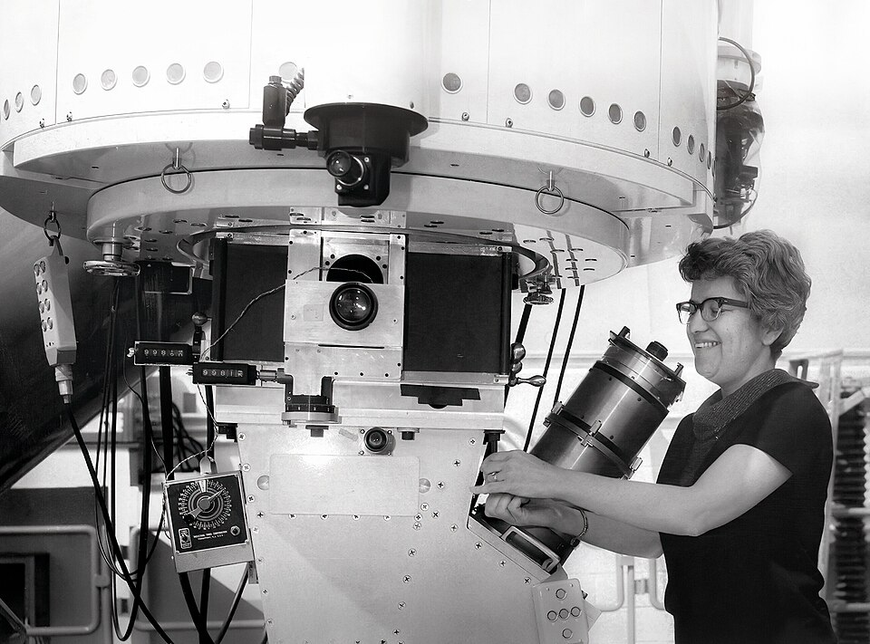

Most of the matter in the universe gives off no light, absorbs none and
reflects none. We know it is there only because it pulls: on galaxies, on
the gas between them, and on light itself. By the standard reckoning there
is about five times as much of this **[dark matter](kloom:e/dark-matter)** as of the ordinary
matter that makes stars, planets and people. As of September 2026 no one
knows what it is.

## Zwicky's missing mass

In 1933 **[Fritz Zwicky](kloom:e/fritz-zwicky)**, a Swiss astronomer at Caltech, looked at the
Coma cluster, a swarm of some eight hundred galaxies, and at how fast they
moved within it: a spread of a thousand kilometers a second or more. A
cluster held together by its own gravity cannot let its members move
faster than its mass allows. Adding up the mass the galaxies' light
implied, Zwicky found the cluster should have flown apart long ago. To hold
it, he wrote, its density would have to be at least 400 times what the
luminous matter gives, so that "dark matter" (_dunkle Materie_) would be
present in much greater density than luminous matter (our translation).
His factor was far too large, mainly because it rested on Hubble's
too-large constant, but the discrepancy did not go away. For forty years
it was mostly set aside.

## Flat rotation curves

What changed minds was galaxies that spin too fast. **[Vera Rubin](kloom:e/vera-rubin)**, at the
Carnegie Institution's Department of Terrestrial Magnetism, worked with the
instrument-maker Kent Ford, whose image-tube spectrograph cut the long
exposures of faint spectra by a factor of ten. In 1970 they published the
rotation of the Andromeda galaxy from sixty-seven glowing gas clouds out to
24 kiloparsecs from its center. Through the 1970s they measured more
spirals, and the pattern held: far from the center, where the light thins
out, the stars do not slow down.

The plate shows why that matters. If a galaxy's mass were where its light
is, most of it near the center, the outer stars should orbit more slowly
the farther out they are, as the outer planets do. Instead the speeds stay
level. The plate is drawn from a model, not from data, but its shape is
theirs: a flat curve needs mass that keeps growing with distance, a halo
of something unseen. Radio astronomers mapping hydrogen gas far beyond the
starlight found the same, and in 1974 two groups, in Princeton and in
Tartu, argued that galaxies sit inside massive dark halos.

## Weighing by bent light

General relativity gives a way to weigh without seeing: mass bends light,
so a cluster of galaxies distorts the images of galaxies behind it, and the
distortion maps the mass. The sharpest case is the **[Bullet Cluster](kloom:e/bullet-cluster)**, two
clusters that passed through each other about 150 million years before
the light we see left them. Most of their ordinary matter is hot gas,
which collided, slowed and piled up in the middle, glowing in X-rays. In
2006 Douglas Clowe and colleagues mapped the mass by lensing and found it
had not stopped: it had passed through with the galaxies, apart from the
gas. They called it "a direct empirical proof of the existence of dark
matter".

The **[cosmic microwave background](kloom:e/cosmic-microwave-background)** says the same from the other end of
time. The ripples in it fit a universe of about 5% ordinary matter and
27% dark matter, and the abundances of the light elements made in the
first minutes allow no more than about 5% of ordinary matter. Whatever the
rest is, it is not atoms.

## The search

The long favorite has been the **[weakly interacting massive particle](kloom:e/weakly-interacting-massive-particle)**, or
WIMP: a heavy particle felt only through gravity and the weak force, which
would have been made in about the right amount in the hot early universe.
Another candidate is the _axion_, a very light particle proposed in 1977–78
to solve a puzzle in the theory of the strong force, sought with magnets
and microwave cavities. Neither has been found.

The most sensitive searches for WIMPs wait deep underground for one to
knock a xenon nucleus. The **[LZ experiment](kloom:e/lz-experiment)**, seven tonnes of liquid xenon
nearly a mile down at the Sanford Underground Research Facility in South
Dakota, and XENONnT, under the
Gran Sasso in Italy, have reported nothing, pushing the limits down by
orders of magnitude. They are now sensitive enough to see the Sun's
neutrinos, the "fog" beyond which a WIMP will be hard to pick out.

| Result                    | Date     | Exposure         | Found                                   |
| ------------------------- | -------- | ---------------- | --------------------------------------- |
| LZ                        | Oct 2024 | 4.2 tonne-years  | No excess over background               |
| XENONnT                   | Feb 2025 | 3.1 tonne-years  | No significant excess                   |
| LZ, light dark matter     | Dec 2025 | 5.7 tonne-years  | No dark matter; solar neutrinos at 4.5σ |
| LZ, higher-energy recoils | Sep 2026 | 2.84 tonne-years | One event, 2.6σ overall                 |

On 1 September 2026 LZ reported a single event from June 2023, a xenon
nucleus struck hard, where little background was expected. It is in
tension with background alone at 2.6 standard deviations overall, far from
the five that physicists ask of a discovery, and the collaboration says
more data are needed.

## The dissent

A minority holds that there is no dark matter, only gravity that departs
from Newton's law at the very small accelerations of a galaxy's outskirts.
**[Modified Newtonian dynamics](kloom:e/modified-newtonian-dynamics)**, proposed by Mordehai Milgrom in 1983, fits
rotation curves remarkably well. It struggles with clusters, including the
Bullet Cluster, with lensing and with the ripples in the microwave
background, and relativistic versions have had to add fields of their own.
Most cosmologists expect a particle. The universe's other unknown, which
makes up most of the rest, is dark energy.
