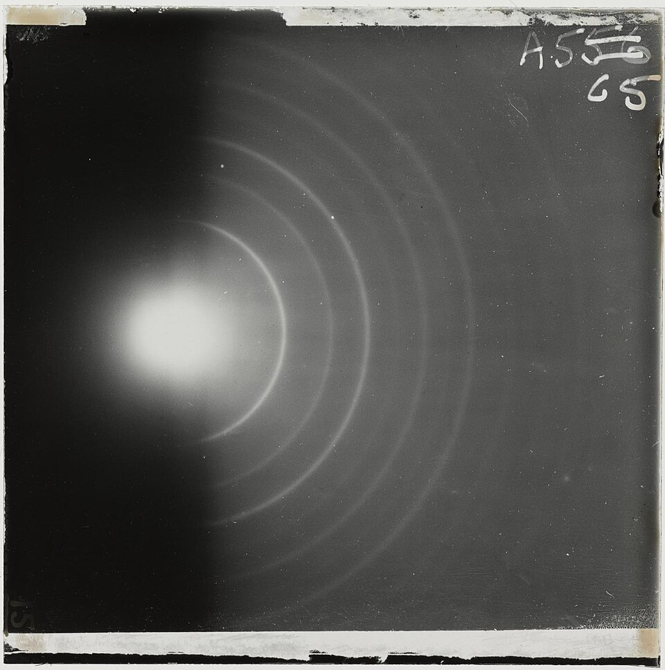

**[Louis de Broglie](kloom:e/louis-de-broglie)** came to physics late and sideways. Born in 1892 into
one of France's great aristocratic families, he took a degree in history
first, spent the First World War on radio work at the transmitter on the
Eiffel Tower, and learned his physics partly in the X-ray laboratory of his
elder brother Maurice. In three short notes to the Paris Academy of
Sciences in the autumn of 1923, and then in his doctoral thesis,
_Recherches sur la théorie des quanta_, defended at the Sorbonne in
November 1924, he turned Einstein's idea around. If waves of light come as
particles, particles of matter should come with waves.

## A wave for every particle

The rule he gave is short: a particle with momentum _p_ has a wavelength
_λ_ = _h_/_p_, where _h_ is the Planck constant. For anything we can hold
the wavelength is absurdly small: by our arithmetic, a baseball thrown at
40 meters a second has one of about 10⁻³⁴ meters. For an electron it is the size of an atom.

His first test was Bohr's atom. Send the electron's wave round an orbit and
it will meet itself; it can only persist if a whole number of wavelengths
fits the circumference, 2π_r_ = _nλ_. That condition is exactly Bohr's rule
for the allowed orbits, found now as a property of waves instead of laid
down. The plate draws the orbit for _n_ = 4, four wavelengths round. For
hydrogen's lowest orbit, by our arithmetic, one wavelength is 0.33
nanometers, just the circumference of an orbit of radius 0.053.

**Paul Langevin**, one of his examiners, sent a copy to Einstein, who
wrote back on 16 December 1924: "He has lifted a corner of the great
veil." De Broglie's own reading of his waves, as real
waves that guide the particles, he defended at the Solvay conference of
1927 and then gave up; David Bohm revived it in 1952. But the wave itself,
generalized by Schrödinger into an equation, became the center of the new
mechanics. The **[matter wave](kloom:e/matter-wave)** won de Broglie the Nobel Prize for 1929.

## Electrons diffracted

Proof came from two laboratories that were not at first looking for it.
At Western Electric in New York, the research department that became
**[Bell Labs](kloom:e/bell-labs)** in 1925, **[Clinton Davisson](kloom:e/clinton-davisson)** and **Lester Germer** were
bouncing slow electrons off nickel to study its surface. In 1925 air leaked
into their tube; to clean the oxidized nickel they heated it, and without
knowing it turned it into a few large crystals. The electrons then came
off in odd peaks. In the summer of 1926, at a meeting in Oxford, Davisson
heard **Max Born** cite Davisson's own earlier curves as evidence for de
Broglie's waves.

Their results of 1927 included the clearest peak: electrons of
54 electronvolts, scattered back at 50° from rows of atoms 2.15 ångströms
apart. Rows that far apart reinforce a wave of 1.65 ångströms at that
angle; de Broglie's rule gives 1.67 for such electrons. The arithmetic is
ours, but the agreement is theirs.

In Aberdeen the same year **[George Paget Thomson](kloom:e/george-paget-thomson)** and his student
Alexander Reid fired faster electrons through thin films and caught them
on a photographic plate as rings, the pattern X-rays make through a
powder of crystals. His father, J. J. Thomson, had won the Nobel Prize in
1906 for showing the electron to be a particle. The son shared the prize
of 1937 with Davisson for showing it to be a wave. Germer was left out, to
the lasting puzzlement of physicists.

## Seeing with electrons

| Particle, and its speed                | Wavelength, picometers |
| -------------------------------------- | ---------------------: |
| Green light, for comparison            |                500,000 |
| A thermal neutron                      |                   ~180 |
| An electron at 54 eV (Davisson–Germer) |                    167 |
| An electron in a 100 kV microscope     |                    3.7 |
| A C60 molecule (Vienna, 1999)          |                    2.5 |

A microscope cannot resolve detail much finer than its wavelength, and an
electron's wavelength falls as its speed rises: the electron values in the
chart are ours, from _λ_ = _h_/_p_. In Berlin in 1931 **Max Knoll** and
**[Ernst Ruska](kloom:e/ernst-ruska)** focused electrons with magnetic coils as a lens focuses
light, and in 1933 Ruska's **[electron microscope](kloom:e/electron-microscope)** saw finer detail than
any light microscope can. Siemens sold the first commercial one in 1938.
Who invented it is still disputed: Reinhold Rüdenberg of Siemens filed
patents in 1932, and Knoll died before Ruska's Nobel Prize of 1986 could
be shared with him.

For decades the lenses, not the wavelength, limited what the instruments
could see. Computer-controlled correctors for the lenses' aberrations,
first shown in 1998, have since let the best transmission microscopes
resolve detail below half an ångström. Neutrons and whole molecules diffract too; in 1999 a
group in Vienna diffracted molecules of sixty carbon atoms.

What these waves were waves of, and what equation they obeyed, was the
question for 1925 and 1926. The first answer did without waves at all:
Heisenberg's matrix mechanics.
