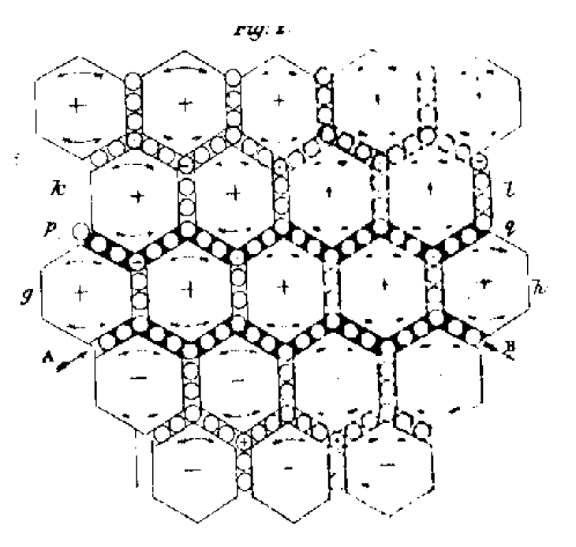

Faraday's lines of force had a reader who could do the mathematics.
**[James Clerk Maxwell](kloom:e/james-clerk-maxwell)**, professor at King's College London, published "[On
Physical Lines of Force](kloom:e/on-physical-lines-of-force)" in the _Philosophical Magazine_ in four parts,
between March 1861 and February 1862. It tried something bolder than a set
of equations: a machine, made of an imagined medium, that would do what
electricity and magnetism do. The machine was wrong. The equations that
came out of it are the ones still taught, and one term in them, the
**[displacement current](kloom:e/displacement-current-density)**, made light an electrical wave.

## Vortices and idle wheels

Faraday's lines behave as if they were under tension along their length
and pressed apart sideways. A spinning vortex does the same: it shortens
along its axis and swells round its middle. So Maxwell filled space with
small cells, each spinning about an axis that runs along the magnetic
line through it, faster where the field is stronger.

That raised a mechanical problem. Two neighbouring cells spinning the same
way rub against each other in opposite directions where they touch. The
answer came from engineering: "In mechanism, when two wheels are intended
to revolve in the same direction, a wheel is placed between them so as to
be in gear with both, and this wheel is called an 'idle wheel.'" Maxwell
put a layer of tiny particles between the cells as idle wheels, and let
those particles be electricity. When they roll along, that is a current;
when a current starts, the gearing spins up the cells around it, which is
magnetism, and the reverse gearing is Faraday's induction. The drawing is
his own.

Maxwell was careful about what he claimed. The particles in rolling
contact were "somewhat awkward," he wrote, a "provisional and temporary"
hypothesis. Historians have long disagreed over how far he believed the
rest. Bruce Hunt points out that he used those words only of the idle
wheels: the vortices he called probable, and in 1861 he had an apparatus
built to detect their spin. The test was inconclusive.

## Springy cells

Maxwell thought the paper finished in May. At Glenlair, his house in
Scotland, that summer he asked how the model could hold static charge, and
made the cells elastic. In an insulator, an electric force pushes the
particles a little way and the cells strain, like a spring, until the
force is balanced; take the force away and they spring back. While the
displacement is changing, particles are moving: "the commencement of a
current." So a changing electric field counts as a current, even where no
charge flows. In today's notation, Ampère's law for the magnetic field
gains a second term:

∇ × **B** = _μ_₀**J** + _μ_₀_ε_₀ ∂**E**/∂*t*

The plate draws the moment: one layer of particles pushed along, and the
cells beside it strained. Maxwell's route to the term is not the one
textbooks give now, which starts from the conservation of charge, and it
has caused a good deal of confusion since.

An elastic medium can carry waves that shake sideways, and their speed
depends on its elasticity and its density. In Maxwell's medium those came
from electricity and magnetism, and the speed came out equal to a number
that could be measured with ordinary apparatus: the ratio between the
electrostatic and electromagnetic units of charge.

## A number from Weber and Kohlrausch

He did the calculation "in the country," he later told Faraday, with no
value for that ratio to hand. Back in London in the autumn he found one.
**[Wilhelm Weber](kloom:e/wilhelm-eduard-weber)** and **[Rudolf Kohlrausch](kloom:e/rudolf-kohlrausch)** had measured it in 1855–56 by
charging a Leyden jar, measuring its charge once by the electric force it
exerted and once by the magnetic effect of discharging it. In Maxwell's units their result
was 310,740 kilometres a second. **[Hippolyte Fizeau](kloom:e/hippolyte-fizeau)** had measured the
**[speed of light](kloom:e/speed-of-light)** in 1849.

| Figure                                          | km per second |
| ----------------------------------------------- | ------------: |
| Weber and Kohlrausch's ratio, in Maxwell's form |       310,740 |
| Fizeau's light, as Maxwell printed it           |       314,858 |
| Fizeau's light, as Fizeau published it          |      ~315,300 |
| The speed of light today                        |   299,792.458 |

The two differ by about 1.3 per cent (the arithmetic, and the conversion
of Fizeau's published figure, are ours). Maxwell wrote to Faraday on 19
October 1861 that "this coincidence is not merely numerical," and in the
paper, in italics: "we can scarcely avoid the inference that light
consists in the transverse undulations of the same medium which is the
cause of electric and magnetic phenomena."

Accounts differ over what Weber and Kohlrausch saw. Some say they found
that their ratio matched the speed of light. Hunt, following Oliver
Darrigol, says they noticed the closeness and thought it meant nothing:
in Weber's theory the number had nothing to do with waves, and his own
ratio was larger than Maxwell's by a factor of √2. Hunt also notes that
Maxwell miscopied Fizeau, printing 70,843 leagues for 70,948.

The fourth part used the vortices to explain the Faraday effect. Then, in
1864, Maxwell dropped the machinery and derived the same equations from
general dynamics: the paper that western civilisation's "Let there be
LIGHT" tells. Why he did so is argued too; Hunt traces it to 1863, a year
spent measuring the ohm with telegraph engineers. No one made a wave that
was not light until Heinrich Hertz, in a lecture room at Karlsruhe,
twenty-five years later.
