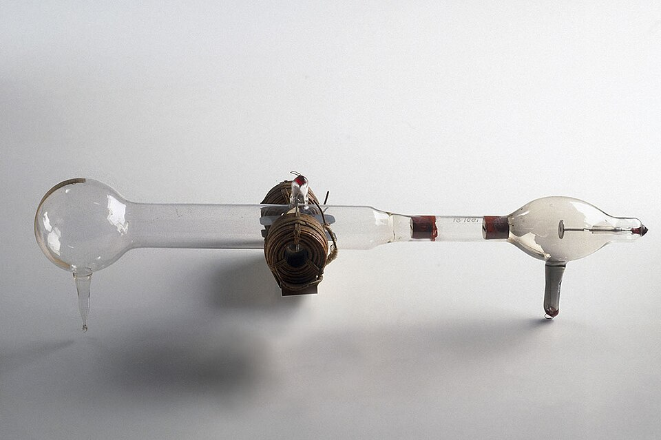

For decades physicists had watched the glow that runs from the
negative electrode of an evacuated glass tube, and they could not agree
what it was. In 1897, at the Cavendish Laboratory in Cambridge, **[J. J.
Thomson](kloom:e/j-j-thomson)** showed that these [_cathode rays_](kloom:e/cathode-ray) were streams of particles far
smaller than any atom, and the same whatever the tube was made of or held.
The atom, the indivisible unit of matter since the Greeks, had parts. The
particle was soon called the **[electron](kloom:e/electron)**, and measuring its charge made
the reputation of **[Robert Millikan](kloom:e/robert-millikan)**, and later cast a shadow on it.

## Rays or particles

**Cathode rays** travel in straight lines, cast shadows, and are bent by a
magnet. Most German physicists thought them a disturbance in the ether,
like light; in Britain William Crookes had argued that they were charged
molecules. Heinrich Hertz had failed to bend them with an electric field,
which counted against particles. In the paper he published in the
_Philosophical Magazine_ that October, Thomson showed why: with a better
vacuum in the tube, the rays did bend towards a positive plate.

The plate draws his second tube. Rays from the cathode pass through slits
in the anode and a plug, then between two plates. An electric field
between the plates bends the beam one way; coils outside the tube make a
magnetic field that bends it the other. Setting the magnetic field to
bring the beam back to the middle gives the particles' speed, and the
deflection by either field alone then gives the ratio of their mass to
their charge, _m_/_e_. He varied the gas and the metal of the electrodes,
and the ratio did not change.

| Gas in the tube | Tube 1, _m_/_e_ | Tube 2, _m_/_e_ |
| --------------- | --------------: | --------------: |
| Air             |       0.40×10⁻⁷ |       0.52×10⁻⁷ |
| Hydrogen        |       0.42×10⁻⁷ |       0.50×10⁻⁷ |
| Carbonic acid   |        0.4×10⁻⁷ |       0.54×10⁻⁷ |

Thomson's means, in his units, from his first method. The smallest value
known before, for the hydrogen ion in electrolysis, was about 10⁻⁴: a
thousand times larger. Either the particles were very light or their
charge was very large, and Thomson in 1897 thought both. He called them
_corpuscles_ and proposed that atoms were built of them. The name that
stuck, _electron_, was George Johnstone Stoney's, coined in 1891 for the
unit of electric charge. Emil Wiechert and Walter Kaufmann had measured
the same ratio that year, but did not claim a new particle; that step was
Thomson's, and it brought him the Nobel Prize in 1906.

In 1904 Thomson proposed an atom of electrons set in a sphere of evenly
spread positive charge. Popular writers called it the **[plum
pudding model](kloom:e/plum-pudding-model)**, a name Thomson never used. Rutherford's gold foil would
put an end to it in 1911, which the nucleus frame tells.

## Oil drops

Thomson's group had estimated _e_ crudely from charged clouds. Millikan, at the University of Chicago, tried
balancing single droplets in a strong electric field, but water evaporated
too fast. His graduate student **[Harvey Fletcher](kloom:e/harvey-fletcher)** tried watch oil from a
perfume atomizer, and it worked. In the **[oil drop
experiment](kloom:e/oil-drop-experiment)** a charged droplet between two plates falls under gravity at a
speed set by its size and by the viscosity of air, and rises when the
field is switched on; timing both gives its charge. As a drop picked up
charges from the air, which an X-ray tube in the apparatus ionised, its
charge jumped, always by whole multiples of one amount.

Millikan's paper of 1913 gave the **[elementary charge](kloom:e/elementary-charge)** as 4.774 × 10⁻¹⁰
electrostatic units, 1.592 × 10⁻¹⁹ coulomb, with an uncertainty of 0.2 per
cent. The academic rules let a student use a paper as a thesis only as
sole author, and Millikan offered Fletcher the Brownian-motion paper on
condition that the charge be Millikan's alone. Fletcher accepted, and
saw that the story was not published until both were dead. Millikan
received the Nobel Prize in 1923.

## The selected drops

The paper says of its 58 drops that "this is not a selected group of
drops, but represents all the drops experimented upon during 60
consecutive days". His notebooks, read by the historian Gerald Holton in
1978, show otherwise, and in 1982 the journalists William Broad and
Nicholas Wade presented it as a case of discarding data that fitted a
rival, Felix Ehrenhaft, who claimed to see smaller charges. The physicist
David Goodstein, defending Millikan in 2000, counted about 100 drops in
the notebooks for those 63 days, some 75 of them complete, of which 58 were
published; the physicist and philosopher Allan Franklin's reanalysis found
the choice barely moved the result. The sentence, Goodstein argues, was
about the correction to Stokes's law, not about whether charge came in
units. It was still untrue.

Goodstein also wrote that today's value agrees with Millikan's within his
0.2 per cent. It does not. Millikan used a wrong value for the viscosity of
air, and his _e_ is about 0.6 per cent low, several times his stated
error. Feynman made that, and the slow creep of later values up from it,
his lesson in "Cargo Cult Science". Since 2019 the elementary charge has
been exact by definition, 1.602176634 × 10⁻¹⁹ coulomb. And Karl Ferdinand
Braun's tube of 1897, a beam of these particles steered onto a glowing
screen, became the television, and the memory of the first stored-program
computer.

Next, the light from hot bodies would show that energy had parts too.
