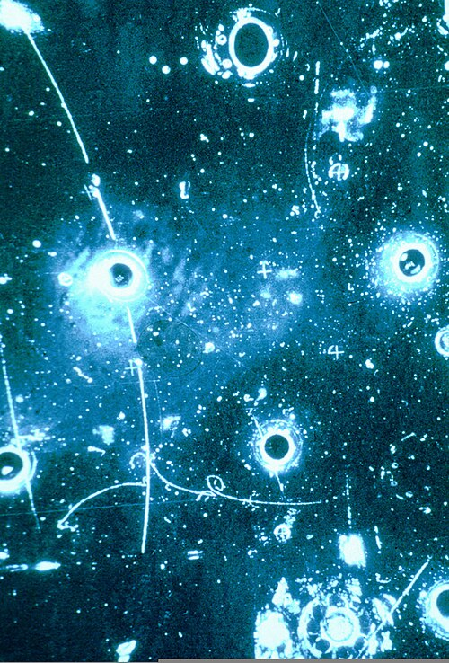

Enrico Fermi's theory of beta decay, of 1933, let a neutron turn into a
proton, an electron and a neutrino at a single point, with no carrier in
between. At the energies of nuclear decay it worked, and once the weak
force was found to tell left from right it took its lasting form, the
V − A law of 1957. But it could not be the whole story. The chance of a
neutrino interacting grows with its energy in Fermi's theory, and at a
collision energy of about 300 GeV it would exceed what quantum mechanics
allows. Something had to carry the force and soften it: a heavy particle,
the W. A theory with a heavy carrier, though, gave infinite answers that
could not be tamed as those of quantum electrodynamics had been.

## Carriers that should have no mass

The way to a theory without those infinities ran through a symmetry.
Electromagnetism is a _gauge theory_: the photon is what a local symmetry
of the electron's field requires. In 1954 **Chen-Ning Yang** and Robert
Mills generalised the idea to symmetries whose operations do not commute,
the **[Yang–Mills theory](kloom:e/yang-mills-theory)**. Its carriers came out massless, and when Yang
presented it at Princeton, Wolfgang Pauli pressed him on the mass. The
paper conceded that the authors did not have "a satisfactory answer".

Julian Schwinger believed as early as 1956 that the weak and
electromagnetic forces should be one gauge theory, and his student
**[Sheldon Glashow](kloom:e/sheldon-glashow)** took up the faith in his Harvard thesis of 1958. In
Copenhagen in 1960 Glashow found the right symmetry group, SU(2) × U(1),
with two neutral carriers: the massless photon and a heavy one he called B,
now the Z. **[Abdus Salam](kloom:e/abdus-salam)** and John Ward reached it independently. But
Glashow put the masses in by hand, the strength of the neutral force was
left open, and the model could not be renormalised. He later wrote that he
had "completely missed the boat".

## The right ideas, the wrong problem

The key was spontaneous symmetry breaking: a symmetry exact in the laws but
hidden in the lowest-energy state. In 1964 Robert Brout and François
Englert, Peter Higgs, and Gerald Guralnik, Carl Hagen and Tom Kibble had
shown that in a gauge theory it gives the carriers mass. **[Steven
Weinberg](kloom:e/steven-weinberg)** had been trying it on the strong force. In the autumn of 1967,
by his own account "while driving to my office at M.I.T.", he saw that he
had been applying the right ideas to the wrong problem: the massless
carrier was the photon, and its heavy partners were the carriers of the
weak force. His paper, "A Model of Leptons", appeared in _Physical Review Letters_ before the year was out. Salam
presented the same theory independently in 1968.

The plate draws its central construction. Breaking the symmetry turns two
neutral fields, W3 and B, through the weak mixing angle into the photon
and the Z. The photon stays massless, the W and Z become heavy, and one
measured angle fixes the Z's mass and the neutral force's strength. Today
sin²θ_W is about 0.23.

Weinberg suspected that the theory could be renormalised but could not
prove it, and for four years it drew almost no attention.

## Utrecht, 1971

In 1971 **[Gerard 't Hooft](kloom:e/gerard-t-hooft)**, a graduate student of **[Martinus
Veltman](kloom:e/martinus-j-g-veltman)** at Utrecht, proved that it could be: a gauge theory whose
symmetry is broken spontaneously gives finite answers to every order.
Glashow heard it from Veltman that spring. Weinberg admitted in his Nobel
lecture that on first reading he was not convinced, "not familiar enough
with the path integral formalism" on which 't Hooft had built. Once the
proof was accepted, the unified theory stood or fell by one prediction:
a _neutral current_, a weak interaction in which no charge changes hands.

## Gargamelle

**[Gargamelle](kloom:e/gargamelle)** was a bubble chamber at **CERN** built at Saclay, 4.8 metres
long and holding 12 cubic metres of heavy Freon, run by a collaboration of
seven laboratories under André Lagarrigue. Neutral currents were fifth on
its list of priorities. Weinberg calculated late in 1971 that his theory
predicted rates low enough to have escaped earlier searches.

In December 1972 Franz-Josef Hasert, a graduate student at Aachen, found
the photograph above in film from the antineutrino beam: an electron set
moving from nowhere, struck by an antineutrino that came in and went out
unseen. By March 1973 the collaboration had 166 candidate events in which
a neutrino struck a nucleus and left no muon. The worry was neutrons from
the surrounding material, which could fake them; three more months of
analysis ruled that out. Paul Musset presented both results at CERN on
19 July 1973, and the two papers appeared together that September. Many
remained unconvinced until experiments in the United States confirmed them
in 1974.

Glashow, Salam and Weinberg shared the Nobel Prize in 1979. 't Hooft and
Veltman had theirs in 1999. Ward, whose name is on the early papers, had
none. The same Yang–Mills mathematics was about to explain the strong force
too, and the W and Z themselves had still to be made.
