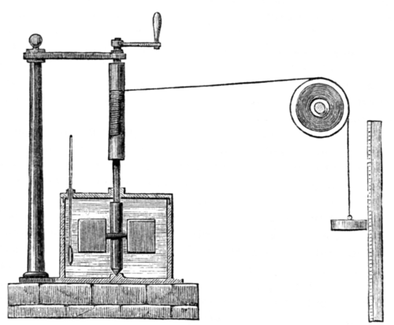

In the 1840s three men who were not professional physicists, a ship's
doctor, a brewer and a young physiologist, arrived by different roads at
the same law: that heat and work are two forms of one thing, which can be
turned into each other at a fixed rate and never made from nothing or lost.
Within a decade the thing had its modern name, energy, and the law was the
**[first law of thermodynamics](kloom:e/first-law-of-thermodynamics)**. It went on to govern every branch of
physics, and it is still the rule no experiment has broken.

## The doctor from Heilbronn

**[Julius Robert Mayer](kloom:e/julius-von-mayer)** sailed to Java in 1840 as physician on a Dutch
ship. In the tropics, he noticed, the blood he let from his patients' veins
was a deeper red than at home, as if the body burned less of its fuel
to keep warm in a hot climate. Back in Heilbronn he turned the observation
into a principle: forces, as he called them, are indestructible and
convertible, and falling, motion and heat are one force in different forms.
The leading physics journal, Poggendorff's _Annalen_, did not print his
first attempt; a second appeared in Liebig's chemistry journal in May 1842. He put a number on the conversion, reached not by experiment but by
reasoning from the extra heat a gas takes to expand at constant pressure:
365 kilogram-meters of work for each kilocalorie of heat, which he later
revised to 425.

His reward was neglect, and then a quarrel. When his priority was pressed
in the 1860s by John Tyndall in London, who set out "to raise a noble and
a suffering man" to his proper place, William Thomson and P. G. Tait
answered that his reasoning was faulty; the _Encyclopaedia Britannica_ of
1911 still called his claim to have calculated the number "baseless". Joule
and Thomson's own settlement had been to grant Mayer the idea and keep the
experiments for Joule.

## The brewer's paddle wheel

**[James Prescott Joule](kloom:e/james-prescott-joule)**, who ran his family's brewery in Salford, came to
the question from business: could the new electric motor replace the
brewery's steam engines? He measured everything in foot-pounds, the work
of lifting a pound one foot, and in 1843 announced that the heat to warm a
pound of water by one degree Fahrenheit was worth 838 of them. His
audience at Cork met it with silence.

He tried other routes: water forced through narrow tubes, air compressed
and let expand, and from 1845 the experiment he is remembered for. Falling
weights, by a cord round a roller, turn a brass paddle-wheel whose eight
revolving arms churn water between four sets of fixed vanes; the plate
draws it in plan. In the version he published in 1850, two lead weights of
about 29 pounds each fell some 63 inches, were wound up and fell again,
twenty times in 35 minutes, and the water warmed by about two-thirds of a
degree Fahrenheit. He claimed to read his thermometers to a two-hundredth
of a degree. Every route gave nearly the same number, and he took the
agreement as proof.

| Joule's measurement                        | Foot-pounds per pound of water, per °F |
| ------------------------------------------ | -------------------------------------: |
| 1843, heat from a magneto-electric machine |                                    838 |
| 1843, water forced through narrow tubes    |                                    770 |
| 1845–47, paddle-wheel in water             |                                  781.5 |
| 1850, paddle-wheel in water, final         |                                772.692 |
| Today's value, converted by us             |                                  778.2 |

(Wikipedia's articles differ from each other on the paddle-wheel figure of
1845; the table takes Joule's own summary in the paper of 1850.)

In 1847 Joule spoke at the British Association in Oxford. William Thomson,
later Lord Kelvin, was in the room, intrigued and skeptical. They met
again that summer at Chamonix, where Joule was on his honeymoon, and made
plans to measure whether a waterfall's water is warmer at the bottom than
at the top. It proved impractical. By 1851 Thomson was convinced.

## Helmholtz's memoir

On 23 July 1847 **[Hermann von Helmholtz](kloom:e/hermann-von-helmholtz)**, twenty-five, read a memoir to the
Physical Society of Berlin, _Über die Erhaltung der Kraft_, on the
conservation of force. He had come to it from physiology, wanting to show
that a muscle needs no vital force beyond what its food supplies. He began from
the assumption, in our translation, "that it is impossible by any
combination of natural bodies to create motive force continually out of
nothing", the premise from which, he noted, Carnot and Clapeyron had
already derived laws of heat, and followed it through mechanics, heat,
electricity and magnetism. For bodies acting by attraction and repulsion,
the sum of what he called their living forces and tension forces stays
constant. His "tension force" was what Rankine in 1853 named **potential
energy**, and the living force became kinetic energy. The memoir cited
Joule's experiments; Helmholtz came round to crediting Mayer as well.

The **[conservation of energy](kloom:e/conservation-of-energy)** left a puzzle it could not solve alone.
Carnot's engine let heat fall and did work; Joule's showed that work used
heat up. Rudolf Clausius reconciled them in 1850 with a second law, the
law of entropy.
