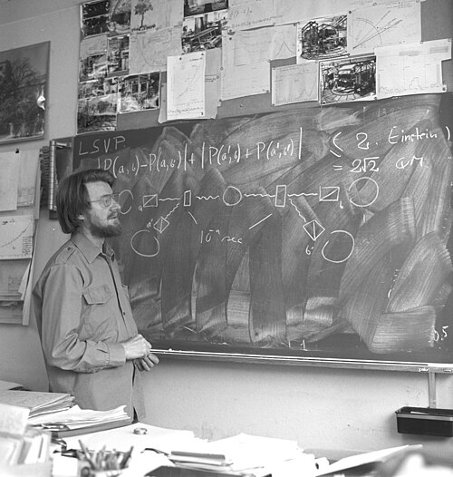

Two particles that have interacted can be left in a joint state that
neither has alone. Measure one, and what the other will show is settled,
however far away it is. Quantum mechanics predicts it; Einstein thought
it showed the theory incomplete; for thirty years it was a question for
philosophers. Then a physicist at CERN turned it into a number that could
be measured, and the measurements, beginning in 1972, went against
Einstein. The strangest thing in the theory has since become a tool.

## Einstein's objection

In May 1935 **Albert Einstein**, with **Boris Podolsky** and **Nathan
Rosen** at the Institute for Advanced Study in Princeton, asked in the
_Physical Review_: "Can Quantum-Mechanical Description of Physical Reality
Be Considered Complete?" The _New York Times_ reported it on 4 May, before
the journal appeared. The paper, known by its authors' initials as
[EPR](kloom:e/einstein-podolsky-rosen-paradox), imagines two particles that have met and flown apart. Measure the
position of the first and you can predict the position of the second;
measure the first's momentum instead and you can predict the second's. The
second was never touched. So, they argued, it must have had both a
definite position and a definite momentum all along, and a theory whose
uncertainty relations forbid both is leaving something out. Podolsky
wrote most of it, and Einstein told Schrödinger that the essential point
had been "smothered by the formalism". Bohr replied in the same journal that October that the
two measurements belong to different arrangements of apparatus, and that
facts from one cannot be combined with facts from the other.

Schrödinger, answering Einstein by letter, gave the joint state a name,
_Verschränkung_, which he put into English himself as **[entanglement](kloom:e/quantum-entanglement)**. He
called it not one but "the characteristic trait of quantum mechanics".

## Bell's number

In 1951 **[David Bohm](kloom:e/david-bohm)** recast the argument with spins, whose measurements
give only up or down, and that made it countable. In 1964, after a year's
leave from CERN in America, **[John Bell](kloom:e/john-stewart-bell)** asked what any theory of the kind
Einstein wanted could predict: one in which each particle carries
instructions for every measurement, fixed when the pair separates, and
nothing travels between them faster than light. He proved that the
correlations between the two sides of such a theory must obey an
inequality, and that quantum mechanics breaks it. The result is known as
[Bell's theorem](kloom:e/bells-theorem).

The form most experiments test was set out in 1969 by Clauser, Horne,
Shimony and Holt. Two observers each choose one of two settings and record
±1; a sum _S_ of four averaged correlations can be no larger than 2 in any
local theory. Quantum mechanics predicts up to 2√2, about 2.83, for the
right choice of angles. The plate draws the reason: for photons the quantum
correlation between two polarisers follows a cosine with the angle between
them, while the best local model is a straight line; the curve bows beyond
the line, and the gap is the violation.

## The tests

| Year | Where                     | What it did                                                   |
| ---- | ------------------------- | ------------------------------------------------------------- |
| 1972 | Berkeley                  | first violation: Freedman and Clauser, photons from calcium   |
| 1982 | Orsay                     | Aspect's settings switched while the photons were in flight   |
| 2015 | Delft, Vienna and Boulder | loophole-free: detection and locality closed together         |
| 2017 | Micius satellite          | entangled photons 1,203 km apart still violate the inequality |

**[John Clauser](kloom:e/john-clauser)** found Bell's paper in 1967, in a journal with the odd
title _Physics Physique Физика_, and built the first test with Stuart
Freedman at Berkeley. **[Alain Aspect](kloom:e/alain-aspect)**'s team at Orsay closed the most
glaring gap: they chose the settings after the photons had left the
source, so that no signal could tell one side what the other would
measure. Each test left loopholes, such as detectors that miss most
photons, until in 2015 groups at Delft, Vienna and Boulder closed the main
ones in one experiment each. The Delft team, entangling electron spins in
two diamonds 1.3 kilometres apart, measured _S_ = 2.42 ± 0.20.

The Nobel Prize in Physics for 2022 went to Aspect, Clauser and **Anton
Zeilinger** "for experiments with entangled photons, establishing the
violation of Bell inequalities and pioneering quantum information science".
Local hidden variables of Einstein's kind are ruled out. What entanglement
is remains argued, but not what it does.

## A resource

It cannot send a message: each side alone sees only random results, and
the correlation shows only when the records are compared by ordinary
means. It can do other things. In 1991 **Artur Ekert** proposed using a
Bell test to share a secret key: an eavesdropper who intercepts the pairs
spoils the correlations and shows up. That is one scheme of [quantum key
distribution](kloom:e/quantum-key-distribution), which **Charles Bennett** and Gilles Brassard had begun
without entanglement in 1984. In 1993 Bennett and five colleagues showed
how an entangled pair, plus two ordinary bits, can move a particle's whole
quantum state to another particle far away without sending the particle:
_quantum teleportation_. Two groups did it with photons in 1997, one of
them Zeilinger's in Innsbruck, and a Chinese team teleported states from Tibet to the Micius
satellite in 2017, 1,400 km.

The security of key distribution is a claim about physics, where the
post-quantum ciphers now in web browsers rest on mathematics. The US
National Security Agency, for one, prefers the mathematics: in practice,
it says, a quantum link's security "is highly implementation-dependent
rather than assured by laws of physics". Entanglement's largest use is
still ahead, in computers that hold many particles entangled at once,
which is the subject of the frame on **quantum computing**.
