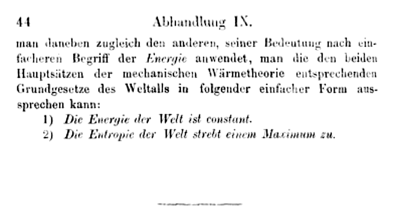

In February 1850 a new professor at the Royal Artillery and Engineering
School in Berlin, **[Rudolf Clausius](kloom:e/rudolf-clausius)**, read a memoir to the Prussian Academy that
began with the steam engine: it had given us "a means of converting heat
into a motive power". Sadi Carnot had shown that an engine makes work by
letting heat fall from hot to cold, as a mill uses falling water; Joule
had shown that heat is used up when work is made. They seemed to
contradict each other. Clausius showed that both could be true at once if
heat obeyed two laws, not one. The second was new, and fifteen years later
he gave the quantity it governs a name, **[entropy](kloom:e/entropy)**.

## Two statements of one law

The **[second law of thermodynamics](kloom:e/second-law-of-thermodynamics)** says which way things go. Clausius's
own statement of it, in 1854, is the one still quoted: "Heat can never pass
from a colder to a warmer body without some other change, connected
therewith, occurring at the same time." A refrigerator can move heat
uphill, but only by spending work, which is the other change.

In Glasgow, **William Thomson**, later **[Lord Kelvin](kloom:e/lord-kelvin)**, had reached the same
place from Carnot's side. His statement of 1851 is that it is impossible,
"by means of inanimate material agency, to derive mechanical effect from
any portion of matter by cooling it below the temperature of the coldest
of the surrounding objects." An engine needs a cold body to dump heat into
as much as a hot one to draw it from. The two statements look different;
each can be proved from the other.

Thomson also gave temperature a zero that belongs to no substance. In 1848
he proposed an _absolute_ scale defined by the work heat can do as it
falls, and reckoned from the gas measurements of his day that nothing could
be colder than about −273 °C. Wikipedia's articles date today's kelvin
scale to that paper. Thomson himself, in a note of 1881, said the 1848
scale rested on Carnot's uncorrected theory and was logarithmic in the one
he gave in 1854, which is the scale used now.

## A name for the quantity

Clausius spent the next fifteen years looking for what stays fixed in a
perfect engine and grows in a real one. He found it in heat divided by the
absolute temperature at which it moves. In a reversible cycle the sum of
all the pieces _Q_/_T_ comes to zero; in any real process it comes out
positive. In a memoir read at Zürich on 24 April 1865 he wrote the quantity
as _S_ and named it from the Greek _tropē_, transformation, "so as to be as
similar as possible to the word energy; for the two magnitudes … are so
nearly allied in their physical meanings". For a small reversible step,
d_S_ = δ_Q_/_T_.

A worked example, with invented numbers, shows the arithmetic. Let 1,000
joules of heat leak along an iron bar from a body at 400 kelvin to one at 300. The hot body loses 1,000/400 = 2.5 joules per kelvin of entropy; the
cold one gains 1,000/300, about 3.33. The total has grown by about 0.83,
and no process that leaves nothing else changed can take it back. The
plate draws that leak, and the rise of entropy towards the ceiling it
cannot pass.

| Invented example       | Heat, J | Temperature, K | Entropy change, J/K |
| ---------------------- | ------: | -------------: | ------------------: |
| The hot body           |  −1,000 |            400 |               −2.50 |
| The cold body          |  +1,000 |            300 |               +3.33 |
| The two together, ours |       0 |              — |               +0.83 |

The memoir ends by turning the two laws on the whole world.

"1. The energy of the universe is constant. 2. The entropy of the universe
tends to a maximum." So runs the English translation of 1867.

## The heat death

Clausius's footnote gave the credit for that conclusion to Thomson. In
1852, in a paper called "On a Universal Tendency in Nature to the
Dissipation of Mechanical Energy", Thomson had argued that friction,
conduction and the absorption of light each waste work beyond full
recovery, and concluded that "within a finite period of time to come the
earth must again be, unfit for the habitation of man as at present
constituted". **[Hermann von Helmholtz](kloom:e/hermann-von-helmholtz)** and William Rankine read the
thought further, from the Earth to the universe: every difference of
temperature evened out, nothing left to run an engine. Helmholtz wrote of
it as a **[heat death](kloom:e/heat-death-of-the-universe)**, Rankine as the end of all physical phenomena. Whether it applies to an expanding
universe, where gravity makes structure rather than smoothing it, is a
question for cosmology, and is still open.

What Clausius did not say is what entropy _is_. His law was a rule about
engines, obeyed without exception and explained by nothing. The trail
"Heat and information" follows the answer: Maxwell's demon (1867), who
seemed to break the law; Boltzmann's counting of molecular arrangements
(1877); Szilard's one-molecule engine (1929); Shannon's entropy of a
message (1948); Landauer's price of erasing a bit (1961); and Bennett's
reversible computer, which laid the demon to rest.
