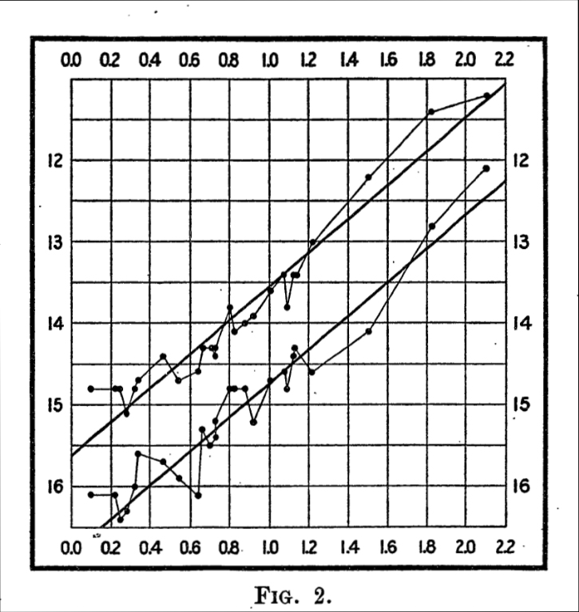

In 1920 we did not know how big the universe was, or whether there was
anything beyond the Milky Way. Ptolemy had put the sphere of the stars at
twenty thousand Earth radii; by 1920 astronomers argued over whether our
galaxy was 30,000 light-years across or 300,000, and whether the faint
spiral _nebulae_ lay inside it or far outside. Within ten years the argument
was settled, and a stranger fact had taken its place: the galaxies are
rushing away from us, the farther the faster, because space itself is
growing.

## A yardstick for the sky

The first step was taken at Harvard by **[Henrietta Swan Leavitt](kloom:e/henrietta-swan-leavitt)**, one of
the women the observatory paid to measure its photographic plates. She was
cataloguing variable stars in the Small Magellanic Cloud, 1,777 of them in
the two Clouds, and in a circular of March 1912 she set out the periods of 25. "A remarkable relation between the brightness of these variables and
the length of their periods will be noticed," it reads: the brighter
_Cepheids_ pulse more slowly. Because the stars of one cloud are all at
nearly the same distance, the relation had to be about their true
brightness. Measure a Cepheid's period and you know how bright it really
is; compare that with how bright it looks and you have its distance.
Ejnar Hertzsprung calibrated the scale the next year.

## Speeds without distances

Meanwhile, at the Lowell Observatory in Arizona, **[Vesto Slipher](kloom:e/vesto-slipher)** was
measuring the spectra of spiral nebulae. The first, in 1912, was the
**[Andromeda Nebula](kloom:e/andromeda-galaxy)**, and it was coming towards us at about 300 km/s, the
greatest speed then known. But as his list grew, almost all the others were
going away: by 1917, all but three of 25. Slipher had speeds, but no
distances.

The size of the universe was argued out in public on 26 April 1920, in the
**[Great Debate](kloom:e/great-debate-astronomy)** in Washington. Harlow Shapley held that the spirals were
parts of a Milky Way some 300,000 light-years across; Heber Curtis that they
were island universes like our own. Shapley was right that the Sun is far
from the centre of the galaxy, and wrong about the rest. In 1923–24
**[Edwin Hubble](kloom:e/edwin-hubble)**, with the new 100-inch telescope on Mount Wilson, found
Cepheids in Andromeda, and Leavitt's yardstick put it far outside our
galaxy. Leavitt did not see it: she had died in 1921.

## The theory came first

Einstein's general relativity allowed a universe that changes. He did not
want one, and in 1917 added a term to hold his model still. In 1922 the
Russian mathematician **[Alexander Friedmann](kloom:e/alexander-friedmann)** showed that the equations
also allow a universe that expands. In 1927 **[Georges Lemaître](kloom:e/georges-lemaitre)**, a Belgian
priest trained in physics, found the same solutions independently, took
Slipher's speeds and Hubble's distances, and argued that they fitted:
galaxies should recede at speeds proportional to their distance, and he
estimated the ratio. He published in French in a Brussels journal few
astronomers read. Einstein, in Lemaître's recollection, told him that his
calculations were correct but his physics abominable.

## Hubble's diagram

In 1929 Hubble published the relation with the data to carry it. The plate
draws his diagram: 24 galaxies whose distances he had estimated, with their
speeds, most measured by Slipher and the newest by **Milton Humason**, a
former mule driver who had become Mount Wilson's most careful observer of
faint spectra. The points scatter, but they climb. Hubble's slope was
500 kilometres a second for every million parsecs.

That number was about seven times too large. Hubble's distances were too
small, chiefly because Cepheids come in two kinds of different true
brightness, which Walter Baade showed in 1952. The error mattered: run
the expansion backwards at Hubble's rate and everything was together about
two billion years ago (our arithmetic), younger than the oldest stars and
the radioactive elements seemed to be. The chart shows how the number came
down.

| Estimate                     | Year | km/s per megaparsec |
| ---------------------------- | ---: | ------------------: |
| Lemaître                     | 1927 |                 625 |
| Hubble                       | 1929 |                 500 |
| Humason, Mayall and Sandage  | 1956 |                 180 |
| Sandage                      | 1958 |                 ~75 |
| Planck (microwave sky)       | 2018 |                67.4 |
| SH0ES (Cepheids, supernovae) | 2022 |                  73 |

Its two modern values still disagree, the tension the frame on cosmology
now takes up. Hubble himself would not say that the universe was expanding.
He and Humason used the term "apparent" velocities, he wrote, to keep to
what was observed, and to the end he kept open the possibility of no real
expansion at all. Lemaître had said it first,
and when his paper was translated for the Royal Astronomical Society in
1931 his own estimate of the constant was left out. For decades that looked
like suppression; in 2011 Mario Livio found Lemaître's letter showing he had
cut it himself, deferring to Hubble's better data. In October 2018 the
members of the International Astronomical Union voted, 78% in favour, to
recommend calling it the **[Hubble–Lemaître law](kloom:e/hubbles-law)**.

In 1931 Lemaître drew the conclusion Hubble would not: if the galaxies are
flying apart now, they were once together, in a _primeval atom_. How
anyone could check such a beginning is the story of the cosmic microwave
background.
