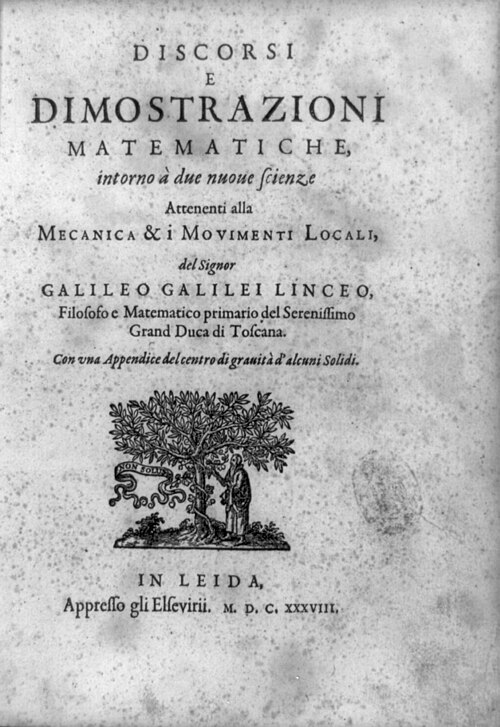
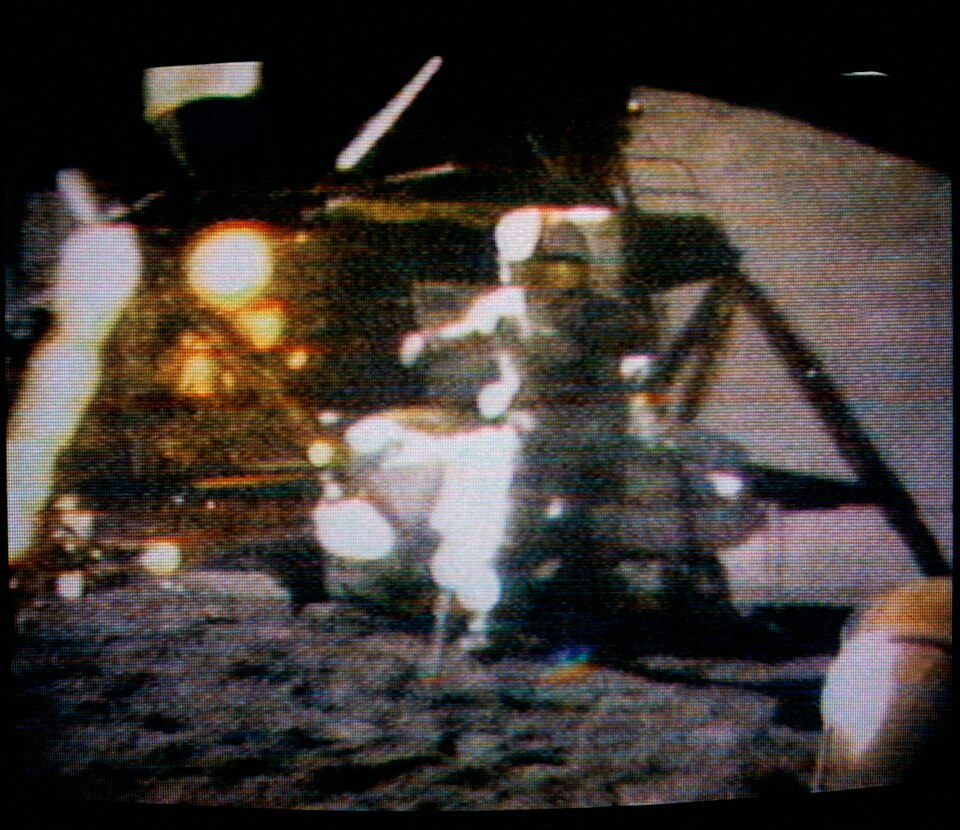

Forbidden after his trial to publish anything at all, [Galileo](kloom:e/galileo-galilei) spent his
years of house arrest at Arcetri finishing a book on the strength of
materials and on motion. It was printed beyond
the Inquisition's reach, by the house of Elzevir at Leiden in the Dutch
Republic, in 1638: the _Discourses and Mathematical Demonstrations
Relating to Two New Sciences_, now called [_Two New Sciences_](kloom:e/two-new-sciences). The same
three speakers as in the _Dialogue_ discuss the strength of materials and,
in the third and fourth days, motion: the science that became the
foundation of physics.

## Two stones tied together

The argument against Aristotle's rule that heavier bodies fall faster
takes Galileo's spokesman, Salviati, a paragraph and no apparatus. Suppose
a large stone falls with a speed of eight and a small one with a speed of
four. Tie them together. The slow stone should hold back the fast one, so
the pair falls at less than eight; but the pair is heavier than the large
stone, so it should fall faster than eight. "Thus you see how, from your
assumption that the heavier body moves more rapidly than the lighter one,
I infer that the heavier body moves more slowly." The rule contradicts
itself. In a medium with no resistance at all, Salviati concludes, all
bodies would fall with the same speed; air and water are what make a
feather differ from a stone, as the frame on Aristotle's physics explains.

## The tower of Pisa

The famous demonstration is not in the book. It comes from Galileo's
pupil **[Vincenzo Viviani](kloom:e/vincenzo-viviani)**, whose life of his master, written in 1654 and
printed in 1717, says that at Pisa, between 1589 and 1592, Galileo showed
by "repeated experiments made from the height of the Leaning Tower" before
professors and students that bodies of one material fall together. Galileo
never describes doing it. Most historians take it for a story, or at most a
thought experiment; the historian Stillman Drake argued that something like
it did happen, as a demonstration for students. The experiment itself had
been done: in 1586 **[Simon Stevin](kloom:e/simon-stevin)** and Jan Cornets de Groot dropped two
lead balls, one ten times heavier, thirty feet at Delft, and reported that
they landed together.

## Slowing the fall

Galileo's real evidence was a ramp. A falling body is too fast to time, so
he let a ball roll down a slope, which dilutes the fall without changing its
law. The book describes a wooden beam about twelve cubits long with a
straight groove lined with polished parchment, a hard round bronze ball,
and a water clock: a thin jet from a raised vessel, caught in a glass during
each descent and weighed. "In such experiments, repeated a full hundred
times, we always found that the spaces traversed were to each other as the
squares of the times."

Distance goes as the square of time: in 1, 2, 3 and 4 equal times a ball
from rest covers 1, 4, 9 and 16 lengths, and so, in the successive times
alone, 1, 3, 5 and 7, "the odd numbers beginning with unity". The rule
behind it, that a uniformly accelerated body covers the distance it would at
its mean speed, had been proved in words by the Merton calculators three
centuries before; Galileo's was a measurement.

| Equal time | Distance in that time | Distance from rest |
| ---------: | --------------------: | -----------------: |
|          1 |                     1 |                  1 |
|          2 |                     3 |                  4 |
|          3 |                     5 |                  9 |
|          4 |                     7 |                 16 |

His notebooks show more than the book. In 1973 Drake described a working
sheet, folio 116v, on which Galileo sent balls from set heights over a
deflector that turned them level, measured how far they flew, and found
discrepancies he put down to the air: the law holds under ideal
conditions. The fourth day sets out the result the plate
draws. A ball leaving the table keeps its even horizontal speed while it
falls by the same squares, so its path is a semi-parabola, and a gun fired
at 45° throws farthest. The book also gives the pendulum's law: a
pendulum's swing takes the same time whether wide or narrow, and to double
the time you make it four times as long. Galileo claimed the first for any
swing; around 1636 Mersenne and Descartes found it true only for small ones.

## On the Moon

On 2 August 1971, near the end of the last moonwalk of **[Apollo 15](kloom:e/apollo-15)**, the
commander, **[David Scott](kloom:e/david-scott)**, stood in front of the television camera with a
geologist's hammer in his right hand and a falcon's feather in his left,
and dropped them together. With no air, they landed together. "Which
proves that Mr. Galileo was correct in his findings." The idea was the
capsule communicator Joe Allen's; Scott said later that he had meant to try
it first, in case the feather stuck to his glove, and had no time.

That all bodies fall alike, whatever they are made of, is now called the
**[equivalence principle](kloom:e/equivalence-principle)**, and it has been tested to better than one part
in a trillion. It was Einstein's way into general relativity. The
next step in the new science, though, came from England, and from light.
