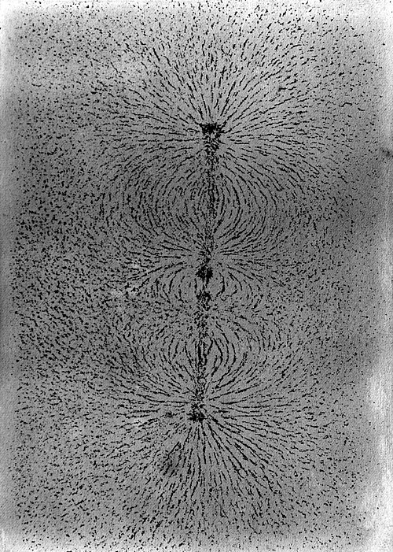

Fourteen years after the iron ring, **[Michael Faraday](kloom:e/michael-faraday)** was still at the
[Royal Institution](kloom:e/royal-institution), and still thinking in lines. He had used "[lines of
force](kloom:e/line-of-force)" to explain induction in 1831, and most of his contemporaries took
them for a picture: a way to see where a compass needle would point, and
nothing more. Between 1845 and 1852 he found three things that made the
lines harder to dismiss, and then argued, carefully and in print, that
they were really there.

## A magnetized ray of light

Faraday had believed for years that light, electricity and magnetism were
forms of one power, and had looked for a link between them without
success. On 13 September 1845 he tried a piece of heavy glass, a
borate of lead and silica he had made in his work on optical glass in the
late 1820s. He polarized the light of a lamp by reflection, turned an
eyepiece until the flame vanished, and put the glass between the opposite
poles of an electromagnet, so that the ray ran along the lines of force.
When the current went on, the flame came back into view. When it went
off, the flame disappeared. His notebook entry for the day says that
"magnetic force and light were proved to have relation to each other."

The magnet had turned the plane of polarization, and the plate draws the
arrangement. The **[Faraday effect](kloom:e/faraday-effect)** is proportional to the strength of the field
along the ray, as Émile Verdet showed by measurement between 1854 and 1863. Faraday reported it to the Royal Society in November 1845 under a
title, "the magnetization of light and the illumination of magnetic lines
of force," that readers took to mean he had made the lines glow. He added
a note in December: he meant illuminated "as the earth is illuminated by
the sun." The ray showed where the lines ran through the glass.

## Glass that fled the magnet

The same bar of glass, hung on a thread between the poles, did something
else. It swung round until it lay _across_ the line from pole to pole, and
returned there when pushed away. Iron lies along the lines; this glass
turned from them. Bismuth had been known since 1778 to be repelled by a
magnet, but Faraday went through his shelves and found that every
substance answered a magnet one way or the other. It was strange, he
wrote, "to find a piece of wood, or beef, or apple, obedient to or
repelled by a magnet," and a man hung delicately enough between the poles
would turn across them too. The bodies that turned away he called
_diamagnetic_, on a suggestion of William Whewell's: **[diamagnetism](kloom:e/diamagnetism)** is a
property of all matter, usually swamped by stronger kinds.

## Thoughts on ray-vibrations

In the spring of 1846 **[Charles Wheatstone](kloom:e/charles-wheatstone)** was to describe his electric
chronoscope at a Friday evening Discourse, and Faraday gave the account
instead. In the usual telling Wheatstone lost his nerve at the door and
fled into the street. The Royal Institution, which used to lock its
speakers in a room before a Discourse, calls the escape a legend; Faraday
says only that he had "to appear suddenly and occupy the place of
another." He filled the time with a speculation, then wrote it up as a
letter to the _Philosophical Magazine_ that May.

Perhaps, it said, light is a vibration of the lines of force themselves,
sideways, as the polarization of light requires. The proposal "endeavours
to dismiss the aether, but not the vibrations": no **[luminiferous aether](kloom:e/luminiferous-aether)**
is needed if the lines can carry the shake, and the shake would take time
to travel. Faraday called it "the shadow of a speculation." Eighteen years
later Maxwell wrote that the electromagnetic theory of light he was
developing was "the same in substance" as Faraday's, "except that in 1846
there was no data to calculate the velocity of propagation."

## Lines that are really there

In December 1851 Faraday published instructions for drawing the
lines with iron filings: level paper over the magnet, filings through a fine sieve, a
light tap with a pen-holder, and a gummed sheet pressed down to fix the
pattern for good. He kept many such sheets.

In June 1852, in "On the Physical Character of the Lines of Magnetic
Force," he made the case. Rays of light could be bent, polarized and
timed, so their lines had a physical existence. Gravity's could not.
Filings alone could not decide it for magnetism, he admitted, since
straight attractions between the filings might make the same pattern. But
a bar magnet alone in space has two poles that act on each other, and he
could not "conceive curved lines of force without the conditions of a
physical existence in that intermediate space."

When Faraday became sure of this is disputed: some historians date his
conviction to 1838, others to this paper. Faraday wrote no
equations for any of it. Maxwell, who did, said that his lines showed him
"to have been in reality a mathematician of a very high order." The next
frame is what Maxwell built from them in 1861: a machine made of spinning
cells.
