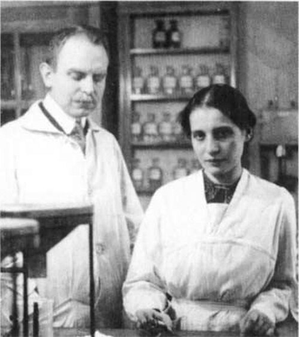
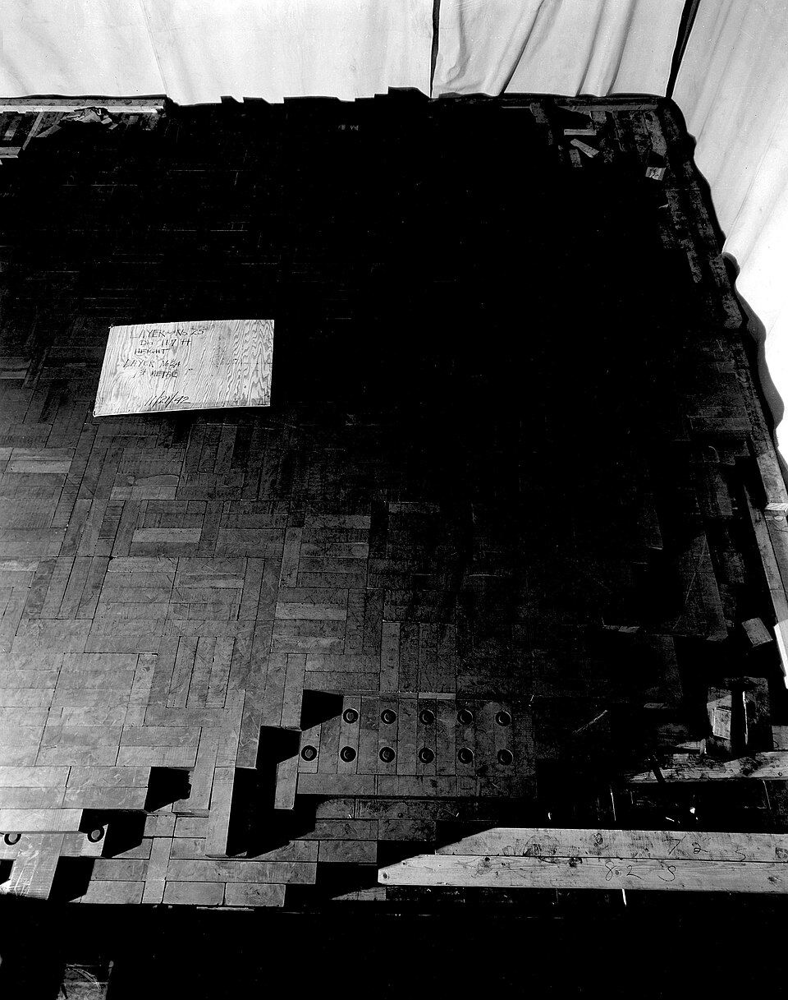

Chadwick's neutron, having no charge, could walk into a nucleus that
repelled every alpha particle and proton. In 1934 **[Enrico Fermi](kloom:e/enrico-fermi)** and his
group in Rome set out to do it to every element they could get, working up
the periodic table like an assembly line. They
made twenty-two elements radioactive. From uranium, the heaviest, Fermi
concluded, cautiously, that he had made elements 93 and 94. The Nobel
Prize he received in 1938 cited those "new radioactive elements".

In October 1934 the group noticed that uranium became more radioactive when
irradiated on a wooden table than on a marble one. Fermi put paraffin wax
between the source and the target and the activity jumped. Hydrogen in the
wax, he reasoned, slowed the neutrons, and a slow neutron lingers near a
nucleus long enough to be caught. A month earlier the
chemist Ida Noddack had suggested that a neutron might break a heavy nucleus
into large fragments. Nobody tested it, Noddack included.

## Barium in Berlin

At the Kaiser Wilhelm Institute for Chemistry in Berlin, the physicist
**[Lise Meitner](kloom:e/lise-meitner)** and the chemist **[Otto Hahn](kloom:e/otto-hahn)**, who had worked together
since before the First World War, took up Fermi's uranium with a young analytical chemist, **[Fritz
Strassmann](kloom:e/fritz-strassmann)**. For four years their "transuranic" activities
multiplied, each harder to explain. In July 1938, after Germany annexed
Austria and her passport became worthless, Meitner, who was of Jewish
descent, escaped to the Netherlands and went on to Stockholm.

That autumn Hahn and Strassmann thought they had found radium among their
products. Meitner, meeting Hahn in Copenhagen in November, did not believe
it. They tried to
separate the "radium" from the barium they added as a carrier, and could
not: it was barium, an element some 40 per cent lighter than uranium. Hahn wrote to
Meitner, and on 22 December the two chemists sent a paper to
_Naturwissenschaften_ that said as much and hesitated: "As chemists… we
should substitute the symbols Ba, La, Ce for Ra, Ac, Th," but as nuclear
chemists they could not yet take a step that contradicted all of physics.

## A drop that divides

Meitner spent Christmas at Kungälv in Sweden with her nephew, the physicist
**[Otto Frisch](kloom:e/otto-robert-frisch)**. In Frisch's telling they talked it through on a
walk in the snow, he on skis, and sat on a tree trunk to calculate. George
Gamow's _liquid drop_ picture of the nucleus, developed by Bohr, held the answer. Uranium's 92 protons
push apart so hard that they almost cancel the surface tension holding the
drop together; one more neutron could set it wobbling, stretch it, and
divide it. The two halves, repelling each other, would fly apart with about
200 million electron volts. Meitner remembered how to compute the masses of
nuclei, and found the two fragments lighter than the uranium by about a
fifth of a proton's mass: by E = mc², just that energy. The plate draws the
drop dividing, and the bookkeeping.

Back in Copenhagen, Frisch told Niels Bohr, who struck his forehead:
"What idiots we have been!" On 13 January 1939 Frisch saw the fragments'
large pulses on a counter set to ignore alpha particles, and borrowed a biologist's word for a
cell dividing: **[fission](kloom:e/nuclear-fission)**. Meitner and Frisch's note appeared in _Nature_ on
11 February.

The Nobel Prize for Chemistry for 1944 went to Hahn alone. The chemists who
judged it did not see why physicists thought Meitner and Frisch's part
essential, and the physics committee never gave them a prize. Meitner thought Hahn fully deserved his, and found it "a bit
unjust" to be called his assistant. By 1990 she had been written back into
the story, but her share is still argued, mainly in Germany.

## The chain

**[Leo Szilard](kloom:e/leo-szilard)** had imagined a nuclear chain reaction in 1933, before
fission was known, after reading in _The Times_ that Rutherford dismissed any
practical use of atomic energy. In Richard Rhodes's retelling of Szilard's
story, the idea came as he waited to cross Southampton Row in London. His 1934 patent went
to the Admiralty, to keep it secret. In 1939 teams in Paris and New
York found that each fission released more neutrons than it took. If more
than one went on to split another nucleus, the reaction would feed itself. Bohr worked out that it was the rare isotope uranium-235 that split
with slow neutrons; natural uranium would need a moderator to slow them, and
Szilard proposed graphite.

At Chicago, under the university's football stands, Fermi's
team built **[Chicago Pile-1](kloom:e/chicago-pile-1)** in November 1942: layer on layer of graphite
bricks, some drilled for lumps of uranium and uranium oxide. As it grew,
Fermi tracked a number that would fall to one when the pile could sustain
itself, and stopped at the 57th layer, where he had predicted it would.

| Layer | Fermi's measure (radius² ÷ neutron intensity) |
| ----: | --------------------------------------------: |
|    15 |                                           390 |
|    19 |                                           320 |
|    25 |                                           270 |
|    36 |                                           149 |
|    57 |                                 1 (predicted) |

On 2 December the last control rod was drawn out step by step, and at 3:25 in
the afternoon Fermi announced that the pile had gone critical. It ran for
about four and a half minutes at about half a watt before he had it shut
down. The accounts of its size disagree: the same Wikipedia article gives
360 short tons of graphite in one place and 400 in another. Arthur Compton
passed the news on: "The Italian navigator
has landed in the New World." What was built on it is the next frame: the
Manhattan Project.
