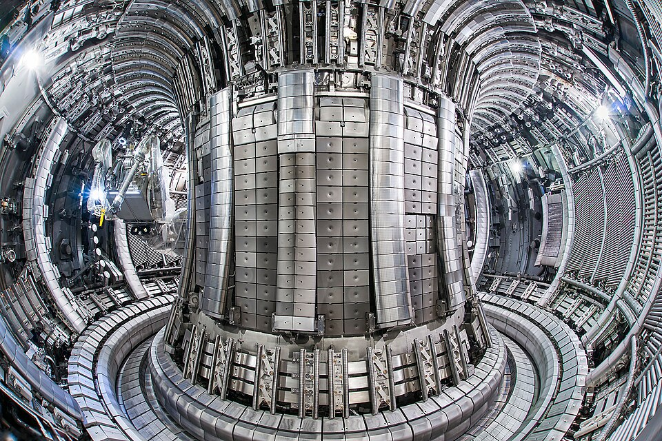
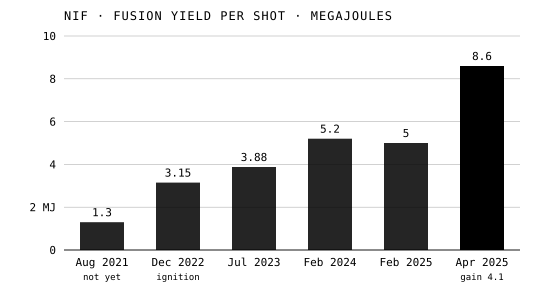

Fission splits the heaviest nuclei. The lightest
release energy by joining. Four hydrogen nuclei that become
one of helium lose about seven-tenths of one percent of their mass. Fission, by our
own arithmetic (200 MeV from 236 units of mass), turns under a tenth of one percent.
We learned fusion from the stars, made it a weapon, and after seventy years
have not made it a power station.

## What the Sun burns

In 1920, in "The Internal Constitution of the Stars", **[Arthur
Eddington](kloom:e/arthur-eddington)** asked what the stars burn. The leading theory, that stars
shine by slowly contracting, did not fit what was seen of the Cepheid
variable stars. Francis Aston had just measured a helium atom as about 0.8 percent lighter than four hydrogen atoms; if a star turned even a few percent
of its mass of hydrogen into helium, Eddington argued, that would pay for
its light. How two positive nuclei got close enough to join was
unknown until George Gamow's quantum tunneling gave the odds in 1928.

**[Hans Bethe](kloom:e/hans-bethe)** worked out the reactions. In 1938, with Charles Critchfield,
he proposed the _proton–proton chain_, and in his 1939 paper "Energy Production in
Stars" he set out a second route, the **[CNO cycle](kloom:e/cno-cycle)**, in which carbon,
nitrogen and oxygen nuclei serve as catalysts. Carl Friedrich von Weizsäcker had found the cycle independently
in 1938. Bethe received the Nobel Prize for it in 1967.

| Route               | Where it dominates         | Share of the Sun's energy |
| ------------------- | -------------------------- | ------------------------: |
| Proton–proton chain | the Sun and lighter stars  |                 about 99% |
| CNO cycle           | stars above about 1.3 Suns |                  about 1% |

The first step is so unlikely that an average proton in the Sun's core
waits about nine billion years for it: that slowness is why the Sun lasts.
The CNO cycle's share in the Sun was confirmed only in 2020, when the
Borexino detector caught its neutrinos.

## The Super

At wartime Los Alamos, Edward Teller led the work on a bomb that would use
a fission explosion to ignite fusion in heavy hydrogen, the "Super". In
December 1945 the first problem run on the electronic computer ENIAC
was a Los Alamos calculation on the Super. After the
first Soviet atomic test, President Truman ordered a full-scale program in
January 1950. In March 1951 Teller and the mathematician Stanisław Ulam
described a design in which radiation from a fission stage compresses a
separate fusion stage, and on 1 November 1952 the United States tested it at
Enewetak Atoll in the Pacific. **[Ivy Mike](kloom:e/ivy-mike)** yielded 10.4 megatons, by our
arithmetic some five hundred times the Nagasaki bomb, and left a crater 1.9 kilometers wide
where the island of Elugelab had been.

## Bottling it

A power station needs fusion that is slow and controlled, in a gas of
nuclei and electrons, a _plasma_, at over a hundred million degrees. No
wall can touch it. In 1950 Andrei Sakharov and Igor Tamm in Moscow proposed
holding it in a magnetic field bent into a ring. After many failures with
other shapes, their **[tokamak](kloom:e/tokamak)**, whose field lines wind round the ring in a
helix, won. In 1968 the Soviet T-3 was reported to reach ten million
degrees; a British team took a laser to Moscow to check, confirmed it in
1969, and laboratories everywhere started building tokamaks. The plate
draws one in section: the plasma's nested magnetic surfaces, a field coil,
and the central solenoid that drives the plasma's current.

The biggest of its generation was the **[Joint European Torus](kloom:e/joint-european-torus)** at Culham, near Oxford, which
ran from 1983 to 2023 and in 1991 was the first to burn the working fuel,
deuterium and tritium. In October 2023 it produced
69 megajoules of fusion energy in about six seconds from 0.21 milligrams of
fuel. Wikipedia gives its 1997 record gain (fusion out over heating in)
as 0.67 in one article and 0.33 in another; either way, below 1.

## Lasers, and ITER

The first gain above 1 came by another road. At Livermore's **[National
Ignition Facility](kloom:e/national-ignition-facility)**, 192 laser beams heat a small gold cylinder, a _hohlraum_,
whose X-rays crush a capsule of frozen fuel inside it. On 5
December 2022 a shot produced 3.15 megajoules from 2.05 megajoules of laser
light. That was _ignition_ as the target counts it; the lasers had drawn
some 400 megajoules from the grid. On 7 April
2025 one produced 8.6 megajoules, a gain above four (4.13 from 2.08
megajoules in the laboratory's annual report; 4.2 from 2.05 in its
director's slides of March 2026). By April 2026 it had reached ignition ten
times. In 2025 it cut the lasers' maximum from 2.2 to 1.9 megajoules
while worn optics are refurbished.

| Shot             | Laser in, MJ | Fusion out, MJ |
| ---------------- | -----------: | -------------: |
| 8 August 2021    |    about 1.9 |            1.3 |
| 5 December 2022  |         2.05 |           3.15 |
| 30 July 2023     |              |           3.88 |
| February 2024    |          2.2 |            5.2 |
| 23 February 2025 |         2.05 |            5.0 |
| 7 April 2025     |         2.08 |            8.6 |

The tokamak meant to make power at scale is **[ITER](kloom:e/iter)**, being built by seven
members at Saint-Paul-lès-Durance in France, to make 500 megawatts
of fusion heat from 50 megawatts of heating: a gain of ten. Its plan of
2024 moved the start of research to 2034, full magnetic energy to 2036 and
deuterium–tritium fuel to 2039, and added about five billion euros. As of
the end of September 2026 it is still the working plan: in June the last
module of the central solenoid was stacked, and in July the sixth of the
vacuum vessel's nine sectors was lowered into the pit.

No fusion experiment has yet put more electricity back than it took. The
nucleus, meanwhile, had turned out to be made of smaller things still, and
the next segment follows them, beginning with antimatter.
