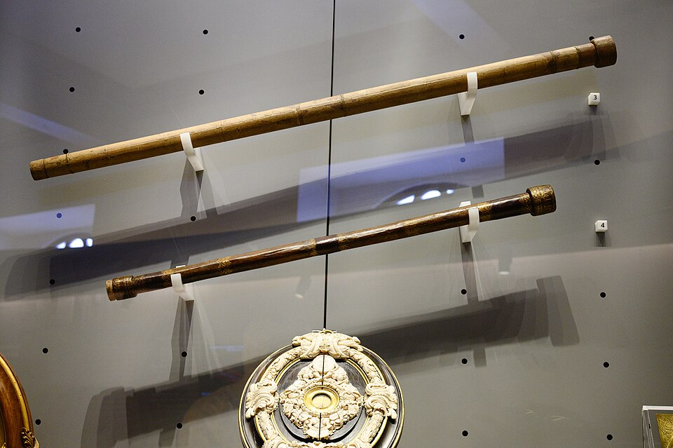
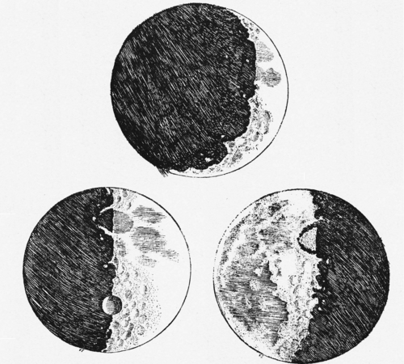

In the summer of 1609 the professor of mathematics at Padua, **[Galileo
Galilei](kloom:e/galileo-galilei)**, heard that a Dutchman had made a tube that showed distant things
as if near. Such spyglasses had appeared in the Netherlands the year
before, when a spectacle-maker of Middelburg, **[Hans Lipperhey](kloom:e/hans-lipperhey)**, asked the
States General for a patent on one; whether he was the first to build one
is unclear. Galileo worked out the principle, and within months had made
the best telescopes in Europe. He then did what the Dutch had not: he
pointed one at the sky, drew what he saw, and published it.

## The starry messenger

His first tube, of lead, had a convex lens at one end and a concave one at
the other, and made things look three times nearer. He ground his own
lenses and pushed on to an instrument that showed things "more than thirty
times nearer", as he put it in the book; the Wikipedia account of it gives
about twenty. One of his two surviving telescopes, in the Museo
Galileo in Florence, is 927 millimeters long and, with a nineteenth-century replacement
eyepiece, magnifies 21 times, with a field of view of 15 minutes of arc: half the Moon at a time, by our
reckoning.

On 13 March 1610 a Venetian printer brought out his report, the
[_Sidereus Nuncius_](kloom:e/sidereus-nuncius), the "starry messenger", in Latin. It was the first book of observations made with a telescope. The
Moon, it said, was not a perfect sphere of heavenly stuff but rough like the
Earth: points of light stood out in its dark part, beyond the line between
day and night, and could only be mountain peaks catching the sunrise.

He measured one. A peak lit at a distance from the boundary of one
twentieth of the Moon's diameter must stand above the surface by the amount
a tangent ray clears the sphere. Taking the Moon's radius as 1,000 Italian
miles, that is the difference between √(1,000² + 100²) and 1,000, about 5
miles by our arithmetic; Galileo said "more than 4", and that no mountain on Earth reached
even one.

| Seen in 1610      | Naked eye | Through the telescope |
| ----------------- | --------: | --------------------: |
| Stars of Pleiades |         6 |                    35 |
| Stars of Orion    |         9 |                    80 |
| Moons of Jupiter  |         0 |                     4 |

The stars were ten times as many as anyone had counted, and the Milky Way
dissolved into them. The last pages were the news. From 7 January 1610 he
watched three, then four, little stars beside Jupiter, always in a line and
never in the same places, and concluded that they circled it "as Venus and
Mercury round the Sun". The **[Galilean moons](kloom:e/galilean-moons)**, as they are now called,
were a small Copernican system that anyone with a telescope could see. He named them the
Medicean Stars, for the grand duke of Tuscany, Cosimo II de' Medici, and
was made his court mathematician and philosopher in Florence.

Some would not look. Others said the lens made the points of light. The
first astronomer to back him in print was Kepler, in April 1610, and
Jesuit astronomers in Rome had repeated the observations by 1611.

## Venus and the Sun

Later in 1610 Galileo saw the **[phases of Venus](kloom:e/phases-of-venus)**, and sent Kepler the news
scrambled into an anagram, to claim it without giving it away. Venus goes
through the whole series, from a small full disc to a large thin crescent,
as the plate draws. That is impossible in Ptolemy's arrangement, in which
Venus stays between the Earth and the Sun. It fits Copernicus, but it fits
equally the system of Tycho Brahe, in which the planets go round the Sun
and the Sun round a still Earth. The telescope killed Ptolemy; it did not
settle the question.

Galileo also saw spots on the Sun, published in 1613 after a dispute over
who saw them first, and proposed a use for Jupiter's moons: their eclipses,
which can be predicted, would make a clock in the sky for finding longitude
at sea. He applied to Spain for its prize in 1616. On a ship the method was
impractical; on land it later remapped France.

## The trial

Copernicanism was now a public claim, and it met Scripture. In February
1616 the theologians who advised the **[Roman Inquisition](kloom:e/roman-inquisition)** called a still
Sun "foolish and absurd in philosophy, and formally heretical"; Cardinal
Bellarmine told Galileo to abandon the opinion, and Copernican books were
banned.

In 1623 a patron of his became **[Pope Urban VIII](kloom:e/pope-urban-viii)**, and allowed Galileo
to write on the question as a hypothesis. The [_Dialogue Concerning the Two
Chief World Systems_](kloom:e/dialogue-concerning-the-two-chief-world-systems), of 1632, argued for the Earth's motion through three
characters and put the pope's own argument in the mouth of the one called
Simplicio. Its chief physical proof, that the tides come from the Earth's
motion, was wrong. The pope took offense, the sale was stopped, and in 1633
Galileo, aged sixty-nine, was tried in Rome and threatened with torture. On
22 June he was found "vehemently suspect of heresy", made to abjure, and
sentenced to prison, commuted to house arrest in his villa at Arcetri,
outside Florence, for the rest of his life. That he muttered "and yet it
moves" is a legend first written down a century later. The Dialogue left
the Index of forbidden books in 1835, and in 1992 Pope John Paul II said
the theologians of the time had erred.

Under arrest, Galileo went back to the work of his youth, on how things
fall.
